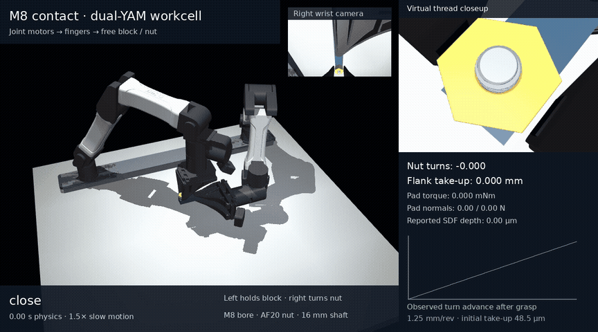
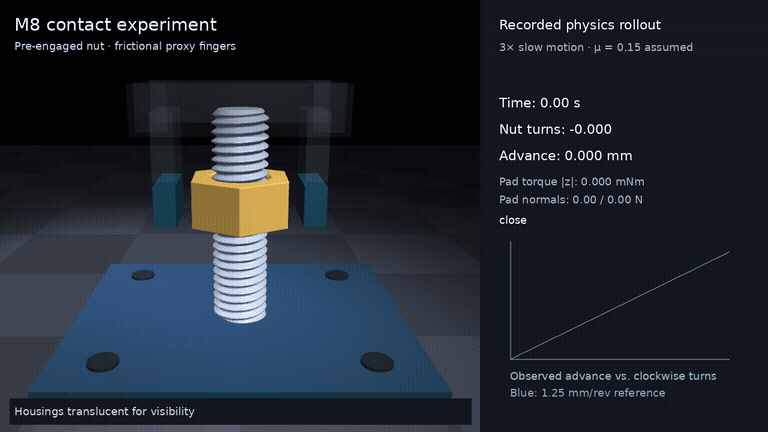

# Bimanual YAM M8 contact tasks

**Both robots now physically pick up their workpieces.** The left YAM arm
reaches for the female-threaded block on the table, clamps it, lifts it and
rotates it into the assembly pose. The right arm picks up the separately
supported M8 × 1.25 bolt, finds the thread, releases/regrasps and completes
two qualified half-turns. One measured revolution advances **1.245488 mm**;
the two pitch residuals are **−2.46 / −2.16 µm**. Native MuJoCo CPU contact
drives this motion, with no grasp welds, imposed helix or free-object drive.

[](media/m8_table_pickup/full/demo.mp4)

[Normal-speed MP4](media/m8_table_pickup/full/demo.mp4) ·
[Screenshot](media/m8_table_pickup/full/demo.png) ·
[Raw trajectory and original checks](media/m8_table_pickup/full) ·
[Measured motion/contact chart](media/m8_table_pickup/full/trajectory.png) ·
[Controls, audits and limits](docs/yam_m8_insertion.md) ·
[Agent checkout, replay and reproduction handoff](docs/m8_agent_handoff.md)

The continuous **43.6361 s** rollout completes all 49 executed phases without
an abort. **22 of 23 checks pass; the original overall result remains false.**
The strict continuous left-pad preload check records 9 / 6 isolated 50 µs
unloaded steps during acquisition/handling, totaling 450 / 300 µs. The raw
842,723-step force history preserves that failure. The 43.67 s video plays
at normal 1× speed; it selects actual recorded states.

The block is physically lifted **59.965 mm** from the table. Both captured
open resets have zero hand/bolt, world-support and head-seating contacts,
with peak axial drift **0.178 / 0.424 µm**. Independent saved-pose audits
check all four resets. The head remains unseated; full tightening/preload,
hardware calibration and broad policy-training fidelity remain unqualified.

**672 software tests pass** for the current table-supported C2/inertia
controller, with [all 74 exact source files, original log and before/after proof](media/m8_table_supported/software_proof_c2_inertia_v2).
Producer `da69a9c` starts a new fresh, unspliced table/rest-spawn attempt,
`full_c2_inertia_v2`, at **13:12:50 UTC on 2026-10-09**. That native attempt is
in progress; capture, lead/reset and complete assembly remain unqualified.
The [current exact checkout/fresh-run recipe](docs/m8_supported_agent_handoff.md#current-producer-fresh-run)
binds the new producer, source/runtime checks and finite C2/inertia controller.

The historical `6e7d0d2` producer retains its separate
[402-test / 65-source proof](media/m8_table_supported/software_proof_feedback_v1).
Its fresh unspliced native attempt closed with a
failure at **16.47615 s** (**2194.916 s** launch wall time); all 65 tested
source files stayed unchanged. The original report passes **19/27 checks**
and aborts in `stop_reverse_seat_1`: final stopped axial drop is **19.121 µm**,
below the unchanged 50 µm direction criterion. Formed overlap and loaded
interior contacts remain zero; no opening, qualified turn or reset occurs.
The closed independent compatibility audit passes **14/19 checks** and
remains overall false. The frozen reader's original boundary exception and
the separate narrow correction/eight standalone regressions are preserved.
This software proof does not qualify capture, lead or reset. See the
[historical failed-run recipe and controls](docs/m8_table_supported.md#historical-6e7d0d2-canonical-attempt).
The [supported-agent handoff](docs/m8_supported_agent_handoff.md) gives exact
checkout, lossless original-layout restoration, replay and serial audit commands.
The older alternate-grip `b2b13ff` source retains its separate
[281-test proof](media/m8_table_supported/software_proof_281).
The pinned supported producer `66276d0` retains its separate 213-test proof.
Reverse seating and the later full table-supported turn/reset sequence remain
under development; software tests do not qualify those motions.
The first-demo publication retains its separate
[181-test proof](media/m8_table_pickup/software_tests.json), and the completed
native trial retains its historical
[176-test source proof](media/m8_table_pickup/full/software_tests.json).
Policy success does not enforce
the demo's open-release/reset sequence or strict zero-gap left-pad criterion;
a success flag does not certify those checks.

The demonstrated starting speed is now the table default, **1 rad/s**, with
qualified strokes at 2 rad/s. The explicit 0.5 rad/s
[slower trial](media/m8_table_pickup/failures/conservative_second_turn_grasp_abort)
aborts during its second turn at the unchanged 1 mm grasp-slip guard; it is
failed evidence, not a successful speed comparison. Earlier progress clips
and failed starting/contact pilots remain linked in the task documentation.

The isolated thread fixture passes its strict travel/lead refinements, but
its peak reported depth changes **45.02%** with contact-search refinement.
Older load/search failures also remain. See
[the numerical comparison](media/m8_insertion/refinement/README.md) and
[mechanics status](docs/m8_status.md) before using this for training.

## Separate table-supported approach in progress

The left arm can stabilize a block that stays on the solid table.
The separate [crest-search V3 cold trial](media/m8_table_supported/diagnostics/crest_seat_search_v3_failed/README.md)
closed with a **1.6254 s** radial-guard failure after requesting a stop at
1.61915 s. Offset reaches **150.848 µm**, above the unchanged 150 µm limit;
there is no stopped readiness, forward scan or capture. Its
[normal-speed clip](media/m8_table_supported/diagnostics/crest_seat_search_v3_failed/render/demo.gif)
and [original stop-boundary chart](media/m8_table_supported/diagnostics/crest_seat_search_v3_failed/render/scientific_plot/native_stop_boundary.png)
remain separate from the full failed run. The separate
[crest V4 failed packet](media/m8_table_supported/diagnostics/crest_seat_search_v4_failed/README.md)
closes at **1.7091 s**, radial error **150.011 µm**, after
89.95 ms of its intended 150 ms smooth brake. No stopped direction readiness
or forward scan occurs. Its [normal 1× clip](media/m8_table_supported/diagnostics/crest_seat_search_v4_failed/render/demo.gif)
and [dense brake-boundary chart](media/m8_table_supported/diagnostics/crest_seat_search_v4_failed/render/scientific_plot/native_stop_boundary.png)
retain the failure and exact repeat/replay instructions. Its 50 pure braking
tests and separate 17 reader/mass regressions do not extend the historical
69 observer contracts or 402-test canonical proof. The 19-state held-finger
mass estimate is a no-solve approximation; no feedforward ran in V4.
The separate V5 cold trial now has an actual
[1.90625 s stopped-direction progress clip](media/m8_table_supported/diagnostics/crest_seat_search_v5_stopped_progress/render/demo.gif),
[endpoint screenshot](media/m8_table_supported/diagnostics/crest_seat_search_v5_stopped_progress/render/endpoint_detail.png)
and [immutable recording/replay instructions](media/m8_table_supported/diagnostics/crest_seat_search_v5_stopped_progress/README.md).
It completes the 150 ms brake and a fresh 100 ms quiet/load gate, with
15.317 µm radial error; formed overlap/interior contacts remain zero.
The [complete closed V5 recording](media/m8_table_supported/diagnostics/crest_seat_search_v5_closed/README.md)
now preserves **7.3566 s / 147,132 native steps**, with no abort:
[normal 1× clip](media/m8_table_supported/diagnostics/crest_seat_search_v5_closed/render/demo.gif),
[final thread detail](media/m8_table_supported/diagnostics/crest_seat_search_v5_closed/render/endpoint_detail.png)
and [dense native trajectory](media/m8_table_supported/diagnostics/crest_seat_search_v5_closed/scientific_plot/native_closed_trajectory.png).
Forward travel is **552.970 µm over 2.842942 rad**, but formed overlap is only
**21.615 µm**, with zero interior contacts or opening. The original
`passed=false` remains; this cold branch does not qualify capture, reset or a
fresh complete trajectory. Its [lossless restore, isolated repeat and recorded-state replay](media/m8_table_supported/diagnostics/crest_seat_search_v5_closed/README.md#repeat-the-exact-cold-native-branch)
include every dense force/command row and the frozen independent audit.
The 31 reader tests, 67+6 synthetic checks and historical 69/50/402 proofs
remain separate. The earlier stopped-prefix package stays immutable.
The [complete closed failed attempt](media/m8_table_supported/full_canonical_v1_failed_evidence/README.md)
has [normal 1× GIF](media/m8_table_supported/full_canonical_v1_failed_evidence/demo.gif),
[MP4](media/m8_table_supported/full_canonical_v1_failed_evidence/demo.mp4),
[actual endpoint](media/m8_table_supported/full_canonical_v1_failed_evidence/endpoint_detail.png)
and [measured direction-gate chart](media/m8_table_supported/full_canonical_v1_failed_evidence/scientific_plot/native_direction_gate.png).
It preserves every original trace/force byte and the original failed outcome;
capture, qualified lead/reset and complete assembly remain unexecuted.
The failed `6e7d0d2` attempt preserves a historical
[13.1949 s entry/weight-transfer snapshot](media/m8_table_supported/entry_transfer_progress/README.md),
with [normal 1× GIF](media/m8_table_supported/entry_transfer_progress/entry_transfer_progress.gif),
[MP4](media/m8_table_supported/entry_transfer_progress/entry_transfer_progress.mp4)
and [actual entry detail](media/m8_table_supported/entry_transfer_progress/entry_transfer_detail.png).
It was captured while the attempt continued; zero formed overlap and zero
loaded interior contacts make it starting-geometry support, not capture.
The earlier
[4.82 s pickup-to-alignment clip](media/m8_table_supported/full_canonical_v1_pickup_align_progress/pickup_align_progress.gif)
and [actual screenshot](media/m8_table_supported/full_canonical_v1_pickup_align_progress/pickup_align_progress.png)
show the same attempt before entry.
Its [exact snapshot and geometry-only replay](media/m8_table_supported/full_canonical_v1_pickup_align_progress/PROGRESS.md)
preserve physical stabilization, bolt pickup and transfer before the later abort.
The latest [cold opening/reset/regrasp clip](media/m8_table_supported/diagnostics/entry_supported_reset_regrasp_v4/native_v4/render/demo.gif)
records **8.8531 s** with all original guards held: a contact-free open −π
reset, quiet bilateral regrasp and the next native π turn. That partial
half-turn advances **624.7518 µm**, with **−0.2632 µm** pitch residual;
final formed overlap is **646.637 µm**, below one 1.25 mm pitch.
[Exact frozen inputs, sources and repeat/replay instructions](media/m8_table_supported/diagnostics/entry_supported_reset_regrasp_v4/README.md)
keep this `b2b13ff`/281-test producer's cold diagnostic separate from the failed
`6e7d0d2`/402-test producer's continuous attempt. Full capture, a qualified passive
reset and complete table-supported assembly remain unqualified.
The [new 120° grip pickup-to-entry clip](media/m8_table_supported/face120_pickup_entry_v1/render/demo.gif)
records physical block stabilization, bolt pickup and transfer through 6.3983 s.
The [table close-up](media/m8_table_supported/face120_pickup_entry_v1/render/table_context/table_view.png)
shows both actual grips. Its [exact sources, forces and four audits](media/m8_table_supported/face120_pickup_entry_v1)
are bound to `b2b13ff` and its 281-test proof. This is a partial cone-entry
pilot with zero formed capture; the original overall result stays false.
The newer [partial helical starting-load clip](media/m8_table_supported/diagnostics/face120_partial_helical_start_v3/render/demo.gif)
runs a separate cold **6.8281 s** closed-jaw diagnostic with all **25 guards**
held. Its final stopped 100 ms has 99.9966% mean thread reaction of bolt
weight and 0.01512% mean positive right-hand support. Formed geometry reaches
21.622 µm and loaded entry normals show partial helical contact; conservative
full-interior loaded contacts stay zero. [Exact sources, native records and repeat instructions](media/m8_table_supported/diagnostics/face120_partial_helical_start_v3/README.md)
preserve privileged perfect pose feedback at 20 kHz through finite robot
motors, independently scheduled yaw and no axial pitch feedback. Capture,
full-pitch lead, opening/reset and a trained/perception policy remain
unqualified. The separate harness leaves the canonical `b2b13ff` app unchanged.
The historical [opening/wait trials](media/m8_table_supported/diagnostics/entry_supported_open_wait_trials/README.md)
include [v1](media/m8_table_supported/diagnostics/entry_supported_open_wait_trials/entry_supported_open_search_v1/render/demo.gif)
and [v2](media/m8_table_supported/diagnostics/entry_supported_open_wait_trials/entry_supported_open_search_v2/render/demo.gif).
Both preserve failed readiness gates and overall false results. V2 has earlier
strict-ready windows but fails its fixed endpoint gate. Every fully open
native tick has zero entire-right-robot/bolt contacts and zero hand load;
maximum open axial drift is 98.131 nm over 0.12 s in v1 and 141.733 nm over
0.75 s in v2. Neither reaches reset/regrasp or qualifies capture/full assembly.
The linked package retains exact native records and complete frozen-source
reproduction instructions, separate from the 281-test proof.
The [three closed cold search trials](media/m8_table_supported/diagnostics/face120_closed_search_trials/README.md)
retain separate native videos and exact repeat instructions:
[reverse seat](media/m8_table_supported/diagnostics/face120_closed_search_trials/face120_seat_search_v1/README.md)
fails its loaded-stop criterion;
[forward v1](media/m8_table_supported/diagnostics/face120_closed_search_trials/face120_closed_forward_v1/README.md)
aborts table support; and
[forward hold v2](media/m8_table_supported/diagnostics/face120_closed_search_trials/face120_closed_forward_hold_v2/README.md)
aborts left-pad load after a 100 µm downward robot target. Each has zero formed
capture and no opening/reset. They cold-start archived states and cannot be
combined into a continuous trajectory. Those output-only diagnostics retain
their canonical `b2b13ff` source binding; the newer continuous candidate is
a separate producer.
The [actual bolt-over-bore screenshot](media/m8_table_supported/progress_bolt_over_bore/demo.png)
shows the fresh corrected run after physical bolt pickup, lift and transport;
that recorded frame precedes thread contact. The
[closed second attempt](media/m8_table_supported/failures/cone_release_alignment_abort)
later aborts at 12.84275 s when radial offset exceeds the unchanged 150 µm
limit during opening. Its first starting half-turn advances only 8.946 µm,
with zero formed-flank overlap. Table/left-pad support stays loaded throughout
the observed 11.1928 s active period; complete threading remains unqualified.
The separate [one-second cold weight-transfer diagnostic](media/m8_table_supported/diagnostics/cone_weight_transfer_B200)
starts a new solve from an archived checkpoint. Its final 100 ms has 99.97%
mean thread support of bolt weight but 67.08% mean positive right-hand
support and zero loaded interior-flank contacts. Release readiness stays
false. Its 15 observer tests are separate from the 213-test producer proof;
further checkpoint diagnostics remain pending.
The [closed gravity-first starting-turn comparison](media/m8_table_supported/diagnostics/entry_gravity_start_B200)
reduces measured withdrawal from 1.332 mm in parent samples to 1.346 µm in
the cold branch's native rows, but formed overlap stays zero and final mean
positive right-hand support is 94.26% of bolt weight. It performs no release
or passive reset. Its 15 observer and four geometry tests remain separate
from the historical producer proof.
The [actual 1.65 s stabilization clip](media/m8_table_supported/progress_stabilized/demo.gif)
records 99.072% mean block weight on the table, with 0.928% mean positive
upward left-hand load. It has not attempted bolt pickup or threading;
only one active tick follows stabilization acquisition. See the
[separate guide and run/replay instructions](docs/m8_table_supported.md),
[independent pilot audit](media/m8_table_supported/progress_stabilized_audit)
and [historical 213-test producer proof](media/m8_table_supported/software_proof_213).

## Earlier left-touching block rollout

The [earlier bolt-pickup demo](media/m8_insertion/full/demo.mp4) starts with
left pads already touching the free block. Its separate raw report passes
all 18 nominal checks: one revolution advances 1.245793 mm. It remains valid
for that initial condition and does not establish tabletop block pickup.
Its 126-test source snapshot and evidence remain archived.

## Verified turning baseline

Two actual YAM arms hold a free mounting block and turn a larger nut on its
short M8 shaft. The nut has a 20 mm outer width and the same M8 × 1.25 bore;
the shaft is 16 mm long. Native joint motors and finite finger contacts drive
the task. See [scene, controls, policy interface and current results](docs/yam_m8.md).

[](media/yam_m8/demo.mp4)

The [complete three-stroke demo](media/yam_m8/demo.mp4) passes all
15 nominal checks: measured lead errors are **2.9, 3.1 and 3.1 µm**, and both
open resets have zero hand/nut contacts. The left arm lifts the free assembly
**3.829 mm**, with zero world supports or artificial object forces. See the
[raw rollout](media/yam_m8/demo_trace.npz),
[checks](media/yam_m8/demo_validation.json), and
[independent audit](media/yam_m8/demo_independent_audit.json).
Firmer left-pad contact reduces post-clamp block slip to **3.52 µm**;
[the original softer-contact comparison](media/yam_m8/contact_sticking_comparison.json)
retains its results and identical thread/controller settings.
**97 baseline software tests pass**; nominal demo checks do not certify policy-training
fidelity.

```bash
scripts/run_m8.sh -m yam_twin.m8_demo --output outputs/yam_m8/demo \
  --dt .00005 --angular-speed 1 --video
```

## Independent M8 mechanics experiment

A video-informed M8 × 1.25 experiment with a free six-DOF nut, continuous
60° helical collision surfaces, and finite-force frictional fingers. Rotation
and axial travel emerge from contact. The thread plugin supplies geometry only;
the nut has no motor, grasp weld, or prescribed screw joint.

[](media/m8_contact.mp4)

**[Watch the two-turn contact demo](media/m8_contact.mp4)** ·
**[Measured results](media/m8_gripper_validation.json)** ·
**[Acceptance status and remaining failures](docs/m8_status.md)**

Download the raw MP4 from GitHub if its file page does not play it. The video
replays recorded simulated states at 3× slow motion; its blue pitch line is a
comparison reference. The nut advances **1.249786 mm and 1.249902 mm** on its
two turns. During the open-hand 360° reset, there are zero hand/nut contacts
and **13.46 nm** of nut drift. This demonstrates contact-driven running and
release/regrasp in the tested condition.

**Physics qualification is incomplete.** The complete load suite passes
13/19 individual diagnostics and retains failures in low-friction local lead,
high-friction speed fluctuation, and some scalar analytical torque comparisons.
The free-body suite also misses its strict contact-search convergence gate.
Read the failed checks before using this for policy training.

The nut starts engaged on a fixed bolt. A proxy parallel hand replaces the
YAM arms for this mechanics experiment. M8 dimensions, steel density, and
μ=0.15 are declared assumptions; the videos do not provide measurements of
tolerances, forces, or friction. This older trace contains no pickup or thread
starting. Calibrated hardware contact, seating/preload and a trained bimanual
policy remain unfinished.

## Run

The tested cloud runtime is Python 3.12 on CPU with Mesa EGL. Setup builds a
pinned MuJoCo 3.15.0 core and matching Python bindings; two documented SDF
search constants are changed for micron-scale geometry. Use the verified
launcher, which checks the engine and C++ ABI before execution.

```bash
cd /workspace/astra-r2s
scripts/setup.sh
scripts/run_m8.sh -m pytest -q
scripts/run_m8.sh -m thread_lab.demo --output outputs/m8/demo
scripts/run_m8.sh -m thread_lab.render outputs/m8/demo/gripper_trace.npz \
  --fps 12 --slow-motion 3 --output outputs/m8/demo/contact.mp4
```

The demo commands finite forces/torques on the hand and permits axial floating
during rotation. It logs per-step validity gates and measured pad forces, and
exits unsuccessfully if the demo checks fail. CPU contact search is expensive;
the recorded demo simulated about 5 seconds. Rendering reuses the trajectory.

```bash
scripts/run_m8.sh scripts/check_m8_distance.py
scripts/run_m8.sh scripts/check_m8_optimization.py
scripts/run_m8.sh -m thread_lab.validate --output outputs/m8/acceptance
scripts/run_m8.sh -m thread_lab.load_benchmark --help
```

`thread_lab.validate` retains strict physics gates and can exit with failure.
The alternate-grip source passes **281 software tests** with unchanged source
hashes. Software tests, numerical geometry checks,
and physics acceptance answer different questions.
[Setup and engine provenance](docs/m8_setup.md) explain the separate runtimes.

## Policy interface and evidence

`thread_lab.env.M8NutEnv` is a Gymnasium interface with seven normalized
hand-wrench/jaw actions, bounded physical actuation, 42 privileged state
observations, and a 25 µs default physics timestep. Invalid depth, alignment,
phase, or solver states terminate with reward −1. Short action stress probes
check these guards; they do not establish long-horizon training stability.
See [hand/controller details](docs/m8_gripper.md).

- [Load tables, failed gates, and raw traces](media/m8_load/README.md)
- [Free-body checks](media/m8_free/validation.json)
- [Thread geometry, analytical predictions, and investigation](docs/thread_mechanics_research.md)
- [MuJoCo contact investigation](docs/mujoco_thread_research.md)
- [Exact geometry optimization and reproducibility](docs/m8_sdf_performance.md)
- [Newton evaluation](docs/newton_thread_research.md): its official thread
  example requires CUDA; this CPU environment did not establish a Newton advantage.
- [Observations from the nut video](docs/nut_video_observations.md)

The original dual-YAM M4 reconstruction is preserved under
[legacy demonstration](docs/legacy_m4.md). It uses an imposed helix and grasp
welds and is insufficient evidence of thread physics. The separate MJLab
bridge also represents that legacy scene; GPU policy training was not run.

Use the existing checkout directly in cloud tasks; no worktree or background
service is needed.
