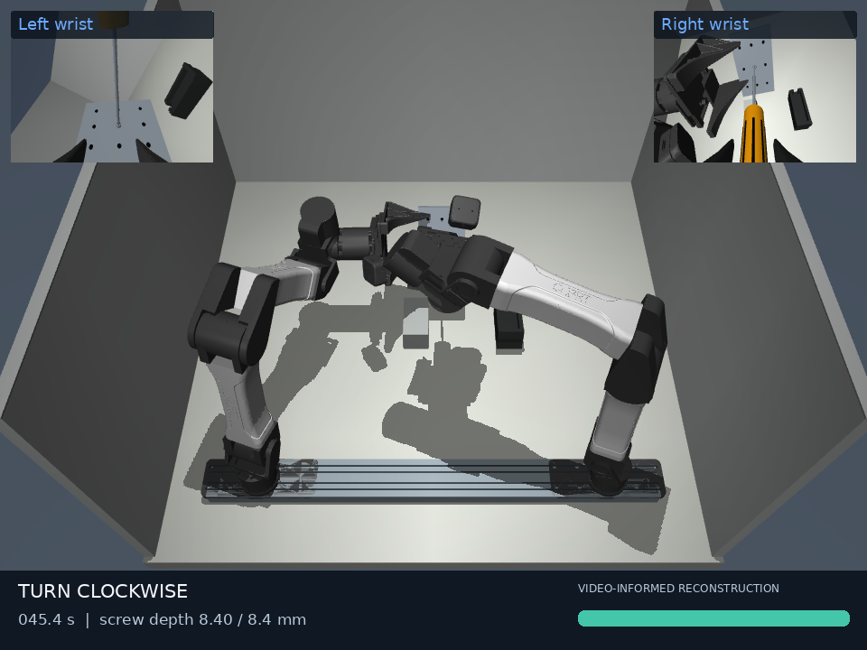

# Dual-YAM screwdriving twin



**[Demo video](media/twin_demo.mp4)** · **[Source vs. simulation](media/comparison.mp4)** · **[Portable MuJoCo scene](media/twin_scene.zip)**

Open a video file and use GitHub's **Download raw file** control to play it locally.
The MP4 files use H.264 with streaming metadata at the beginning.

A runnable, video-informed reconstruction of two YAM arms using a manual Phillips
screwdriver on a perforated plate. Includes real YAM meshes and kinematics from
MJLab, a reconstructed bench and tools, dynamic arm control, a scripted
pickup–present–turn/reset–return demonstration, wrist cameras, trajectory export,
and a tested MJLab scene bridge.

The complete demonstration reached **8.40 mm insertion** and returned the plate
and screwdriver within **1 mm and 9 mm** of their starting positions, with no
solver warnings. **24 tests pass**. The recorded results are in
[native simulation validation](media/validation.json) and
[MJLab CPU scene smoke check](media/mjlab-smoke.json). Geometry and motion are
estimated from the video; grasp and thread dynamics use reduced models.

## Run in the prepared cloud environment

```bash
cd /workspace/astra-r2s
/workspace/.venvs/astra-r2s/bin/python -m yam_twin.demo
/workspace/.venvs/astra-r2s/bin/python -m yam_twin.demo --video
/workspace/.venvs/astra-r2s/bin/python -m pytest -q
```

The first command executes the whole 54-second simulation and fails if insertion
does not complete. It saves `outputs/validation.json`, `metrics.csv`, and
`trajectory.npz`. The video command adds `twin_demo.mp4`, overview screenshots,
and closeups, including the two wrist camera views seen in the source video.
Rendering runs on CPU Mesa in this cloud machine and takes longer than physics.
You can reuse a validated trajectory to change rendering without redoing physics:

```bash
/workspace/.venvs/astra-r2s/bin/python -m yam_twin.demo \
  --replay outputs/final/trajectory.npz --fps 12 --output outputs/rendered
```

On a machine with a desktop, use `python -m yam_twin.demo --viewer` for the live
MuJoCo viewer. Use `python -m yam_twin.demo --export-only` to export the scene.
The generated plain XML references the checkout's meshes; `outputs/twin_scene.zip`
is the portable scene with embedded assets. The project ZIP includes source,
assets, and instructions. Install this project in editable mode because assets
are retained alongside the source.

## Install elsewhere

Python 3.12 (the locked, tested runtime) and an EGL-capable OpenGL implementation are required for headless
rendering; a desktop OpenGL implementation is sufficient for `--viewer`.

```bash
uv venv .venv
uv pip sync --python .venv/bin/python --require-hashes requirements.lock
uv pip install --python .venv/bin/python --no-deps -e .
.venv/bin/python -m pytest -q
.venv/bin/python -m yam_twin.demo --video
```

The core lockfile records the tested MuJoCo 3.15 dependency set. The optional
[MJLab bridge](docs/mjlab.md) has a separate environment because its pinned
version requires MuJoCo 3.11. Real MJLab CPU batched initialization and stepping
were tested; GPU training was not run.

## What is reconstructed

- The YAM model uses MJLab's published meshes, inertials, and joint limits.
  Two arms are mounted 0.61 m apart. Original third-party files are unmodified,
  licensed, and recorded with SHA256 provenance under `assets/yam/`.
- The 120 × 84 × 6 mm plate, 193 mm screwdriver, camera placement, pickup
  supports, and work poses are explicit estimates. They are not calibrated
  measurements from the monocular video. Nine hole markings are visual features;
  the plate collision shape is solid, with a separate active screw guide.
- The 189-second source sequence is summarized by a 54-second scripted
  demonstration. Each turn is followed by withdrawing the tip, resetting the
  wrist, and re-engaging. This reproduces the task phases, not original joint
  telemetry or a learned policy. See [video observations](docs/video_observations.md).
- Arms run at 500 Hz with Cartesian commands at 50 Hz, bounded IK, and combined
  PD plus inverse-dynamics bias compensation inside finite torque limits
  (28 Nm proximal, 10 Nm wrist). Arm coordinates are not teleported after
  initialization. Free objects use switched grasp welds rather than frictional
  grasping; held-object/arm contacts are excluded to avoid duplicate constraints.
- The screw uses a reduced helical joint model: assumed M4 coarse pitch
  0.7 mm/revolution and 8.4 mm insertion. Rotation is driven from measured
  screwdriver angular velocity relative to the plate, gated on tip alignment
  and clockwise turning. The visual thread rings do not simulate tooth contact,
  torque preload, stripping, or cam-out.

## Validate and tune

The test suite checks model provenance/compilation, startup, bounded IK, relative
rotation, alignment failure cases, independent M4 pitch, seating limits, and
total actuator torque saturation. The full run reports final insertion, helix
residual, engagement fraction, solver warnings, and object return error.

`yam_twin/scene.py` contains dimensions, fixtures, rendering, and thread
assumptions. `yam_twin/simulation.py` contains work pose, stroke timing, and
controller behavior. To make this a calibrated twin, replace estimated tool,
fixture, and camera transforms with measurements and replay recorded joint/tool
poses; detailed contact validation would also need force and torque data.

New cloud tasks already have isolated environments: use this checkout directly;
do not create a Git worktree unless explicitly requested.
