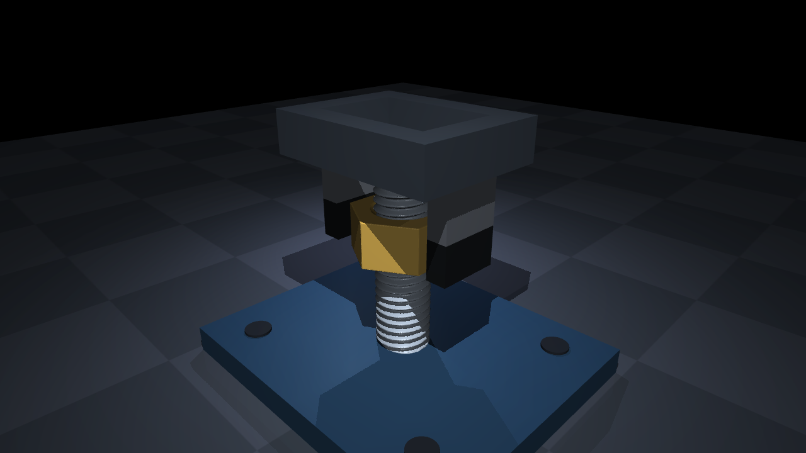

# M8 contact experiment: progress and acceptance gates

The first M4 animation in this repository used a prescribed helix, an axial
actuator, decorative holes, and grasp welds. **It is not evidence of thread
physics and should not be used to train a contact assembly policy.**

The replacement experiment uses an M8 × 1.25 right-hand thread with 60° flanks,
specified male/female tolerances, a rounded bolt root, and entry chamfers. The
nut has independent rigid-body motion; the geometry plugin contains no forces
or rotation-to-insertion rule. Fingers transmit torque through frictional
contacts. The bolt is fixed to a fixture for this first mechanics benchmark.
These dimensions and friction are declared design choices, not measurements
recovered from the video.

[Watch the preliminary contact-driven turn](../media/m8_progress.mp4)
(download the raw MP4 from GitHub). This is a recorded nominal-friction rollout,
shown at 4× slow motion. Its blue line is a comparison reference; it does not
drive insertion. The gripper has no grasp weld and the nut has no axial motor.

This screenshot shows geometry, not a validated assembly result. Work is in
progress. The nominal-friction contact experiment produces approximately the
expected pitch; the open-finger negative control does not turn the nut. A free
nut's frictionless backdrive test is currently unstable, although a fixture
with independent axial and rotational degrees of freedom passes. This is a
blocking issue for a general policy-training claim.

The investigation identified an absolute 100 µm minimum line-search step in
MuJoCo 3.15's SDF contact search, larger than the chosen 84 µm radial thread
clearance. A smaller, explicitly documented search tolerance is being tested
against unchanged SI geometry. Results will report the engine revision and
patch rather than presenting them as stock MuJoCo results.

Required evidence: torque-driven lead and reversal, no feed without a bolt,
frictionless backdrive and frictional self-locking, torque versus axial load,
penetration relative to clearance, timestep/contact-search convergence, energy
diagnostics, and torque transmission through finite-force fingers. Thread
starting, cross-threading, seating/preload, and a trained bimanual policy remain
separate acceptance targets.

Research: [thread mechanics](thread_mechanics_research.md),
[video observations](nut_video_observations.md),
[Newton evaluation](newton_thread_research.md).
