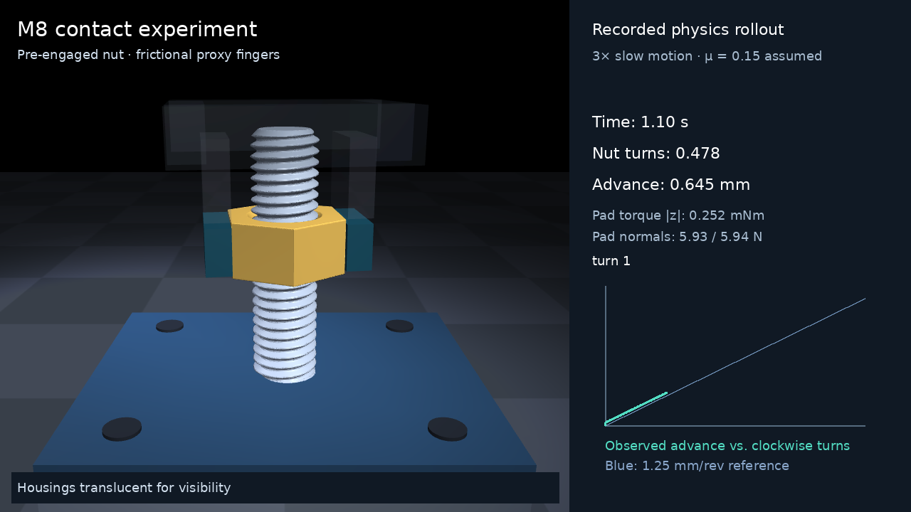

# M8 contact evidence and unresolved acceptance gates

The replacement for the original imposed-helix M4 animation is a passive
M8 × 1.25 right-hand contact model. It has continuous 60° flanks, explicit
male/female fit, a rounded bolt root, and entry chamfers. The nut is a free
rigid body; the hand transmits forces through finite frictional pad contacts.
The collision plugin contains no force law or rotation-to-translation rule.

The separate [YAM bolt-pickup and female-block task](yam_m8_insertion.md)
has an earlier published rollout passing all 18 nominal gates, including actual thread capture and one
qualified revolution. Its raw evidence is published alongside this older
fixed-bolt experiment. Those nominal results do not erase the load/search
failures or calibration limits documented here. That earlier rollout starts
with the left pads touching the block. The current extension physically picks
up both workpieces, as shown in the [native progress clip](../media/m8_table_pickup/progress_first_start/demo.mp4),
but has no completed tabletop threading rollout.
The [167-test software proof](../media/m8_table_pickup/software_tests.json)
checks the recorded damped-controller snapshot; it does not cover the next
contact-dwell revision or override failed physics gates.
The [earlier full attempt](../media/m8_table_pickup/failures/full_v10_depth_abort)
physically picked up both workpieces but aborted at the unchanged depth guard
before capture. Recorded preload gaps and camera/jaw collisions remain failures.
The later [damped attempt](../media/m8_table_pickup/failures/damped_second_release_abort)
has no sampled unexpected camera/backing penetrations but still stops before
capture at 10.129 µm depth, above the unchanged 10 µm guard. Its strict
per-step pad-preload check remains failed. A first unengaged recovery is
recorded; it supplies no formed-thread holding or qualified lead proof.

[Two-turn video](../media/m8_contact.mp4) ·
[Transparent nut view](../media/m8_thread_view.png) ·
[Complete demo report](../media/m8_gripper_validation.json) ·
[Recorded trajectory](../media/m8_gripper_trace.npz)

## Results and practical limits

| Test | Recorded result | Interpretation |
| --- | --- | --- |
| Two gripped turns | 1.249786 / 1.249902 mm advance | Contact lead agrees with 1.25 mm; no pitch-controlled axial command |
| Open-hand full-turn reset | Zero hand/nut contacts every substep; 13.46 nm axial drift | Release decouples the hand; finite-duration hold passes |
| Gripper demo validity | 1.983 µm peak reported SDF depth; 0.647 µm radial offset; 0.00643° tilt; no warnings | All ten demo gates pass in this nominal condition |
| Axial reversal | 97.087 µm backlash; opposite flank reacquired | Matches the approximately 97 µm fit clearance |
| Slow running load suite | 13/19 individual diagnostics pass all original gates | Whole suite remains unaccepted |
| Friction / torque | All 12 running torques inside independently calculated geometry bounds | Several stricter scalar mean-radius comparisons still fail |
| Zero-torque hold/backdrive | All seven finite-duration diagnostics pass | Frictionless backdrive and frictional holding are distinguished |
| Nominal timestep refinement | Mean torque, lead, reported depth change <2% at 25→12.5 µs | These measurements converge in that condition; work and speed variance do not all converge |
| Free-body contact search | 40→80 starting points change travel 2.477% | Fails the unchanged 2% convergence gate; 80→160 also changes travel 2.627% |
| Policy action stress | All eight modest and eight pure axial/yaw maximum pulses remain valid; three extreme corners stop under depth guards | Short interface/termination check, not long-horizon policy validation |

The exact numerical values and all failed gates are retained in
[load evidence](../media/m8_load/README.md),
[free-body evidence](../media/m8_free/validation.json),
[policy stress](../media/m8_policy_action_stress.json), and
[backlash diagnostic](../media/m8_backlash_diagnostic.json).

The μ=.08 lowering local lead misses the 2% gate. At μ=.25, running speed
fluctuations exceed the declared limit. Nominal lowering torque differs from
the declared mean-pitch-radius analytical prediction by approximately 5.5–6.5%,
while remaining within the predeclared geometric contact-radius envelope.
Using measured contact radius afterward explains much of that difference,
but does not erase the independent failed comparison. The slow load fit spans
only about 7 µm of travel; it is a local diagnostic, separate from the full
gripper turns. [Mechanics investigation](thread_mechanics_research.md) gives
the detailed interpretation.

## Numerical implementation

The official MuJoCo 3.15.0 SDF search uses a 100 µm absolute minimum step,
larger than the model's 84 µm radial flank clearance. The reproducible custom
core lowers that search floor to 100 nm and starts its search at 2 mm. Exported
markers, hashes, and matched GCC Python bindings are checked by the launcher.
These are documented engine modifications; the results are not stock-wheel
MuJoCo results. [Build details](m8_setup.md).

Thread contact uses zero margin. MuJoCo's SDF narrowphase rejects positive
distances, so a positive solver margin caused recurring contact loss and
incorrect slow friction/holding. Removing the incompatible margin fixed that
failure without retuning friction or imposing a helix. Elliptic Coulomb
friction, zero extra rolling/torsional friction, and a 0.5 ms contact time
constant are explicit assumptions. Reported SDF intersection depth is a
solver metric: overlap between parallel flat fields can be about twice that
value. It is not an independently certified geometric overlap bound.

Historical demo/load traces use the preserved reference geometry kernel.
The current kernel skips expensive bore calculations when a proven bound
shows the outer hex/cap field dominates. It produces byte-identical distances,
finite-difference gradients, and a fresh 4,000-step contact trajectory against
the reference. [Proof, checks, and hashes](m8_sdf_performance.md) accompany the
optimization; no geometry, contact law, or forces were approximated.

## Scope before policy training

This is a fixed-bolt, **pre-engaged** mechanics experiment with a proxy hand
and privileged observations. It does not reproduce nut pickup, thread finding,
the video's full bimanual YAM motion, or an already trained policy. Dimensions,
steel density, pad friction, and thread friction are design assumptions rather
than calibrated measurements from the video. The camera cannot supply actual
thread forces, tolerances, or material properties.

Remaining qualification includes resolving the strict search/dynamic gates,
checking larger action/initial-state distributions over useful horizons,
starting from above the bolt, validating seating and elastic preload, and
matching physical force/torque data. Rigid contacts alone do not establish
plastic cross-threading, wear, stripping, or damage.

Newton's official nut/bolt SDF path requires CUDA. The CPU mesh investigation
did not produce a trustworthy geometry/contact benchmark, so no Newton
fidelity advantage is claimed. [Evaluation](newton_thread_research.md).

The original [M4 visual reconstruction](legacy_m4.md) remains explicitly
labeled as an imposed-helix surrogate.
