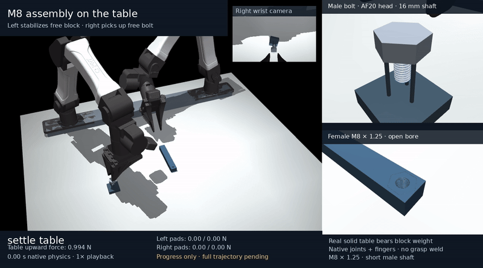

# M8 assembly with a table-supported block

This separate second trajectory leaves the female-threaded block on a solid
table. The left YAM approaches and clamps its sides to stabilize it; the
right YAM picks up the separate M8 × 1.25 bolt and attempts the same physical
thread-start, turn, open-reset and regrasp sequence. Table contact must carry
the block's weight throughout the task. The block remains a free body.

The [completed first trajectory](yam_m8_insertion.md) picks up and carries the
block. Its controller, default environment and evidence remain intact. Use
the [first-trajectory handoff](m8_agent_handoff.md) to reproduce that result.
Its successful threading measurements and historical software proofs do not
establish completion of this new table-supported trajectory.

## Start here

The latest [crest-search V3 cold diagnostic](../media/m8_table_supported/diagnostics/crest_seat_search_v3_failed/README.md)
fails at **1.6254 s**, radial error **150.848 µm** above the unchanged
150 µm guard, after requesting a closed stop at 1.61915 s. It never reaches
stopped direction readiness, forward scan, formed capture or opening/reset.
Its [normal-speed clip](../media/m8_table_supported/diagnostics/crest_seat_search_v3_failed/render/demo.gif),
[exact failed state](../media/m8_table_supported/diagnostics/crest_seat_search_v3_failed/render/abort_detail.png)
and [dense stop-boundary chart](../media/m8_table_supported/diagnostics/crest_seat_search_v3_failed/render/scientific_plot/native_stop_boundary.png)
preserve the failed physical response. The separate new crest V4 trial
also closes failed at **1.7091 s** (**260.939 s** native wall time), radial
error **150.011 µm**, after executing 89.95 ms of its 150 ms C2 brake from
the same 13.1949 s cold checkpoint. Caps and guards remain unchanged; no
stopped direction readiness or forward scan occurs. Its frozen evidence
package is pending. These crest
trials are distinct from the older opening/reset V4 diagnostic below.
Use the [cold-search handoff](m8_supported_agent_handoff.md#separate-cold-crest-search-diagnostics)
for exact frozen sources, restoration/replay differences and proof scopes.

The new canonical feedback candidate passes
[402 software tests on 65 unchanged source files](../media/m8_table_supported/software_proof_feedback_v1).
Use its [full-run candidate recipe](#run-current-canonical-candidate) for the
new 30 mm opening/B200 controller, pinned to producer
`6e7d0d2ac3d28ff2538e122a10d7ffb2febf83b1`. Its fresh unspliced
`full_canonical_v1` native attempt closed with exit 1 at **16.47615 s**,
after **2194.916 s** launch wall time. All 65 tested source bytes stayed
unchanged. The original `passed=false`, `partial=false` report passes
**19/27 checks** and aborts in `stop_reverse_seat_1`: its bounded 0.75 s
stop cannot confirm the unchanged 50 µm measured direction drop; the
final stopped drop is **19.121 µm**. Formed overlap and loaded interior contacts
stay zero, and no opening, qualified turn or reset is executed. All task
qualification checks remain failed or unexecuted. The closed independent
compatibility audit reads all 329,523 native ticks and checks 1,717 original
local thread-force/contact frames; the trajectory has 3,311 saved states.
**14/19 independent checks pass**, with overall false because five full-task
stages are absent. The original frozen-reader boundary exception and its
narrow separate correction/eight standalone tests are preserved. Left-pad,
passive-property and rest audits are closed without altering native acceptance.
Historical results and recipes below retain their exact older producer bindings.

Use the [supported-agent handoff](m8_supported_agent_handoff.md) for exact
checkout, lossless restoration of all original filenames, nonintegrating 1×
replay, complete serial audits and policy-training limits. The
[closed failed evidence package](../media/m8_table_supported/full_canonical_v1_failed_evidence/README.md)
includes [normal 1× GIF](../media/m8_table_supported/full_canonical_v1_failed_evidence/demo.gif),
[MP4](../media/m8_table_supported/full_canonical_v1_failed_evidence/demo.mp4),
[actual endpoint](../media/m8_table_supported/full_canonical_v1_failed_evidence/endpoint_detail.png)
and [direction-gate chart](../media/m8_table_supported/full_canonical_v1_failed_evidence/scientific_plot/native_direction_gate.png).

The [13.1949 s entry/weight-transfer snapshot](../media/m8_table_supported/entry_transfer_progress/README.md)
preserves a historical prefix captured while the same fresh run continued:
[normal 1× GIF](../media/m8_table_supported/entry_transfer_progress/entry_transfer_progress.gif),
[MP4](../media/m8_table_supported/entry_transfer_progress/entry_transfer_progress.mp4)
and [actual endpoint detail](../media/m8_table_supported/entry_transfer_progress/entry_transfer_detail.png).
Its measured starting-geometry weight transfer has zero formed overlap and
zero loaded interior duration. Open force ledgers at snapshot time do not
establish full-trace audit coverage; the later native failure is separate.

The earlier [4.82 s pickup/alignment snapshot](../media/m8_table_supported/full_canonical_v1_pickup_align_progress/PROGRESS.md)
includes [normal-speed video](../media/m8_table_supported/full_canonical_v1_pickup_align_progress/pickup_align_progress.mp4)
and an [actual approach screenshot](../media/m8_table_supported/full_canonical_v1_pickup_align_progress/pickup_align_progress.png).
It records real left stabilization and right bolt pickup/transfer. Its force
ledgers were still open at the snapshot; no capture or full-task audit is claimed.

The latest [cold opening/reset/regrasp V4 diagnostic](../media/m8_table_supported/diagnostics/entry_supported_reset_regrasp_v4/README.md)
holds every original guard through **8.8531 s**. Its
[normal-speed clip](../media/m8_table_supported/diagnostics/entry_supported_reset_regrasp_v4/native_v4/render/demo.gif)
shows a contact-free open −π reset, 100 ms quiet bilateral regrasp and the
next native π turn. The measured partial half-turn advances **624.7518 µm**,
with **−0.2632 µm** pitch residual; final formed overlap reaches
**646.637 µm**, below the 1.25 mm pitch. Every fully open native tick has zero
whole-right/bolt contacts, hand load and extra axial feed. Full capture,
full-pitch qualification, a qualified passive reset and complete assembly
remain unproven.

Use the package's [complete cold-input restore recipe](../media/m8_table_supported/diagnostics/entry_supported_reset_regrasp_v4/README.md#repeat-the-frozen-native-branch-in-an-isolated-checkout)
for the exact `42ed0d3b` harness, original closed-v3 state/report/ledger and
isolated `b2b13ff` model/reference prefix. The 30 mm opening changes the
finite finger command within unchanged model/force limits. Perfect native
pose feedback at 20 kHz drives bounded robot motors; this is not a trained
policy. Its historical 281-test producer binding, earlier failed 24 mm branch
and static preflight are separate from the new 402-test producer's continuous
attempt.

The historical continuous result is the
[6.3983 s pickup-to-entry prefix](../media/m8_table_supported/face120_pickup_entry_v1/README.md),
using producer `b2b13ff39cd47c48afd19b38f83e9a405c9d6e32` and its separate
[281-test source proof](../media/m8_table_supported/software_proof_281).
Use the [isolated prefix commands](#repeat-current-pickup-to-entry-prefix)
below. It ends at cone entry, with zero formed capture and original overall
validation false. The older `full_v1`/`full_v2` commands reproduce failed
attempts; no complete second trajectory is qualified.

The newer [closed partial helical starting-load diagnostic](../media/m8_table_supported/diagnostics/face120_partial_helical_start_v3/README.md)
runs **6.8281 s** in **861.33 s** CPU wall time with all **25 original guards**
held. Its [normal-speed clip](../media/m8_table_supported/diagnostics/face120_partial_helical_start_v3/render/demo.gif)
and [actual endpoint](../media/m8_table_supported/diagnostics/face120_partial_helical_start_v3/render/endpoint_open_side.png)
show closed jaws and finite native motors. In the final stopped 100 ms,
mean signed thread reaction is **99.9966% of bolt weight**, mean positive
right-hand support is **0.01512%**, and loaded thread duty is 100%.
Conservative formed geometry reaches **21.622 µm**; original loaded entry
normals show partial helical-flank contact consistent with 1.25 mm pitch.
Conservative full-interior loaded contacts remain zero throughout. This
short entry does not qualify capture, full-pitch lead, opening or passive reset.

Its [exact cold-input repeat/replay instructions](../media/m8_table_supported/diagnostics/face120_partial_helical_start_v3/README.md#repeat-the-exact-cold-native-input)
pin canonical producer `b2b13ff` and separate output-only harness `b735c16a`,
restore all three complete packages, and preserve the failed reverse-seat
checkpoint as the actual input. The 281-test proof covers the canonical
source. It does not cover this harness. Privileged perfect simulator poses
at 20 kHz drive finite arm motors; desired yaw is independently scheduled,
with no axial position or pitch feedback. No trained/perception policy or
continuous full trajectory is demonstrated. The pinned `b2b13ff` schedule
does not include this experimental controller.

The historical [opening/wait v1 and v2 trials](../media/m8_table_supported/diagnostics/entry_supported_open_wait_trials/README.md)
cold-start from that exact closed-v3 state. Their original readiness failures
and overall false results remain:

| Trial | Integrated duration | Original readiness result |
| --- | ---: | --- |
| [Opening v1](../media/m8_table_supported/diagnostics/entry_supported_open_wait_trials/entry_supported_open_search_v1/render/demo.gif) | 0.37000 s | No strict 100 ms quiet window; gate fails before the unintegrated 0.37005 s command. |
| [Opening v2](../media/m8_table_supported/diagnostics/entry_supported_open_wait_trials/entry_supported_open_search_v2/render/demo.gif) | 1.00000 s | Earlier strict-ready windows occur, first at 0.46205 s; fixed 1.00005 s gate still fails. |

Every fully open native tick has **zero entire-right-robot/bolt contacts**,
zero hand load and zero right axial feed, with no external object drive or
bolt/table support. Maximum open axial drift is **98.131 nm over 0.12 s** in
v1 and **141.733 nm over 0.75 s** in v2. Hard physics checks hold, but neither
branch reaches reset or regrasp; capture and a qualified passive reset remain
unproven. V1's final saved state precedes its scalar endpoint by 4.95 ms;
the media never synthesizes that missing state tail. The
[exact frozen-source restore/repeat recipe](../media/m8_table_supported/diagnostics/entry_supported_open_wait_trials/README.md#verify-and-repeat-the-exact-cold-inputs)
includes the adjacent closed-v3 report/ledger required by the native harness.
These historical output-only harnesses and separate arithmetic checks do not
extend the 281-test source proof or establish a continuous full trajectory.

The earlier [three closed cold search trials](../media/m8_table_supported/diagnostics/face120_closed_search_trials/README.md)
preserve exact local inputs, native force records, frozen harnesses, media and
independent audits:

| Trial | Native duration | Closed result |
| --- | ---: | --- |
| [Reverse seat v1](../media/m8_table_supported/diagnostics/face120_closed_search_trials/face120_seat_search_v1/README.md) | 3.55075 s | Measured drop fails the continuously stable loaded-stop criterion. |
| [Closed forward v1](../media/m8_table_supported/diagnostics/face120_closed_search_trials/face120_closed_forward_v1/README.md) | 1.26175 s | Table-load guards abort; original yaw-origin offset and separate correction are retained. |
| [Closed forward hold v2](../media/m8_table_supported/diagnostics/face120_closed_search_trials/face120_closed_forward_hold_v2/README.md) | 2.53060 s | A 100 µm downward left-arm target increases native compression; left-pad load aborts. |

All three have zero formed overlap and zero loaded interior-flank steps;
none performs opening/reset. The prefix supplies the canonical scene and
original grasp references. Both forward branches cold-start from the failed
reverse-seat endpoint at 9.94905 s, with no original solver warm starts.
They cannot be spliced into a continuous result. The
[self-contained repeat recipe](../media/m8_table_supported/diagnostics/face120_closed_search_trials/README.md#repeat-the-exact-cold-inputs)
restores both complete newer packages into an isolated pinned checkout and
installs exact harnesses at their required `outputs/` depth. Preserve its
raw reports and separate yaw correction. Table force above block weight
represents additional downward clamp compression. These output-only
harnesses/auditor checks remain separate from the 281-test producer proof.

[](../media/m8_table_supported/progress_stabilized/demo.mp4)

[Normal 1× pilot video](../media/m8_table_supported/progress_stabilized/demo.mp4) ·
[Actual final screenshot](../media/m8_table_supported/progress_stabilized/demo.png) ·
[Closed progress evidence](../media/m8_table_supported/progress_stabilized)

## Earlier stabilization and full attempts

The actual four-phase native stabilization pilot is closed. It simulated
**1.65 s** in **100.24 s** CPU wall time, with `aborted=null`, `partial=true`
and original overall `passed=false`. The later bolt/thread phases were
intentionally omitted. Its actual final settled load window reports:

| Quantity | Measurement |
| --- | ---: |
| Block weight | 0.998797 N |
| Mean table upward force over the final 100.05 ms | 0.989528 N (99.072% of block weight) |
| Mean positive upward left-hand force over that window | 0.009269 N (0.928% of block weight) |
| Loaded table duty over that window | 100% |
| Bilateral pad normals at actual acquisition | 15.999 / 15.990 N |

The block moves less than 0.8 µm from its initial position, with no upward
lift and no unexpected native contacts. The left reference is acquired at
the very end of `settle_left_block`; only **one 50 µs post-acquisition active
tick** exists in this pilot. Its passing active-load/pad checks therefore
establish no sustained whole-task result. The closed original trace and
validation are under `outputs/m8_table_supported/stabilization_v1/`.
It proves actual approach/closure and measured tabletop weight bearing
before bolt pickup, not thread capture, lead, reset or completed assembly.

The pilot preserves all 33,000 original native support-force steps. Its
closed trace SHA-256 is
`b8dfa45c6c9e4dc51916c0788aa34c9b392b0b00aa45e641756c95e0860234aa`;
its original validation SHA-256 is
`da2a08b7261808cf98778bce35b72fc38379599f86f88da15380259c60f4a94b`.
Those identify the acquisition pilot, not a future complete trajectory.

The earlier isolated contact diagnostic simulated 0.65 s and ended with
1.088523 N upward table force, −0.089738 N left-pad vertical force and
16.045 / 15.951 N pad normals. Its slightly downward clamp load explains the
table force above block weight. No unintended contacts appeared in its
5 ms samples. That narrower local diagnostic is under
`outputs/m8_supported/scene_geometry_probe/native_support_diagnostic_v2/`,
with explicit scope, exact source/runtime snapshots and checksums. Its NPZ
contains only the final qpos/qvel, not an end-to-end trajectory or an
every-substep force archive. It does not replace the actual stabilization
pilot or qualify unsampled clearance.

The [published progress package](../media/m8_table_supported/progress_stabilized)
replays the actual final state at 1.65 s and the short pilot at normal 1×
speed. It preserves the original trace, exact pilot sources, native force
ledger, render/state identities and checksums. Its
[serialization record](../media/m8_table_supported/progress_stabilized/validation_serialization.json)
maps only two unobserved right-transport minima from `Infinity` to `null`
for strict JSON; the byte-exact original report remains
`validation_original.json.txt`. No force measurement or failed outcome changes.

The [separate independent pilot audit](../media/m8_table_supported/progress_stabilized_audit)
validates original load/frame/source identities, passive workpieces, finite
actuation, enabled table masks and saved geometry for the selected four
phases. Its repeat against the published progress package reproduces the
same check outcomes. Original and independent overall results remain false
because the complete sequence was not executed. Its one active tick does
not establish sustained support.

The pilot's recorded source archive remains authoritative: the supported
controller changed afterward. The initial additive scene/controller/auditor
revision `4ea910e0854bb47049484eb24f1afe5037ce0662` passes
**210 software tests** in **80.07 s** wrapper time, with unchanged source
hashes. The
[software result](../media/m8_table_supported/software_proof/software_tests.json),
[log](../media/m8_table_supported/software_proof/software_tests.log) and
[manifest/verifier](../media/m8_table_supported/software_proof/manifest.json)
bind that proof. The first publication's 181-test proof and the completed
first native trial's 176-test proof remain separate and unchanged.

No complete table-supported bolt/thread rollout has been qualified yet.
Software tests and a stabilization clip cannot stand in for successful
threading or hardware fidelity.

The first full attempt, `full_v1`, used that exact producer revision and
aborted during `transport_bolt` at **3.571 s**, when the lifted bolt recontacted
its original rest, before thread starting. The
[closed failed trial and actual lift screenshot](../media/m8_table_supported/failures/transport_rest_recontact)
preserve its original report, raw states/forces and independent audits.
Its original `partial=false` only means the full phase list was selected;
the non-null abort and failed result remain. The revised bolt-transport path
was subsequently exercised in the separately recorded `full_v2` attempt.

The corrected supported-only path uses 35 mm tip clearance above the block
top, putting its nominal bolt tip at 51 mm versus the native rest tops at
36 mm. A measured 10 mm minimum full-shaft clearance is guarded at lift
completion and every transport timestep. Lateral transfer holds this height;
only `align_over_hole` then descends. The corrected producer `66276d0` passes
**213 tests** in 79.24 s with unchanged source hashes, recorded in the
[separate proof](../media/m8_table_supported/software_proof_213). The
prior 210-test proof stays bound to its initial producer. The closed `full_v2`
attempt uses producer `66276d0dd2188c763ada69e7426e5d74cf64fd29` and
[preserves its failed result and actual normal-speed media](../media/m8_table_supported/failures/cone_release_alignment_abort).
It physically picks up the bolt and clears the rest, transports above the
bore, acquires settled native starting contact and executes the first
starting stroke. It aborts at **12.84275 s** in `release_search_2`: radial
offset reaches **150.129559 µm**, above the unchanged 150 µm guard.

The first starting stroke rotates **3.141634 rad** but advances only
**8.945825 µm**; formed-flank overlap remains zero. Mid-stroke the floating
hand withdraws about 1.401 mm and the bolt about 1.332 mm. This lead-in motion
does not establish M8 engagement, qualified pitch travel or an unsupported
formed-thread reset. Original overall validation remains false.

The observed **11.1928 s** active stabilization period has zero strict
table/pad load gaps and no block lift. Every active trailing window has at
least **99.046985%** mean block weight on the table, at most **0.953019%**
mean positive upward hand load and 100% loaded table duty. Measured minimum
full-shaft/rest clearance during transfer is **14.93967 mm**. These support
and transfer results apply to the actually executed failed prefix, not an
unexecuted complete assembly.

The [closed one-second B200 weight-transfer diagnostic](../media/m8_table_supported/diagnostics/cone_weight_transfer_B200)
starts from the parent's actual saved `stop_start_1` checkpoint at
12.76565 s. Exact archived qpos/qvel/ctrl initialize a new `MjData` once;
the original solver state and warm starts are absent. It is a cold
diagnostic branch, not a continuous run or a splice into the parent.

Its axial damping is 200 N·s/m, with net feed ramped from 0.05 N to the
0.262414 N bolt weight over 0.5 s and then held for 0.5 s. In the independently
evaluated final exact 100 ms, mean signed native thread support is **99.97%**
of bolt weight, while mean positive right-hand support is **67.08%**.
Loaded thread-support duty is 63.6%, and actual formed overlap/interior-flank
loading remain zero. Cone/right-pad load chatter keeps release readiness
false; mean signed force balance does not establish unsupported capture.
The [original-force plot and evidence](../media/m8_table_supported/diagnostics/cone_weight_transfer_B200)
retain exact force/frame/source identities. Its **15 diagnostic observer
tests** remain separate from the historical **213 producer tests**.

The subsequent [closed gravity-first B200 starting-turn diagnostic](../media/m8_table_supported/diagnostics/entry_gravity_start_B200)
starts a separate cold branch from the parent's `feed_to_entry` checkpoint
at 6.75515 s. It ramps/holds the changed feed, then performs a physical
starting half-turn and a closed hold over 7.3905 s. Its original native
turn rows show **1.346192 µm** peak withdrawal from the first actual turn
row, compared with **1.332065 mm** in the parent's roughly 5 ms samples.
Sampling, reference poses, loading, damping and cold initialization have
explicit separate scopes; the comparison does not isolate one causal change.

Both turns retain zero formed overlap, and the branch has zero loaded
interior-flank steps. Its final independently evaluated exact 100 ms has
**99.11%** mean signed thread support but **94.26%** mean positive right-hand
support and only **3.55%** loaded thread-support duty. Earlier readiness
windows that pass remain cone-only. No opening, release, passive reset or
qualified lead is demonstrated. Its separate **15-test observer** and
**four-test geometry audit** proofs do not extend or combine with the
historical **213-test producer** proof. The separate alternate-grip source
has its own [281-test proof](../media/m8_table_supported/software_proof_281),
including measured load and seat-direction observations. It does not extend
the older trials' physics results.

## Repeat current pickup-to-entry prefix

The frozen `b2b13ff` producer selects another actual opposed flat pair
120 degrees around the regular hex head. The independently spawned bolt
keeps its original world yaw; this is a robot grasp choice, not groove
registration. The original 35 mm transfer height and unconditional 10 mm
whole-shaft rest-clearance guard remain unchanged. A fresh pickup-to-entry
prefix has executed 6.3983 s without an abort, with actual table/left-pad
support and rest clearance checked independently. Its entry remains cone-only,
with about 100.65 micrometres radial offset and zero formed overlap.
Its [published native prefix](../media/m8_table_supported/face120_pickup_entry_v1)
includes normal 1× video, a clear tabletop still, exact raw state/force records,
four independent audits and a separate source-matching publication binding.
The original audit's creation-time uncommitted provenance is preserved.
Actual native minimum joint margin is 0.017349 rad; the static planning
study's 0.101560 rad margin is a separate geometric result.

To repeat that narrow prefix, use an unused isolated checkout pinned to
producer `b2b13ff39cd47c48afd19b38f83e9a405c9d6e32`, whose source hashes match
the 281-test proof. This source selects the 120° opposed-flat grasp by
default; the historical `66276d0` producer uses a different grasp. Reuse the
verified native runtime, or run `scripts/setup.sh` from the pinned checkout
first if it is absent. Then use a fresh output directory:

```sh
git clone https://github.com/robomechanics/astra-r2s.git /workspace/astra-r2s-supported-b2b13ff
git -C /workspace/astra-r2s-supported-b2b13ff switch --detach b2b13ff39cd47c48afd19b38f83e9a405c9d6e32
cd /workspace/astra-r2s-supported-b2b13ff
scripts/run_m8.sh -m pytest -q
scripts/run_m8.sh -m yam_twin.m8_supported_demo --output outputs/m8_table_supported/face120_repeat --maximum-phases 12 --dt .00005 --starting-angular-speed 1 --angular-speed 2 --maximum-entry-dwell 3 --axial-damping 50
```

At this producer expect 281 tests. Run its launcher from this isolated
checkout so module imports use the pinned source. The source proof and
prefix result do not establish a completed thread-start/turn/reset sequence.
This ends after `feed_to_entry`: `partial=true`, `passed=false` is expected.
The closed cold search branches above remain separate experimental work.
Running the pinned producer's longer schedule does not reproduce a qualified
complete second trajectory. Its
eventual full producer will require a fresh unspliced rollout and its own
source proof, raw forces, lead/reset audits and acceptance result.

A new continuous full attempt will need its own producer, source proof, trajectory
and acceptance result. Post-closure audit
corrections cover unloaded window endpoints and qualified closed hold phases;
they do not alter the original failed trajectory.

## Scene and physical support

The same 20 × 120 × 16 mm female block lies flat on the real tabletop, rotated
90° in the table plane. Its center is approximately (0.300, −0.010, 0.008) m;
the bore center is (0.350, −0.010, 0.008) m. The declared 10 nm initial resting
overlap creates a native candidate, and gravity establishes support. No
support is hidden inside the bore and no weld connects the block to the table.

The left clamp is at the opposite end, approximately
(0.255, −0.010, 0.014) m. The native hand approaches from the side at 30°;
its jaw normal is horizontal along world Y. The 18.4 mm commanded closed
aperture clamps the 20 mm width and keeps the native finger backing above
the tabletop. No block lift or roll is commanded. Inherited carried-block
lift settings are unused in this controller and are identified as such in
the recorded metadata.

The separate male bolt retains the 16 mm shaft, AF20 × 8 mm head, M8 × 1.25
collision profile and original free-body mass/inertia. Its head starts at
(0.360, −0.220, 0.040) m on the physical three-pin rest. The right hand must
pick it up before threading. Rest support is permitted before pickup; after
pickup, male/world contact is forbidden.

The table remains solid beneath the bore. The measured male tip must retain
at least **1 mm tabletop clearance**. This is bounded running-thread
insertion; full through-travel, head seating and tightening preload are not
claimed. Table collisions cannot be disabled to create extra insertion room.

The finite native robot motors and pad contacts drive both arms. There are
no workpiece actuators, grasp welds, object pose updates during integration,
external object forces or commanded axial helix. The same numerical pad
compliance and idealized thread surfaces retain their calibration limits.

## Load observations and independent checks

Contact candidates alone do not show that the table bears weight. The new
controller records resolved **world-frame forces and wrenches on the block**
from actual native table contacts, including friction. It separately records
normal-only contributions, left-pad forces and original contact frames.
Positive Z means upward force on the block; a downward left force remains
negative in the raw archive.

Before bolt pickup, a settled 100 ms native load window requires:

- Mean upward table force at least 90% of block weight.
- Mean positive upward left-hand force no more than 10% of block weight.
- At least 99% loaded table duty, where a loaded substep exceeds 10% of block
  weight, with loaded contact at transition.
- Actual bilateral loaded left pads and valid declared support geometry.

The same rolling load-share thresholds are evaluated at **every active
trailing 100 ms window**, including bolt pickup, entry, turning and open
resets. The initial settled window alone does not establish support over
the later task. Positive upward hand load is averaged separately from
downward hand load, so downward pressure cannot cancel an interval in which
the hand carries the block.

Separate strict checks preserve every-substep table-load gaps and bilateral
pad-load gaps. A rolling average can pass while a strict gap check fails;
retain both actual outcomes. The block also has position/rotation/lift
guards: upward lift at most 0.5 mm, translation at most 1 mm and rotation at
most 2°. Unexpected native penetration, joint bounds, finite actuation and
zero object drive are checked independently.

The right hand retains measured settled-entry readiness, formed-flank
capture, metric lead, torque transfer and unsupported unseated bolt-reset
checks. Its grasp reference is acquired after actual loaded pickup and
again after each real loaded regrasp. A reference ends on intentional
opening; no reference is reset to hide slip during a closed stroke.

The additive `scripts/audit_m8_supported_trace.py` checks the new original
all-step load/contact archive, source/model/runtime identities, saved-pose
geometry and actual bolt lead/reset measurements. It does not reinterpret
the first carried-block report. Original solved forces and derived geometry,
including the raw ledger's block position and rotation, belong to the
pre-integration state at recorded time minus one timestep. Saved trajectory
qpos/qvel are post-integration. These are different state observations, not
interchangeable poses for force reconstruction. Replayed geometry does not
reconstruct original forces.

## Run the separate controller

Use the same verified native GCC MuJoCo CPU runtime and launcher described
in [setup](m8_setup.md). No CUDA, Newton or MJLab runtime is used. Source entry
points are `yam_twin/m8_supported_scene.py`,
`yam_twin/m8_supported_simulation.py` and `yam_twin/m8_supported_demo.py`.
Explicit output paths below keep this work separate from the first task;
the current CLI's implicit output is `outputs/m8_supported/demo`.

## Run current canonical candidate

The [software-only packet](../media/m8_table_supported/software_proof_feedback_v1/README.md)
preserves all 65 tested files and the original proof/log/verifier. Detach an
unused complete checkout at its exact producer. Reuse the matched runtime,
or run `scripts/setup.sh` there first if needed:

```sh
task_producer=6e7d0d2ac3d28ff2538e122a10d7ffb2febf83b1
git clone https://github.com/robomechanics/astra-r2s.git /workspace/astra-r2s-supported-feedback
git -C /workspace/astra-r2s-supported-feedback switch --detach "$task_producer"
cd /workspace/astra-r2s-supported-feedback
scripts/run_m8.sh -m yam_twin.m8_supported_demo --output outputs/m8_table_supported/full_canonical_v1 --dt .00005 --starting-angular-speed 1 --angular-speed 2 --maximum-entry-dwell 10 --maximum-starting-strokes 5 --qualifying-strokes 2 --axial-damping 200
```

Use an absent output directory and omit `--maximum-phases`. This begins at
independent table/rest spawns. Actual 30 mm opening, 18.4 mm closure, finite
2 N left downward hold, privileged pose feedback and live bounded phase gates
come from this producer's supported defaults. The **10 s entry bound** is an
explicit configuration override for the slow 0.05 N/B200 initial feed; it
changes the timeout, not the entry criterion, forces or geometry. Historical
`b2b13ff` prefix commands stay at 3 s/B50. These exact flags reproduce the
closed failed source/configuration above, not a qualified assembly. Budget
roughly 1–2 h CPU, refined by live
throughput and native events; exhausting the maximum plan can take longer.

The packet also preserves the output-only launcher's original source. Copy
it to `outputs/m8_table_supported/launch_continuous_supported_v3.py` before
using its `--proof`, `--producer` and fresh `--output` arguments; its root lookup
requires that depth. It binds tested source bytes before/after and retains
the original native exit/log. Frozen auditor snapshots are provenance;
replay/audit from the complete producer checkout and restore all closed
scene/source/force sidecars. Preserve the new
`native_feedback_force_history.npz` with the table and pad histories.

## Historical controller recipes

To check the exact initial full-attempt producer without switching a shared
checkout, clone into an unused directory and pin the full commit SHA:

```bash
git clone https://github.com/robomechanics/astra-r2s.git \
  /workspace/astra-r2s-supported-4ea910e
git -C /workspace/astra-r2s-supported-4ea910e switch --detach \
  4ea910e0854bb47049484eb24f1afe5037ce0662
cd /workspace/astra-r2s-supported-4ea910e
scripts/run_m8.sh -m pytest -q
```

At that revision expect 210 tests. Reuse the verified matched runtime when
it is already installed; otherwise run `scripts/setup.sh` from this pinned
checkout first. Its launcher changes into its own checkout, so module
commands use the pinned source. This revision reproduces the failed first
full attempt's source, not a later successful trajectory. It also contains
the exact archived **earlier** stabilization pilot, whose whole controller
hash is `189009b40d959325873bc6d215f9031ce9546cf56e01fcfd6b11ada32ef99e6d`.

To check or recreate the **failed revised `full_v2` attempt**, use a separate unused
checkout pinned to its exact producer instead:

```bash
git clone https://github.com/robomechanics/astra-r2s.git \
  /workspace/astra-r2s-supported-66276d0
git -C /workspace/astra-r2s-supported-66276d0 switch --detach \
  66276d0dd2188c763ada69e7426e5d74cf64fd29
cd /workspace/astra-r2s-supported-66276d0
scripts/run_m8.sh -m pytest -q
```

At this revised producer expect 213 tests, as bound by the separate
[213-test source manifest](../media/m8_table_supported/software_proof_213/manifest.json).
The higher 35 mm transfer target and measured 10 mm full-shaft/rest clearance
guard come from that pinned source. Reusing the same CLI flags on `4ea910e`
does not select this revised path. A passing source proof does not change
the recorded failed physics result.

Run the following commands from the checkout you chose. Remain in the pinned
clone when examining that producer; the ordinary cloud checkout is
`/workspace/astra-r2s` when working with newer source.

```bash
scripts/run_m8.sh -m yam_twin.m8_supported_demo --help
scripts/run_m8.sh scripts/audit_m8_supported_trace.py --help
scripts/run_m8.sh -m yam_twin.m8_supported_demo \
  --output outputs/m8_table_supported/agent_scene --export-only
```

The export compiles the scene and writes `scene.xml` and
`supported_scene.zip`; it integrates no physics and establishes no motion
result. This CLI has no `--preview` flag. Use an actual recorded pilot for
progress pictures.

To run a **fresh** four-phase stabilization diagnostic on the source in the
active checkout, use a new output directory:

```bash
scripts/run_m8.sh -m yam_twin.m8_supported_demo \
  --output outputs/m8_table_supported/agent_stabilization \
  --maximum-phases 4 --dt .00005 --fps 12 --slow-motion 1 --video
```

The four phases are `settle_table`, `reach_left_block`, `close_left_block` and
`settle_left_block`. This is intentionally a partial task and contains no
bolt pickup or thread turn. Read its original validation; the CLI can exit
1 for absent full-task checks even when stabilization itself succeeds.
This is not byte-exact reproduction of the published earlier pilot: the
controller changed afterward. Record the new source IDs and actual result.
For the preserved pilot itself, replay the archive without integrating:

```bash
scripts/run_m8.sh -m yam_twin.m8_supported_demo \
  --replay media/m8_table_supported/progress_stabilized/trace.npz \
  --output outputs/m8_table_supported/archived_stabilization_replay \
  --fps 12 --slow-motion 1
```

A fresh attempt with the revised path uses the following explicit parameters
from the pinned `66276d0` checkout. Choose a new output directory; the original
closed failed production attempt is under `outputs/m8_table_supported/full_v2/`.
Running these flags at `4ea910e` instead recreates the initial failed
transport configuration:

```bash
scripts/run_m8.sh -m yam_twin.m8_supported_demo \
  --output outputs/m8_table_supported/agent_full_v2 --dt .00005 \
  --starting-angular-speed 1 --angular-speed 2 \
  --maximum-starting-strokes 5 --qualifying-strokes 2 \
  --maximum-entry-dwell 3 --axial-damping 50 \
  --fps 12 --slow-motion 1 --video
```

The default stroke is 180°. Entry/start profiles use 1 rad/s peak, qualifying
profiles 2 rad/s, velocity-only axial damping 50 N·s/m, net axial feed 0.05 N
and at most 3 s starting-support acquisition dwells. Actual axial advance
must emerge from contact, not a yaw-to-Z position target.

Native M8 collision solving is expensive on CPU. The completed first
trajectory took 51.4 minutes for 43.636 simulated seconds; that is a context
for runtime, not an ETA or validated timing for this new scene. Do not start
another full run merely to replay a saved video.

## Replay and audit a closed supported trial

A new run archives `scene.xml`, `supported_scene.zip`,
`controller_source.py`, `renderer_source.py`, `scene_source.py`,
`engagement_observer_source.py`, imported `recorded_sources/yam_twin/*.py`,
`insertion_trace.npz`, `insertion_validation.json`,
`left_pad_force_history.npz` and `table_support_force_history.npz`.
The new canonical feedback producer also archives
`native_feedback_force_history.npz` with every original native feedback force,
motor command, actual aperture and readiness observation. Preserve it whole.
Phase-end partial traces are progress evidence. Require the final closed
trace and original report before final auditing.

```bash
scripts/run_m8.sh -m yam_twin.m8_supported_demo \
  --replay outputs/m8_table_supported/agent_full_v2/insertion_trace.npz \
  --output outputs/m8_table_supported/agent_full_v2_replay \
  --fps 12 --slow-motion 1
mkdir -p outputs/m8_table_supported/agent_full_v2_audits
scripts/run_m8.sh scripts/audit_m8_supported_trace.py \
  outputs/m8_table_supported/agent_full_v2/insertion_trace.npz \
  --output outputs/m8_table_supported/agent_full_v2_audits/supported.json
```

Replay itself writes `supported_demo.mp4` and `supported_demo.png`; it needs
no `--video` flag. Add `--stills-only` for a single recorded-state image and
`--still-time SECONDS` to select a saved timestamp. It selects actual saved
qpos/qvel using the exact archived XML, with no interpolation or integration.
Replay success does not alter an original failed physics report.

Always give the auditor an explicit new output path: its default writes next
to the trace. Preserve the original all-step forces, contacts, validation
and source snapshots. A future `media/m8_table_supported/full/` must refer
to an actually complete, unaborted supported sequence and contain its own
immutable manifests/checksums. An overall failed or partial attempt remains
honestly labeled evidence; an evidence-only package is not acceptance.
Do not reuse or overwrite `media/m8_table_pickup/full/`, or assume its generic
packager establishes these new support-specific gates.

No separate table-supported policy environment or trained policy is claimed.
The carried-block 14-action policy interface and its pickup-based reward
requirements have a different task scope. Material calibration, broader
numerical convergence, full seating and policy-training robustness remain
unqualified for this second approach as well.
