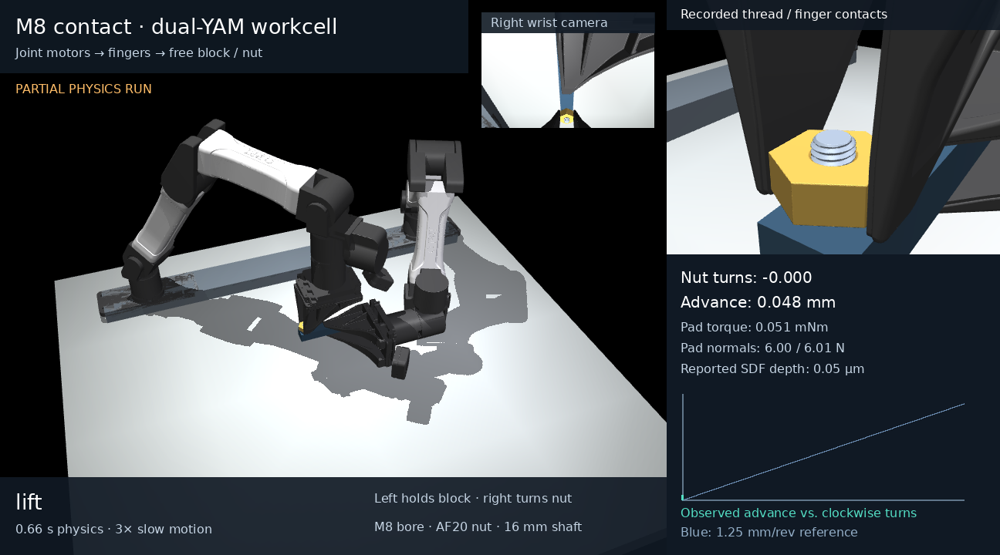
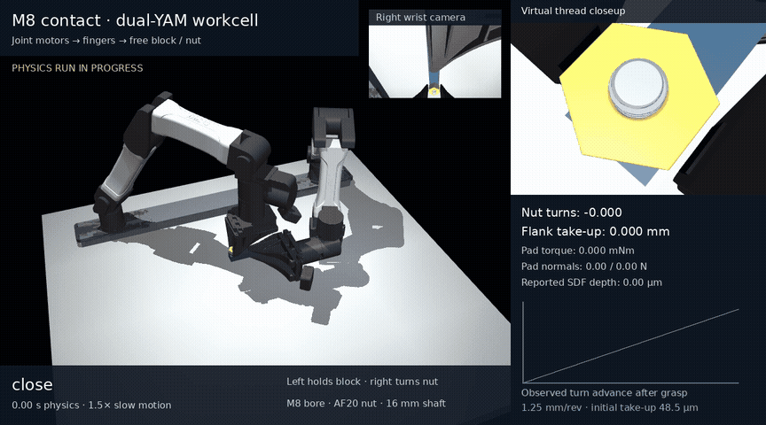

# Bimanual YAM M8 contact task

The left YAM arm holds a free aluminum block carrying a short M8 bolt. The
right YAM arm turns a larger steel nut with the same M8 threaded bore. Both
workpieces are free bodies. The actual robot joint motors and sliding fingers
supply the forces; there is no grasp weld, screw joint, nut motor, or imposed
axial trajectory.

[](../media/yam_m8/hold.mp4)

[](../media/yam_m8/turn_progress.mp4)

The [complete three-stroke reference demo](../media/yam_m8/reference_demo.mp4)
passes all 15 nominal gates. Its 120° strokes pass the unchanged 8.33 µm
lead-error gate (errors 2.991, 3.082 and 3.142 µm). Both open resets have zero
hand/nut contacts, with 14.0 and 7.37 nm of axial creep. See the
[rollout checks](../media/yam_m8/reference_validation.json),
[raw states](../media/yam_m8/reference_trace.npz), and
[independent audit](../media/yam_m8/reference_independent_audit.json).
The original soft left grip rotates by 1.896°, close to its 2° limit; a
left-contact sticking comparison is still in progress.
The inspection camera keeps the nut visible
between the actual fingers; the inset is the real model's wrist camera. The
advance plot uses the measured post-grasp baseline and reports initial flank
take-up separately; no simulated state or motion command is corrected.

The earlier grasp/lift clip replays the actual 1.32 s hold/lift trajectory
at 3× slow motion. It passes the hold, alignment, support and drive checks;
its full-demo report deliberately remains incomplete because it contains no
turning strokes or open resets.

## Requested geometry

| Part | Dimensions | Simulated mass |
|---|---|---|
| Steel nut | 20 mm across flats, 8 mm tall, M8 bore | 18.985 g |
| Steel threaded shaft | 16 mm long, M8 × 1.25 | 4.995 g |
| Aluminum mounting block | 20 × 120 × 16 mm | 103.680 g |

The M8 right-hand pitch, 60° flank profile, declared clearance and μ=0.15
thread friction are inherited from the independent contact experiment. The
larger nut's outer dimensions and the shorter shaft have independently
integrated steel mass properties. The nut uses symmetric diagonal inertia;
tiny integrated COM/product terms are neglected. The short bolt retains its
integrated COM and full inertia tensor. [Quadrature convergence](../media/yam_m8/mass_properties.json)
compares 1,048,576 and 4,194,304 samples.

The left arm clamps vertically across the block's 16 mm thickness, near the
assembly's center of mass. This lets normal forces carry its weight. Its
14.4 mm requested aperture produces about 16.6 / 15.3 N at the two pads;
the right arm requests 19.4 mm around the 20 mm nut and produces about 6 N
per pad. All four finger actuators remain capped at 20 N. The 9 × 3 × 5.5 mm
pad inserts and μ=0.8 pad friction are declared reconstruction assumptions.
Their positions near the real fingertips permit clearance around the short
shaft. Native arm, camera and finger collision meshes remain active.

## Verified holding behavior

The left arm commands a 4 mm lift through finite joint torques. The actual
block rises **3.829 mm**, with zero world-support contacts, zero externally
applied nut/block forces, and no solver warning. The initial clamp moves the
block about 138 µm relative to the left grasp. After clamping, the lift/hold
adds at most **3.56 µm** of relative movement; the last 100 ms hold changes
that position by **73.7 nm**. These are measurements, not prescribed block
coordinates. See the [rollout checks](../media/yam_m8/hold_validation.json),
[independent pose audit](../media/yam_m8/hold_independent_audit.json), and
[raw recorded states](../media/yam_m8/hold_trace.npz).

The initial side clamp was inadequate: the block rotated within the pads at
about 0.0616 rad/s. MuJoCo's soft tangential constraints permit slow slippage
under sustained load. A separate stiffer-contact probe confirmed that cause.
The final vertical clamp fixes the grasp geometry while retaining the original
left contact settings, thread friction and solver parameters.

## Controls, task scope, and validation

The demo commands bounded joint torques on both real arms: 28 N m at joints
1–3 and 10 N m at joints 4–6. Arm gravity/bias and known viscous damping are
compensated within those same caps. During a turn, the right hand has no axial
position spring or velocity damper and receives a constant 0.05 N axial feed.
It follows the measured bolt frame laterally and rotationally. Nut depth,
nut yaw and pitch do not enter its motion commands.

The schedule uses three 120° strokes, with open-hand resets and regrasping,
to respect the native wrist limits. Full-demo gates require measured lead
error below 8.33 µm per stroke, angular error below 0.03 rad, radial offset
below 150 µm, tilt below 2°, reported SDF depth below 10 µm, no world support,
retained left grasp, no object drive, and zero hand/nut contacts during each
open reset. A full run exits with failure when its checks fail. Reported SDF
depth is a native contact-distance proxy, not a certified physical-overlap
measurement.

Reset places the arms at ready grasp poses with the nut already engaged and
the left pads touching the free block. Finite finger actuators then acquire
the grip. The nut settles about 48.5 µm within the declared backlash before
turning. The task does not demonstrate pickup, thread starting, bolt seating,
preload or material deformation. Geometry comes from the video and declared
dimensions; contact forces, friction, motor limits and hardware response have
not been calibrated against the physical setup.

**Physics qualification remains incomplete.** The original independent load
suite passes 13/19 individual cases, and contact-search travel convergence
misses its strict 2% gate. The larger nut/free fixture does not inherit a full
qualification from the smaller fixed-bolt experiment. Read
[the remaining failures](m8_status.md) before treating this as training evidence.

## Run and replay

Use the verified native MuJoCo CPU runtime, not the stock wheel or MJLab's
GPU path. The custom native SDF plugin is not supported by that GPU path.
Newton's CUDA thread example was not run on this CPU-only machine.

```bash
scripts/setup.sh
scripts/run_m8.sh -m pytest -q
scripts/run_m8.sh -m yam_twin.m8_demo --output outputs/yam_m8/demo \
  --dt .00005 --angular-speed 1 --video
scripts/run_m8.sh -m yam_twin.m8_demo --replay media/yam_m8/hold_trace.npz \
  --output outputs/yam_m8/hold --slow-motion 3
scripts/run_m8.sh scripts/audit_yam_m8_geometry.py
scripts/run_m8.sh scripts/audit_yam_m8_trace.py media/yam_m8/hold_trace.npz
```

Rendering replays saved `qpos/qvel` states and checks portable model/mesh
provenance. It runs no physical rollout and synthesizes no nut trajectory.
`--export-only` writes a native `MjSpec` ZIP containing the YAM mesh assets;
loading its custom thread plugin still requires the matched engine.
The [97 software tests pass](../media/yam_m8/software_tests.json). Software
tests and short successful holding checks do not establish policy stability.

`yam_twin.m8_env.YamM8Env` exposes 14 normalized actions: 12 actual arm motor
torques and two mirrored finger apertures. Its 98 privileged observations
include both arms, the free block, moving bolt frame, relative nut motion and
contact loads. Success requires both pads of each hand to carry load, no world
support, and a retained left grasp. Invalid thread alignment, depth, phase,
state, solver warnings or externally driven workpieces terminate with reward
−1. No scripted demo controller runs inside a policy step, and no policy has
been trained.
