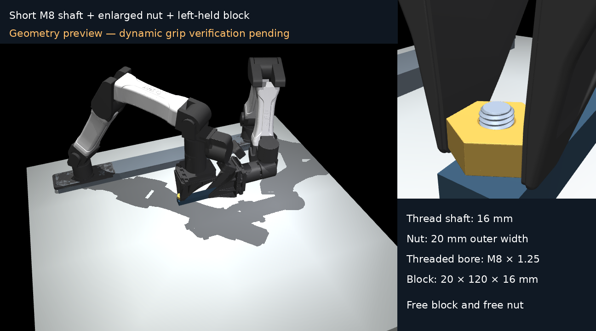
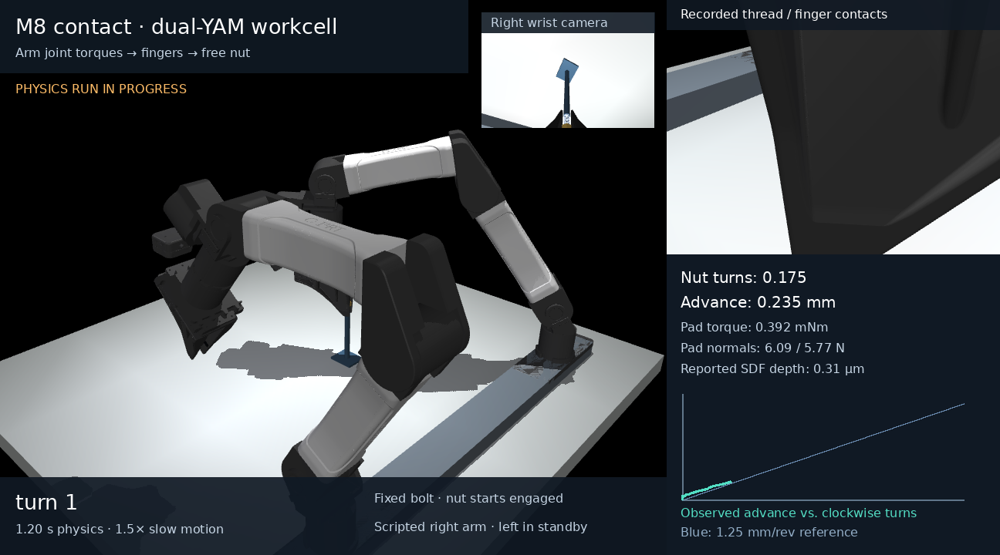

# M8 contact integration in the dual-YAM environment

Work in progress: the passive M8 model now compiles in the real dual-YAM
workcell. The shortened bolt is attached to a free aluminum block held by the
left arm. The right arm grasps a larger nut with the same M8 threaded bore.
Pads are attached to the native sliding finger bodies. Both block and nut
remain free bodies; the robot's joint motors supply all manipulation forces.

This is a geometry preview. Dynamic holding and turning checks are pending.
The shaft is 16 mm long; the nut is 20 mm across flats and 8 mm tall;
the aluminum block is 20 × 120 × 16 mm. The M8 × 1.25 bore, flank clearance and
thread friction are unchanged. Independent solid integration gives the steel
nut a mass of 18.985 g and the short steel bolt 4.995 g; the block weighs
103.680 g. The complete 120° right-arm stroke and left grip pass the static
reach and collision audit. No grasp weld or fixture support is used.

The image above is the previous exploratory turn, not an accepted demo. A three-stroke
120° schedule fits the native wrist limits and preserves hex-flat alignment
when the fingers open, reset, and regrasp. The first grasp transmits about
5.94 N per pad and the commanded 0.05 N axial feed. The first turn fails the
strict per-stroke lead check: 26 µm residual versus an 8.3 µm limit, accompanied
by nut rocking and arm orientation tracking error. Controller work is underway;
the thread geometry, friction, contact parameters and gates remain unchanged.

The source, runnable full demo, recorded video and complete evidence will be
published after the arm-driven validation run. The original independent M8
[qualification limits](m8_status.md) remain in effect.
