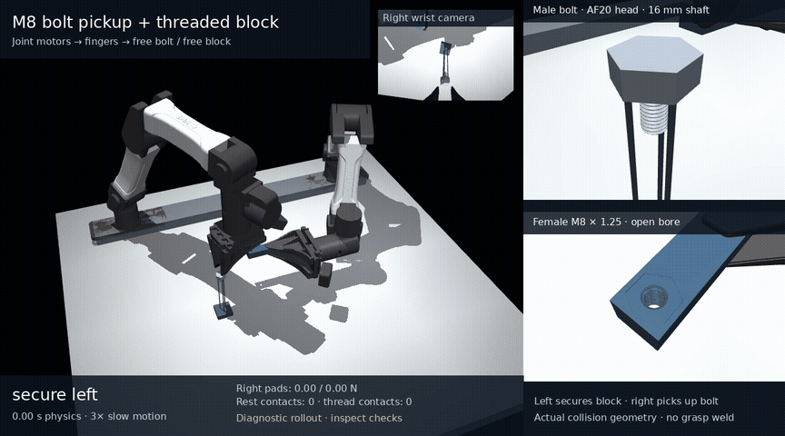

# YAM pickup and M8 thread starting

The female M8 × 1.25 through-hole is in a free aluminum block held by the
left YAM arm. A separate steel bolt has a 16 mm shaft and an AF20 × 8 mm
solid head. The right arm reaches for it, closes its real fingers, lifts it
off a physical three-pin rest, transports it over the hole, and searches for
the thread with finite motor torques and an axially floating hand.

[](../media/m8_insertion/pickup/demo.mp4)

## Current recorded results

The 2.72 s pickup/transport trajectory passes its pickup checks. Both right
pads carry at least 5.94 N, and the bolt has zero world-support contacts
during transport. Its measured movement within the right grasp stays below
41.75 µm. The left arm lifts the free block 3.849 mm. Independent replay
checks native joint margins, finite motor commands, actual object poses and
support disappearance. The [raw trajectory](../media/m8_insertion/pickup/trace.npz),
[rollout checks](../media/m8_insertion/pickup/validation.json),
[preserved executed controller](../media/m8_insertion/pickup/controller_source.py),
and [independent audit](../media/m8_insertion/pickup/independent_audit.json)
are published. The full-demo result remains false because pickup alone
contains no qualified threading strokes.

The first actual robot search stroke also completes without a guard abort.
It reaches approximately 2.125 mm total insertion. Only about 0.116 mm of
fully formed flank overlaps, so it is correctly not marked engaged. The
full multi-stroke starting/reset/lead-qualification run is in progress.
Watch the [recorded first entry stroke](../media/m8_insertion/first_start/demo.mp4)
and its [independent entry-only audit](../media/m8_insertion/first_start/independent_audit.json).

An environment restart interrupted the earlier full trials. Their original
partial traces, executed sources, interruption records and audits are preserved
under [interrupted trials](../media/m8_insertion/interrupted). The legacy
continuous-force trial reached capture and an unsupported reset, then stopped
before its first qualification turn. It has no final acceptance result.
The current full run starts again from the separate bolt's original pickup
state; no trajectory is spliced from those checkpoints.

The separate fixed-female/free-bolt contact experiment starts from 0.5 mm
separation and an arbitrary angular phase. Its conservative full-flank window
measures **1.2500516 mm/revolution**, while the original broad entry-region
fit remains failed. A zero-rotation feed test stops at **1.400317 mm** and
does not push through the threads. These tests use an explicitly declared
bounded ideal fixture wrench; they do not qualify robot force transmission.
See [the physics investigation and limits](m8_insertion_physics.md).

Halving the timestep and doubling the search points both pass the declared
strict 2% total-travel, complete-flank-window travel and lead comparisons.
Doubling search points changes the peak reported contact depth by 45.02%,
so this depth proxy fails its separate 2% comparison. These refinements
qualify motion in the ideal fixture only. The [comparison, raw cases and
preserved failures](../media/m8_insertion/refinement/README.md) are published.

## Geometry and controls

The block is 20 × 120 × 16 mm and weighs 101.814 g after subtracting the real
helical bore. Its collision geometry tiles the rectangular solid around an
AF16 female-thread SDF prism without overlapping volumes or a box covering
the opening. The solid steel head and independently integrated shaft weigh
26.750 g together. Both thread frames point down; the unchanged exact M8
SDF geometry supplies contact surfaces only.

The left arm starts with its pads touching the block and acquires the grip
through finite finger forces. The right arm starts open, 20 mm above the
separate bolt head, then physically reaches and closes. Only actual YAM joint
and finger motors are commanded. The free bolt and block have no actuator,
grasp weld, external wrench, or prescribed screw trajectory.

During thread search/turning, the right controller removes axial position and
velocity servo forces. A constant net 0.05 N axial feed is produced through
bounded arm torques, including the declared bolt-weight compensation. Nut
or bolt yaw is never converted into a commanded axial position. Lateral and
orientation targets follow the measured moving hole frame.

Full engagement is distinct from cone contact. The geometry observer requires
one whole pitch of complete, unchamfered flank overlap, accounting for tilt
and the female exit. It also checks actual loaded contacts inside both
unchamfered axial spans. Qualified closed strokes independently require
measured pitch agreement within 2%. Search resets and qualified unseated
thread resets have separate reports; head/block seating cannot supply a
thread self-locking claim.

The current demo uses a versioned capture observer: 0.2 s of valid complete-ring
geometry, at least 0.001 N·s of measured interior-contact normal impulse,
at least 0.5 ms of loaded contact, and at most 150 µm helix-phase variation.
Normal impulse establishes loaded contact; it does not establish axial force
balance. Actual lead and unsupported open resets independently qualify
engagement. Every saved sample records the window metrics.

The earlier observer required 0.2 s of uninterrupted positive contact force.
Zero-margin unilateral contacts have real force gaps even during correct
pitch-following motion. That criterion remains a separate diagnostic, and
the original trial retains its executed source and outcome. The new trial
starts again from the unengaged pickup. Contact geometry, force laws, motor
bounds, lead limits and reset limits are unchanged.

## Run and replay

Use the verified native MuJoCo CPU launcher. This is separate from the legacy
MJLab bridge; no GPU or learned policy is used.

```bash
scripts/run_m8.sh -m yam_twin.m8_insertion_demo --preview
scripts/run_m8.sh -m yam_twin.m8_insertion_demo \
  --output outputs/m8_insertion/demo --dt .00005 \
  --stroke-degrees 180 --angular-speed 2 --maximum-starting-strokes 5 --video
scripts/run_m8.sh -m yam_twin.m8_insertion_demo \
  --replay media/m8_insertion/pickup/trace.npz \
  --output outputs/m8_insertion/pickup_replay --slow-motion 3
scripts/run_m8.sh scripts/audit_m8_insertion_trace.py \
  media/m8_insertion/pickup/trace.npz
scripts/run_m8.sh scripts/probe_m8_thread_start.py \
  --duration 5.5 --output outputs/m8_insertion/geometry_start
```

Physical thread integration can take tens of minutes on CPU. Rendering
replays recorded states without simulating or inventing object motion. The
full robot command can fail when strict gates fail. The fixture probe retains
its original failed broad lead test even when its separate full-flank
diagnostic passes; inspect every result and its scope.

`yam_twin.m8_insertion_env.YamM8InsertionEnv` exposes 14 bounded actual
motor/jaw actions and 118 privileged observations, including pickup history,
grasp slips, moving-thread geometry and measured contact impulse. Policy
steps contain no scripted pickup controller. Success requires retained,
unsupported grasps and independently measured rotation/advance within 2%
of pitch after full-flank engagement. No policy has been trained.

This task does not yet demonstrate full head seating, tightening preload,
thread damage or calibrated hardware response. Original independent
load/search failures remain in [the mechanics status](m8_status.md).
