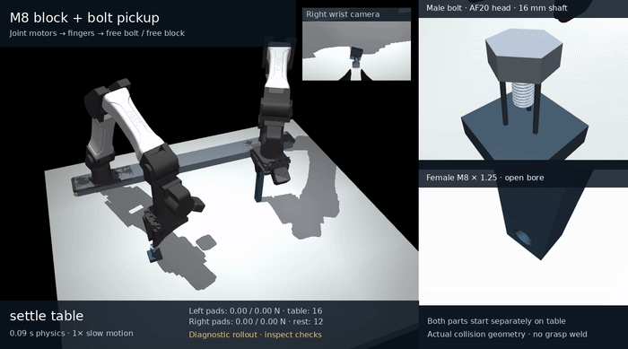

# YAM tabletop pickup and M8 thread starting

Both YAM hands begin open and separate from the workpieces. The left arm
physically picks up the free female-threaded block from the table, lifts it
and rotates/transports it into the assembly pose. The right arm picks up the
separate headed M8 × 1.25 bolt, establishes starting contact, searches through
three starting strokes, captures complete flanks, releases/regrasps and turns.
Only bounded native joint and finger motors act on the robot. The block and
bolt have no actuator, grasp weld, external drive or prescribed screw motion.

[](../media/m8_table_pickup/full/demo.mp4)

[Normal-speed MP4](../media/m8_table_pickup/full/demo.mp4) ·
[Screenshot](../media/m8_table_pickup/full/demo.png) ·
[Measured motion/contact chart](../media/m8_table_pickup/full/trajectory.png) ·
[Exact raw evidence and source manifest](../media/m8_table_pickup/full)

## Completed physical rollout and retained failure

The fresh, unspliced **43.63610 s** faster rollout completes all **49 executed
phases**, including both pickups, capture, two qualified half-turns and four
open resets. It has `partial=false` and `aborted=null`. The normal 1× video
contains 524 frames at 12 fps, with 43.67 s playback.

**22 of 23 recorded checks pass. The original overall `passed=false` remains.**
The failed check is strict continuous bilateral left-pad preload: the raw
history covers **842,723** post-acquisition physics steps at 50 µs and records
**9 / 6 isolated unloaded steps**, each 50 µs long, totaling **450 / 300 µs**.
The coarser sampled load check passes. Its success does not override the
all-substep failure, and the gate has not been relaxed.

The completed pickup/capture/turn sequence is physical evidence for this
nominal condition. It is not full physics, hardware or policy-training
qualification. The head remains unseated: final thread overlap is
**4.62537 mm**, with **2.62041 mm** of potential fully formed flank overlap.

| Qualified stroke | Measured rotation | Axial advance | Signed pitch residual |
| --- | ---: | ---: | ---: |
| `turn_1` | 180.01536° | 622.591 µm | −2.462 µm |
| `turn_2` | 180.01535° | 622.897 µm | −2.156 µm |

The strokes total **1.000085 measured revolutions and 1.245488 mm travel**.
Both remain captured and pass the unchanged 2% lead limit, approximately
±12.5 µm for each half-turn. Residuals compare actual axial motion with
1.25 mm pitch times actual rotation; no axial helix is commanded.

| Captured open reset | All-substep peak axial drift | Peak yaw drift | Hand / world / head-seating contacts |
| --- | ---: | ---: | --- |
| `reset_open_1` | 0.178 µm | 0.363 mrad | 0 / 0 / 0 |
| `reset_open_2` | 0.424 µm | 0.377 mrad | 0 / 0 / 0 |

The two earlier search resets have partial starting geometry, with about
0.126 / 0.760 mm formed-flank overlap, below the one-pitch capture condition.
They are unqualified lead-in recoveries, not strictly cone-only contact and
not complete-flank self-locking evidence. Independent collision replay checks
296 saved poses in each of all four resets; every candidate is either the
true thread pair or left-pad/block contact, with zero other native candidates.

The left arm acquires its reference after actual loaded closure and lifts
the block **59.965 mm** at 2.4 s. Subsequent lift/rotation/holding retain at
least **47.062 mm** center elevation relative to its initial tabletop pose,
with zero world support after lift. Both hands have zero initial workpiece
contacts. Peak grasp translation is **227.50 µm** at the block and
**625.47 µm** at the bolt. Minimum sampled loaded pad normals are
**15.91 / 15.02 N** on the left and **5.78 / 5.62 N** during declared right
transport/closed-turn phases. These sampled minima are distinct from the
raw continuous-load check above.

Peak native reported thread-depth proxy is **1.049 µm**, radial offset
**56.52 µm** and tilt **0.2192°**. Minimum actual arm-joint margin is
**0.033856 rad**. The depth proxy is a solver measurement rather than an
independent solid-overlap certificate.

## Evidence and verification scope

The [canonical package](../media/m8_table_pickup/full) contains the exact
closed trace, unchanged original validation, XML and source archives, native
runtime/mesh identities, raw per-physics-step pad forces, independent audits
and media/chart provenance. The independent capture, geometry, reset-contact,
free-joint and raw-force consistency audits pass; they preserve the failed
preload outcome. Both free objects have zero damping, friction loss, armature,
springs, gravity compensation and artificial fluid forces. The model has
16 native robot joint actuators and two native finger-coupling equalities.

[Original validation](../media/m8_table_pickup/full/validation.json) ·
[Closed raw trace](../media/m8_table_pickup/full/trace.npz) ·
[Primary manifest](../media/m8_table_pickup/full/manifest.json) ·
[Independent capture/geometry audit](../media/m8_table_pickup/full/independent_capture_audit.json) ·
[Reset-contact audit](../media/m8_table_pickup/full/independent_reset_contact_audit.json) ·
[Raw-force consistency audit](../media/m8_table_pickup/full/independent_left_pad_force_history_audit.json)

Saved-pose auditing recomputes geometry and collision candidates without
integrating physics or reconstructing original forces. Original native
solved forces/contact data belong to the pre-integration state at recorded
time minus one timestep; saved qpos/qvel are post-integration. The rollout
report supplies all-substep contact/drift maxima, while the raw force archive
independently reproduces the continuous preload statistics.

The executed native controller snapshot passed **176 software tests**, retained
with the trial. The current source passes **181 tests** after selecting the
already exercised 1 rad/s table default and correcting policy reward credit.
The [current proof](../media/m8_table_pickup/software_tests.json) records
unchanged source hashes; its [manifest](../media/m8_table_pickup/software_manifest.json)
binds the log and executed verifier. Software tests do not certify the failed
physics check or hardware fidelity.
The [zero-step default-configuration comparison](../media/m8_table_pickup/default_configuration_match.json)
confirms that current scene/control settings exactly match the archived
completed faster trial. It is configuration evidence, not another physics run.

## Scene and native controls

The block is 20 × 120 × 16 mm and weighs 101.814 g after subtracting its
real helical bore. Non-overlapping collision pieces tile the rectangular
solid around an AF16 female-thread SDF prism; no box covers the opening.
The steel bolt has a 16 mm shaft and solid AF20 × 8 mm head, weighing
26.750 g together with independently integrated inertia.

The block initially stands on its 20 × 16 mm short end at approximately
(0.25, 0.15, 0.060) m, with a declared 10 nm resting overlap to create the
native table candidate. Gravity establishes the load. Upright placement
gives the native fingers/wrist table clearance; the robot physically rolls
it flat after lift. The bolt head starts separately at (0.36, −0.22, 0.040) m
on a low three-pin rest that leaves the shaft clear. Initial table/rest
support is permitted and measured; support after pickup must be zero.

Left-pad normal compliance is explicitly numerical: original box geometry,
`solref=(-31250, -2500)`, 0.8 ms tangential regularization, μ=0.8, zero margin
and the declared impedance. These mass-normalized acceleration-reference
parameters are not physical N/m or N·s/m material constants. Their observed
force/indentation mapping depends on pose, inertia, contact patch and coupled
constraints; they do not define calibrated rubber properties. See
[the compliance investigation](m8_insertion_physics.md#pad-compliance-in-the-table-pickup-extension).

During floating entry/search/turning the right controller removes the axial
position spring. Bounded native arm torques supply constant net 0.05 N feed,
declared bolt-weight compensation and velocity-only damping `F=-50*v`, where
`v` is hand axial velocity relative to the moving hole. No yaw-to-position
rule acts on the bolt. Lateral/orientation targets follow the measured hole.
The current table CLI defaults to 180° strokes, **1 rad/s starting speed**,
**2 rad/s qualified speed**, five maximum starting strokes, two qualification
strokes, 50 µs physics steps and 50 N·s/m axial damping.

`EntrySupportWindow v1` is starting-contact readiness, separate from capture.
It requires 50 ms of aligned geometry and actual relative axial bolt velocity
≤0.2 mm/s, ≥0.00025 N·s summed native thread-pair normal impulse, ≥5 ms above
0.005 N load, and loaded contact at transition. This cone-inclusive normal
load is not axial weight support. Closed-jaw readiness permits a physical
release attempt; it proves neither unsupported holding nor formed capture.

Force-only entry and uncaptured starting-stop dwells are bounded to 3 s by
`--maximum-entry-dwell`. Their acquisition timeouts retain closed jaws. A
separate pre-reset check can fail after opening and requires current measured
thread load before moving the open hand. Actual open-grip contact/drift audits
provide holding evidence. Depth, alignment, motor bounds and lead/reset
limits remain unchanged.

`LoadedFlankWindow v1` requires one whole pitch of complete, unchamfered
flank overlap, accounting for tilt and the female exit, plus 0.2 s valid
geometry, ≥0.001 N·s interior normal impulse, ≥0.5 ms loaded contact and
≤150 µm helix-phase variation. Normal impulse is not axial load balance.
Candidate capture occurs at **31.3403 s** in the original all-substep report;
the independent first saved candidate is at **31.34495 s**. Actual lead and
unsupported unseated resets separately establish nominal engagement.
The legacy uninterrupted 0.2 s force diagnostic also tags at 33.7902 s.

## Run and replay

Use the verified native MuJoCo CPU launcher, separately from the legacy
MJLab bridge. No GPU or learned policy is used. The default now matches
the completed faster configuration; `--slow-motion 1` selects normal playback.

```bash
scripts/run_m8.sh -m yam_twin.m8_insertion_demo --preview
scripts/run_m8.sh -m yam_twin.m8_insertion_demo \
  --output outputs/m8_table_pickup/demo --dt .00005 \
  --stroke-degrees 180 --angular-speed 2 --starting-angular-speed 1 \
  --maximum-starting-strokes 5 --maximum-entry-dwell 3 \
  --axial-damping 50 --slow-motion 1 --video
scripts/run_m8.sh -m yam_twin.m8_insertion_demo \
  --replay media/m8_table_pickup/full/trace.npz \
  --output outputs/m8_table_pickup/full_replay --slow-motion 1
scripts/run_m8.sh scripts/audit_m8_insertion_capture.py \
  media/m8_table_pickup/full/trace.npz
scripts/run_m8.sh scripts/audit_m8_insertion_reset_contacts.py \
  media/m8_table_pickup/full/trace.npz
scripts/run_m8.sh scripts/audit_m8_free_joint_properties.py \
  media/m8_table_pickup/full/trace.npz
scripts/run_m8.sh scripts/audit_m8_left_pad_force_history.py \
  media/m8_table_pickup/full/trace.npz
scripts/run_m8.sh -m yam_twin.m8_insertion_demo --preheld-block \
  --output outputs/m8_insertion/preheld_demo --dt .00005 \
  --stroke-degrees 180 --angular-speed 2 --maximum-starting-strokes 5 --video
```

Physics integration can take tens of minutes on CPU. Rendering selects
recorded states without integration, interpolation or pose editing. The
current completed demo command still exits unsuccessfully while the original
strict preload check fails. `--preheld-block` explicitly preserves the earlier
left-touching scene, zero damping, disabled entry dwells and starting speed
equal to qualified speed. `--axial-damping 0` explicitly disables damping.

## Policy interface and limits

`YamM8InsertionEnv` exposes 14 bounded actual torque/jaw actions and 118
privileged observations. It defaults to both workpieces on table/rest when
no model/config is supplied; explicit `scene_config=InsertionConfig()` selects
the historical left-touching reset. Policy steps have no scripted pickup or
measured-entry demo controller. Both physical pickups are required before
capture/reward. A retained loaded block lift ≥3 mm and zero table support
freeze its grasp reference; the bolt must lift ≥5 mm from its rest.
Separate acquisition times, support histories, lift/reference flags and
contact-window diagnostics are in `info`. Temporal window state is not part
of the 118-number vector; policy history may be needed.

Success requires retained unsupported grasps, formed engagement and actual
rotation/advance within 2% of pitch. It does **not** enforce the demo's
open-release/reset self-locking sequence or strict zero-gap left-pad criterion.
A success flag therefore does not certify those checks. Native joint-range
violations over 10 µrad terminate; current/minimum margins are in `info`.
The current reward correction prevents an invalid unloaded retreat followed
by loaded return from earning extra insertion credit; five regression cases
cover repeated/invalid and valid progress paths. This changes reward
bookkeeping, not the archived native demonstration.

No policy has been trained or checked over a useful training horizon. Full
seating, elastic tightening preload, damage/wear and hardware response remain
unqualified. The isolated fixture's timestep/search travel and lead refinements
pass 2%, but its peak reported-depth search comparison fails by 45.02%.
Original broad entry fits, load failures and free-body search failures remain
in [physics investigation](m8_insertion_physics.md),
[refinement evidence](../media/m8_insertion/refinement/README.md) and
[mechanics status](m8_status.md). Limited cold-state branches retain target
mismatches and do not replace the continuous canonical run.

## Slower attempt and archived evidence

The explicit **0.5 rad/s** [slower trial](../media/m8_table_pickup/failures/conservative_second_turn_grasp_abort)
passes its first qualified stroke but aborts in `turn_2` at **59.9922 s**:
bolt grasp slip reaches **1.0000000205 mm**, over the unchanged 1 mm guard.
Its second stroke is partial, with 360.751 µm travel and −59.533 µm residual;
18/23 checks pass. Its failed result and historical 176-test proof remain.
It is not a successful slow configuration or complete speed comparison.

The [earlier left-touching-block rollout](../media/m8_insertion/full)
passes all 18 original nominal gates: one measured revolution advances
1.245793 mm. It starts with pads already touching the block and therefore
has a different pickup scope; its original 126-test proof remains valid for
that archived snapshot. Its [MP4](../media/m8_insertion/full/demo.mp4),
[audits](../media/m8_insertion/full/independent_capture_audit.json) and
[task source](../media/m8_insertion/full/controller_source.py) remain unchanged.

Earlier progress prefixes remain explicitly incomplete:
[faster first start](../media/m8_table_pickup/progress_faster_start),
[earlier first recovery](../media/m8_table_pickup/progress_first_start),
[settled-entry image](../media/m8_table_pickup/progress_settled_entry.png), and
[candidate-capture image/provenance](../media/m8_table_pickup/progress_candidate_capture.json).
Their frames do not substitute for the closed report and audits.

Preserved failures include the [undamped depth/camera-contact abort](../media/m8_table_pickup/failures/full_v10_depth_abort),
[damped second-opening depth abort](../media/m8_table_pickup/failures/damped_second_release_abort),
[direct-normal pickup preload failure](../media/m8_table_pickup/failures/roll_3s_direct_normal_50us_allsteps),
[rejected soft-pad backing contacts](../media/m8_table_pickup/failures/roll_3s_assumed_compliance_50us_allsteps),
[its interrupted full prefix](../media/m8_table_pickup/interrupted_soft_pad_full),
[its historical software proof](../media/m8_table_pickup/rejected_soft_pad_software),
and [earlier block-pickup force-gap diagnostic](../media/m8_table_pickup/failures/roll_3s_normal8ms_friction0p8ms_50us).
Original interrupted legacy trials remain under
[interrupted starting trials](../media/m8_insertion/interrupted). No checkpoint
was used to splice either fresh full tabletop trajectory.
