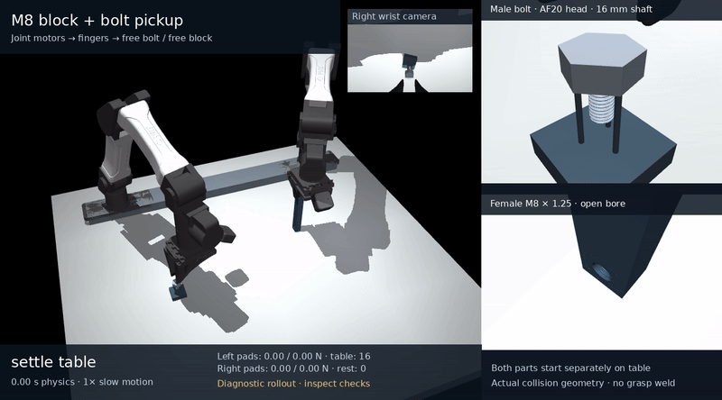
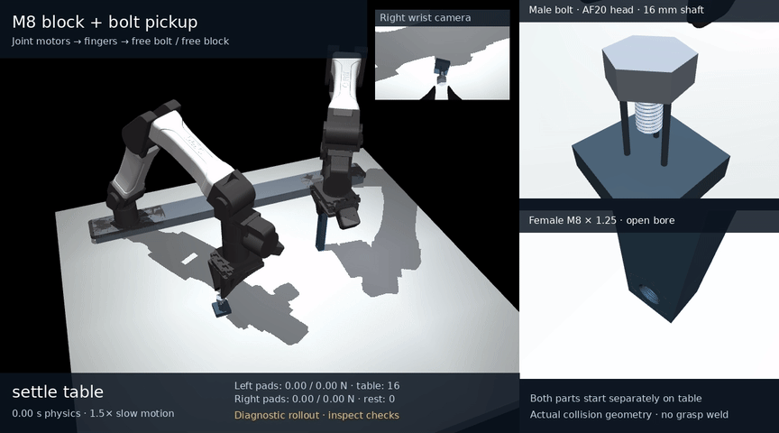

# YAM block and bolt pickup with M8 thread starting

The current table-pickup mode starts with a free aluminum block on the table
and a separate steel bolt on a low three-pin rest. The left arm begins open,
reaches the block, closes its real fingers, lifts it, and rotates/transports
it into the assembly pose. The right arm then physically picks up the bolt,
transports it over the female M8 × 1.25 through-hole, and searches for the
thread with finite motor torques and an axially floating hand. The bolt has
a 16 mm shaft and an AF20 × 8 mm solid head.

The frozen measured-entry controller and CLI pass [176 software tests](../media/m8_table_pickup/software_tests.json)
in 75.52 s with unchanged recorded source hashes; the
[manifest](../media/m8_table_pickup/software_manifest.json) binds the proof and executed verification script.
Its fresh full physics runs start again with both workpieces separately
supported, without reusing a checkpoint, at 0.5 and 1 rad/s starting speed.
**No completed current full tabletop threading task is demonstrated;
the fresh results remain pending.**
The earlier damped full attempt and its separate 167-test source proof remain
preserved below. The
published earlier nominal rollout farther below starts with the left pads
touching the block. Its result establishes bolt pickup and threading,
not block pickup.

The [earlier initial table layout](../media/m8_table_pickup/preview.png) and its
[configuration](../media/m8_table_pickup/preview.json) are a static preview,
with the earlier side-bolt placement.
The current table CLI defaults are 50 µs physics steps, 180° strokes,
0.5 rad/s peak starting speed, 2 rad/s peak qualified-turn speed, at most
five starting strokes, and two qualification strokes. Entry/support dwells
are bounded to 3 s and axial velocity damping defaults to 50 N·s/m. Recorded preview
configurations retain their own original parameters.

[](../media/m8_table_pickup/progress_faster_start/demo.mp4)

[Faster pickup/start MP4](../media/m8_table_pickup/progress_faster_start/demo.mp4) ·
[GIF](../media/m8_table_pickup/progress_faster_start/demo.gif) ·
[Screenshot](../media/m8_table_pickup/progress_faster_start/demo.png) ·
[Exact progress sources and scope](../media/m8_table_pickup/progress_faster_start)

This actual recorded progress prefix uses a **1 rad/s starting command** and
**normal 1× playback**. It ends at **19.0268 s**, after the first regrasp and
before the second starting stroke. It shows both physical pickups, settled
entry, the first starting stroke and opening/reset/regrasp. Capture remains
false throughout; the final potential formed-flank overlap is about 0.125 mm,
below the required 1.25 mm pitch. It supplies no formed-thread capture,
support or qualified lead proof. The [actual settled-entry screenshot](../media/m8_table_pickup/progress_settled_entry.png)
and its [recorded metadata](../media/m8_table_pickup/progress_settled_entry.json)
come from the separate 0.5 rad/s run and show starting contact, not capture.

The [earlier 14.18785 s start/recovery clip](../media/m8_table_pickup/progress_first_start)
remains an archived prefix of the damped failed attempt described below.

The [closed damped full attempt](../media/m8_table_pickup/failures/damped_second_release_abort)
later aborts at **17.32385 s** during `release_search_3`: native depth reaches
**10.1288 µm**, exceeding the unchanged 10 µm guard. Tip overlap is only
1.648 mm and fully formed flank overlap is zero. The second shallow cone
stroke carries the bolt upward, stops without loaded thread contact, and
the following opening allows about 280 µm free fall before the guard stops
the run. It never reaches capture or qualifying turns. The first reset is
an unengaged recovery, rather than a formed-thread self-locking test.

Its saved-pose audit finds zero unexpected penetrating camera/backing
candidates with the revised side-bolt layout. Raw loads cover **316,478**
post-acquisition physics steps and retain the same strict preload failure:
9 / 6 isolated 50 µs unilateral gaps. Actual pickups and zero post-lift world
support do not override these recorded failures. The current revision adds
bounded waits for measured contact before rotation and unengaged opening,
with no axial position spring, pitch servo or relaxed physics guards.

[Damped-failure MP4](../media/m8_table_pickup/failures/damped_second_release_abort/demo.mp4) ·
[GIF](../media/m8_table_pickup/failures/damped_second_release_abort/demo.gif) ·
[Original report](../media/m8_table_pickup/failures/damped_second_release_abort/validation.json) ·
[Measured trajectory](../media/m8_table_pickup/failures/damped_second_release_abort/trajectory.png)

The [preserved failed full attempt](../media/m8_table_pickup/failures/full_v10_depth_abort)
actually picks up both objects, with a 59.965 mm block lift and zero world
support after each lift. It aborts at **12.15315 s** in `release_search_2`:
the native depth proxy reaches **10.562 µm**, exceeding the unchanged
**10 µm** guard. No formed-flank capture, qualifying turn or open reset was
executed. The force-driven floating hand rose during release; the released
bolt fell freely and struck the entry. That recorded physical motion is not
a hand-pose teleport. Its raw trace also retains 9 / 6 isolated 50 µs left
pad-load gaps and 120 sampled camera/jaw penetrating candidates, reaching
36.610 µm. `partial=false` names the requested full-task scope; the attempt
did not finish.

[Failed-attempt MP4](../media/m8_table_pickup/failures/full_v10_depth_abort/demo.mp4) ·
[GIF](../media/m8_table_pickup/failures/full_v10_depth_abort/demo.gif) ·
[Screenshot](../media/m8_table_pickup/failures/full_v10_depth_abort/demo.png) ·
[Measured trajectory](../media/m8_table_pickup/failures/full_v10_depth_abort/trajectory.png) ·
[Original report](../media/m8_table_pickup/failures/full_v10_depth_abort/validation.json)

The earlier [feed screenshot's exact trace link](../media/m8_table_pickup/progress_feed_trace_link.json)
binds it to this failed attempt. Its preserved 158-test source proof is
separate from the recorded 167-test damped-controller result.

The [recorded block-pickup diagnostic](../media/m8_table_pickup/failures/roll_3s_normal8ms_friction0p8ms_50us)
physically acquires the table-supported block, lifts it and rolls it into the
holding pose. It remains **failed and partial**: the every-physics-step pad
retention check records 26 isolated unloaded steps on one pad and 16 on the
other, each 50 µs long, despite the coarser saved-pose force check passing.
The pads are never both unloaded at the same step. The raw
[pad-force history](../media/m8_table_pickup/failures/roll_3s_normal8ms_friction0p8ms_50us/left_pad_force_history.npz)
and [original report](../media/m8_table_pickup/failures/roll_3s_normal8ms_friction0p8ms_50us/validation.json)
preserve that distinction. This bounded trial contains no full bolt-pickup
or thread qualification, and its gate has not been relaxed to claim success.

[](../media/m8_table_pickup/failures/roll_3s_normal8ms_friction0p8ms_50us/demo.mp4)

[Pickup MP4](../media/m8_table_pickup/failures/roll_3s_normal8ms_friction0p8ms_50us/demo.mp4) ·
[Pickup GIF](../media/m8_table_pickup/failures/roll_3s_normal8ms_friction0p8ms_50us/demo.gif) ·
[Pickup screenshot](../media/m8_table_pickup/failures/roll_3s_normal8ms_friction0p8ms_50us/demo.png) ·
[Media/source manifest](../media/m8_table_pickup/failures/roll_3s_normal8ms_friction0p8ms_50us/media_manifest.json)

The video replays the actual 5.55 s diagnostic at 1.5× slow motion; it does
not add a bolt-pickup or thread trajectory.

[](../media/m8_insertion/full/demo.mp4)

## Published earlier nominal rollout

The archived fresh, unspliced **27.35665 s** trajectory passes all **18 nominal gates**.
It starts with the left pads touching the block and the bolt on its rest,
acquires the finite-force left clamp, performs physical bolt pickup and transport,
searches through three starting strokes, captures complete flanks, opens the
right fingers to reset, regrips and performs two qualified half-turns. Those
two strokes give **1.000085 measured revolutions and 1.245793 mm axial travel**.
The final total axial thread overlap is **4.62465 mm**; the head is unseated.

| Qualified stroke | Measured rotation | Axial advance | Signed pitch residual |
| --- | ---: | ---: | ---: |
| `turn_1` | 180.0154° | 624.350 µm | −0.703 µm |
| `turn_2` | 180.0153° | 621.443 µm | −3.610 µm |

Both strokes pass the declared 2% lead limit. Residuals compare actual axial
motion with M8 × 1.25 pitch times actual rotation; no helix is commanded.

| Captured open reset | All-substep peak axial drift | Peak yaw drift | Hand / world / head-seating contacts |
| --- | ---: | ---: | --- |
| `reset_open_1` | 0.253 µm | 0.669 mrad | 0 / 0 / 0 |
| `reset_open_2` | 0.083 µm | 0.168 mrad | 0 / 0 / 0 |

Earlier resets during thread search are reported separately and do not count
as complete-flank self-locking evidence. The left arm physically lifts the
free block **3.846 mm**. Peak measured grasp translation is **131.08 µm**
at the block and **367.40 µm** at the bolt. Loaded sampled left pad forces
remain at least **15.57 / 14.81 N**. Right pad minima during the declared
transport/alignment/feed/closed-turn samples are **5.70 / 5.50 N**.
Minimum actual native arm-joint margin is **0.03467 rad**. No solver/state
abort, direct object drive or post-bolt-pickup world support occurs.

Published evidence:

- [Complete MP4](../media/m8_insertion/full/demo.mp4), [GIF](../media/m8_insertion/full/demo.gif) and [open-reset still](../media/m8_insertion/full/demo.png).
- [Actual trajectory](../media/m8_insertion/full/trace.npz), [all 18 gates and phase metrics](../media/m8_insertion/full/validation.json), [source/runtime manifest](../media/m8_insertion/full/manifest.json) and executed source archives.
- [Independent geometry/capture audit](../media/m8_insertion/full/independent_capture_audit.json), [all-candidate reset-contact audit](../media/m8_insertion/full_reset_contact_audit.json) and [free-joint property audit](../media/m8_insertion/full_free_joint_properties.json).
- [Measured motion/contact chart](../media/m8_insertion/full/trajectory.png) and [126-test software proof for the earlier source snapshot](../media/m8_insertion/software_tests.json).

The contact audit recomputes collision candidates at saved poses without
integrating physics. The rollout report supplies all-substep contact and
drift maxima; sampled replay cannot independently reconstruct forces between
samples. The free-joint audit separately checks zero joint damping, friction
loss, armature, springs, gravity compensation and fluid forces on both objects.

The [pickup-only trajectory](../media/m8_insertion/pickup) and
[first entry stroke](../media/m8_insertion/first_start) remain archived scoped
diagnostics. Their full-demo status remains incomplete; neither substitutes
for this completed rollout.

An environment restart interrupted the earlier full trials. Their original
partial traces, executed sources, interruption records and audits are preserved
under [interrupted trials](../media/m8_insertion/interrupted). The legacy
continuous-force trial reached capture and an unsupported reset, then stopped
before its first qualification turn. It has no final acceptance result.
The completed earlier run starts again from the separate bolt's original pickup
state; no trajectory is spliced from those checkpoints.

The separate fixed-female/free-bolt contact experiment starts from 0.5 mm
separation and an arbitrary angular phase. Its conservative full-flank window
measures **1.2500516 mm/revolution**, while the original broad entry-region
fit remains failed. A zero-rotation feed test stops at **1.400317 mm** and
does not push through the threads. These tests use an explicitly declared
bounded ideal fixture wrench; they do not qualify robot force transmission.
See [the physics investigation and limits](m8_insertion_physics.md).

Halving the timestep and doubling the search points both pass the declared
strict 2% total-travel, complete-flank-window travel and lead comparisons.
Doubling search points changes the peak reported contact depth by 45.02%,
so this depth proxy fails its separate 2% comparison. These refinements
qualify motion in the ideal fixture only. The [comparison, raw cases and
preserved failures](../media/m8_insertion/refinement/README.md) are published.

## Geometry and controls

The block is 20 × 120 × 16 mm and weighs 101.814 g after subtracting the real
helical bore. Its collision geometry tiles the rectangular solid around an
AF16 female-thread SDF prism without overlapping volumes or a box covering
the opening. The solid steel head and independently integrated shaft weigh
26.750 g together. Both thread frames point down in the assembly pose; the unchanged exact M8
SDF geometry supplies contact surfaces only.

In the current table-pickup mode, the block stands on its 20 × 16 mm short
end, with its center initially at (0.25, 0.15, 0.060) m. This upright placement
gives the native fingers and wrist clearance from the table; the block is
physically rotated flat after lifting. The male bolt starts separately, with
its head center at (0.36, −0.22, 0.040) m on a three-pin support that leaves
the shaft clear. Table support before acquisition is permitted and measured;
support after the declared lift must be zero. Both hands start open and clear
of their workpieces. The block's grasp reference is acquired after actual
closure rather than initialized as a held object.

Left-pad normal contact compliance is an explicit numerical assumption. Native
mass-normalized normal-penalty parameters do not identify a material modulus;
their force/indentation mapping depends on pose, inertia and contact patch.
The [compliance discussion](m8_insertion_physics.md#pad-compliance-in-the-table-pickup-extension)
explains the recorded indentation/load diagnostics and hardware-calibration
limit. Per-physics-step force gaps remain explicit failures, even when the
physical pickup movement completes.

The next full trial uses the original box pad geometry, direct normal
`solref=(-31250, -2500)`, and 0.8 ms tangential contact regularization.
A softer pilot was rejected after a separate clearance audit found native
finger-backing contacts; successful motion does not make those contacts
acceptable. This numerical contact model does not represent a calibrated
rubber material. Full-run results for the selected parameters remain pending.

The selected [direct-normal block-pickup pilot](../media/m8_table_pickup/failures/roll_3s_direct_normal_50us_allsteps)
still fails the unchanged strict load-retention gate: it records 9 / 6
isolated 50 µs unilateral force gaps. Its saved-pose geometry audit finds
zero nonpad left-hand/block candidates and at most 10.315 µm pad depth;
this sampled check does not establish every-substep backing clearance.
The [rejected softer pilot](../media/m8_table_pickup/failures/roll_3s_assumed_compliance_50us_allsteps)
records 1,720 penetrating native backing candidates at saved poses, with
18.46 µm maximum penetration. Its [interrupted full attempt](../media/m8_table_pickup/interrupted_soft_pad_full)
has no final validation and supplies no checkpoint for the fresh trial.
The [158-test proof for that rejected source snapshot](../media/m8_table_pickup/rejected_soft_pad_software)
is retained as software evidence, rather than physical acceptance of that model.
The earlier 158-test numerical-contact source proof remains inside the
failed full attempt. The recorded 167-test result was rerun after moving the
bolt and adding the native axial damping; it has a separate source-bound record.

The explicit `--preheld-block` mode preserves the earlier initial left pad
touching pose and finite-force clamp. The factory `InsertionConfig()` remains
that historical mode; `table_pickup_config()` selects the new table layout.
The demo CLI uses the table layout by default. The right arm starts open,
20 mm above the separate bolt head, then physically reaches and closes. Only actual YAM joint
and finger motors are commanded. The free bolt and block have no actuator,
grasp weld, external wrench, or prescribed screw trajectory.

During thread search/turning, the right controller removes the axial position
spring. It applies a constant net 0.05 N feed plus velocity-only damping
`F=-50*v` N through bounded native arm torques, including the declared
bolt-weight compensation. Here `v` is the hand's axial velocity relative to
the moving hole. This damping is active in floating phases, including release,
and has no axial position target or yaw-to-travel rule. Nut or bolt yaw is
never converted into a commanded axial position. Lateral and orientation
targets follow the measured moving hole frame.

The table demo defaults to 50 N·s/m damping. `--axial-damping` selects another
declared value; an explicit `--axial-damping 0` preserves undamped behavior.
The historical `--preheld-block` default remains zero damping. The policy
environment continues to expose actual torque actions, without this scripted
pickup controller.

Starting strokes use a declared 0.5 rad/s peak speed; qualification strokes
remain at 2 rad/s. `--starting-angular-speed` overrides the starting speed
independently. The slower command is a trajectory change, not evidence of
reduced contact error until the new continuous physics run is assessed.

The table demo uses `EntrySupportWindow v1` as a starting-contact readiness
test. It requires 50 ms of aligned geometry and actual bolt axial velocity
relative to the hole no greater than 0.2 mm/s, with at least 0.00025 N·s
native thread-pair normal impulse, at least 5 ms above 0.005 N normal load,
and a load above that threshold at the transition. This summed load includes
cone contact and is not a measurement of axial weight support. Readiness
with closed jaws permits a physical release attempt; it proves neither
unsupported holding nor formed-flank capture.

Force-only entry and uncaptured starting-stop dwells are each bounded to
3 s by `--maximum-entry-dwell`. Their acquisition timeouts retain closed
jaws. A separate guard requires current measured thread contact before
moving the open hand through a reset; that check can fail after the jaws
have opened. Actual open-grip contact/drift records, rather than the readiness
tag, determine whether the released bolt held. Feed, native force/torque
bounds, solver/depth/alignment limits and formed-capture/lead/reset gates
remain unchanged.

The historical `--preheld-block` mode disables these entry dwells and defaults
starting speed to the qualified speed. Limited cold-state branches retain
documented target mismatches and are diagnostic trials; they do not qualify
the new continuous table-pickup run.

Full engagement is distinct from cone contact. The geometry observer requires
one whole pitch of complete, unchamfered flank overlap, accounting for tilt
and the female exit. It also checks actual loaded contacts inside both
unchamfered axial spans. Qualified closed strokes independently require
measured pitch agreement within 2%. Search resets and qualified unseated
thread resets have separate reports; head/block seating cannot supply a
thread self-locking claim.

The demo and policy environment use the same versioned capture observer:
0.2 s of valid complete-ring
geometry, at least 0.001 N·s of measured interior-contact normal impulse,
at least 0.5 ms of loaded contact, and at most 150 µm helix-phase variation.
Normal impulse establishes loaded contact; it does not establish axial force
balance. Actual lead and unsupported open resets independently qualify
engagement. Every saved sample records the window metrics.

In the archived earlier rollout, the candidate capture tag occurs at
**16.063 s**. Qualification follows from the measured lead and unsupported
resets above, rather than the tag alone.

The earlier observer required 0.2 s of uninterrupted positive contact force.
Zero-margin unilateral contacts have real force gaps even during correct
pitch-following motion. That criterion remains a separate diagnostic, and
the original trial retains its executed source and outcome. The earlier completed
run also passes this legacy diagnostic at **22.44105 s**. Contact geometry,
force laws, motor bounds, lead limits and reset limits are unchanged.

## Run and replay

Use the verified native MuJoCo CPU launcher. This is separate from the legacy
MJLab bridge; no GPU or learned policy is used.

```bash
scripts/run_m8.sh -m yam_twin.m8_insertion_demo --preview
scripts/run_m8.sh -m yam_twin.m8_insertion_demo \
  --output outputs/m8_table_pickup/demo --dt .00005 \
  --stroke-degrees 180 --angular-speed 2 --starting-angular-speed .5 \
  --maximum-starting-strokes 5 --maximum-entry-dwell 3 \
  --axial-damping 50 --video
scripts/run_m8.sh -m yam_twin.m8_insertion_demo \
  --output outputs/m8_table_pickup/faster_demo --starting-angular-speed 1 \
  --slow-motion 1 --video
scripts/run_m8.sh -m yam_twin.m8_insertion_demo --preheld-block \
  --output outputs/m8_insertion/preheld_demo --dt .00005 \
  --stroke-degrees 180 --angular-speed 2 --maximum-starting-strokes 5 --video
scripts/run_m8.sh -m yam_twin.m8_insertion_demo \
  --replay media/m8_insertion/full/trace.npz \
  --output outputs/m8_insertion/full_replay --slow-motion 1.5
scripts/run_m8.sh scripts/audit_m8_insertion_trace.py \
  media/m8_insertion/full/trace.npz
scripts/run_m8.sh scripts/audit_m8_insertion_capture.py \
  media/m8_insertion/full/trace.npz
scripts/run_m8.sh scripts/audit_m8_insertion_reset_contacts.py \
  media/m8_insertion/full/trace.npz
scripts/run_m8.sh scripts/audit_m8_free_joint_properties.py \
  media/m8_insertion/full/trace.npz
scripts/run_m8.sh scripts/probe_m8_thread_start.py \
  --duration 5.5 --output outputs/m8_insertion/geometry_start
```

Physical thread integration can take tens of minutes on CPU. Rendering
replays recorded states without simulating or inventing object motion. The
full robot command can fail when strict gates fail. The fixture probe retains
its original failed broad lead test even when its separate full-flank
diagnostic passes; inspect every result and its scope.

`yam_twin.m8_insertion_env.YamM8InsertionEnv` exposes 14 bounded actual
motor/jaw actions and 118 privileged observations, including pickup history,
grasp slips and moving-thread geometry. Contact impulse and capture-window
diagnostics are available in `info`. Policy steps contain no scripted pickup
controller. Its default reset uses the table-pickup scene when neither a model
nor a scene config is supplied; an explicit `scene_config=InsertionConfig()`
selects the historical left-touching reset. Separate left/right acquisition
times, table/rest support histories, lift flags and frozen grasp-reference
status are reported in `info`. A loaded, retained block lift of at least
3 mm and loss of table support must precede its frozen grasp reference;
the bolt must similarly leave its rest by at least 5 mm. Both physical
pickups are required before capture or successful threading reward.
Success requires retained,
unsupported grasps and independently measured rotation/advance within 2%
of pitch after full-flank engagement. Actual arm joints outside their native
ranges by more than 10 µrad terminate the episode; current and episode-minimum
margins appear in `info`. The temporal capture-window state is diagnostic
information rather than part of the 118-number observation vector. No policy
has been trained or validated over a useful training horizon.

This task does not yet demonstrate full head seating, tightening preload,
thread damage or calibrated hardware response. Original independent
load/search failures remain in [the mechanics status](m8_status.md).
