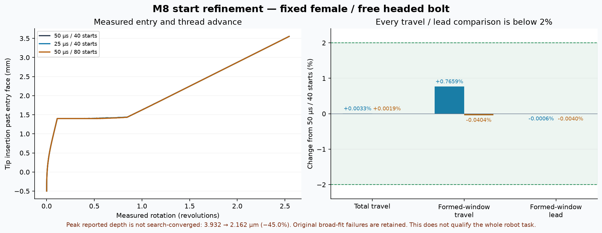

# Frozen M8 start refinement

Frozen fixed-female/free-six-DOF headed-male ideal-fixture start only; not whole robot, load suite, seating, or trained-policy qualification

| Case | dt, µs | Starts | Travel, mm | Late full-ring lead, mm/rev | Δ total travel | Δ late travel | Δ lead | Peak reported depth, µm | Travel/lead refinement |
| --- | ---: | ---: | ---: | ---: | ---: | ---: | ---: | ---: | --- |
| baseline | 50.0 | 40 | 4.051801 | 1.250052 | reference | reference | reference | 3.9320 | reference |
| dt25_points40 | 25.0 | 40 | 4.051934 | 1.250045 | 0.0033% | 0.7659% | -0.0006% | 3.9352 | pass |
| dt50_points80 | 50.0 | 80 | 4.051879 | 1.250002 | 0.0019% | -0.0404% | -0.0040% | 2.1617 | pass |

Every relative comparison requires strictly less than 2%. Late-window travel is checked separately so initial gap/lead-in cannot hide a local difference. Original broad fits and their failures remain in the JSON and original reports. The late formed-flank fit is a separate diagnostic.

Proxy depth is a reported SDF metric, not certified solid overlap. Numerical refinement of this fixture alone does not qualify the whole bimanual manipulation task.

Peak reported depth **fails** the separate 2% comparison for `dt50_points80`: -45.02%. Travel/lead convergence does not establish convergence of this depth proxy.



[Full JSON and failed gates](summary.json) · [Artifact hashes](manifest.json) · [Baseline trace](../start_probe_extended/trace.npz) · [25 µs trace](dt25_points40/trace.npz) · [80-point trace](dt50_points80/trace.npz)

Recompute the comparison from the checked-in traces without rerunning physics:

```bash
scripts/run_m8.sh scripts/compare_m8_thread_start.py \
  --baseline media/m8_insertion/start_probe_extended \
  --case dt25_points40 media/m8_insertion/refinement/dt25_points40 \
  --case dt50_points80 media/m8_insertion/refinement/dt50_points80 \
  --output outputs/m8_insertion/refinement_recomputed
```
