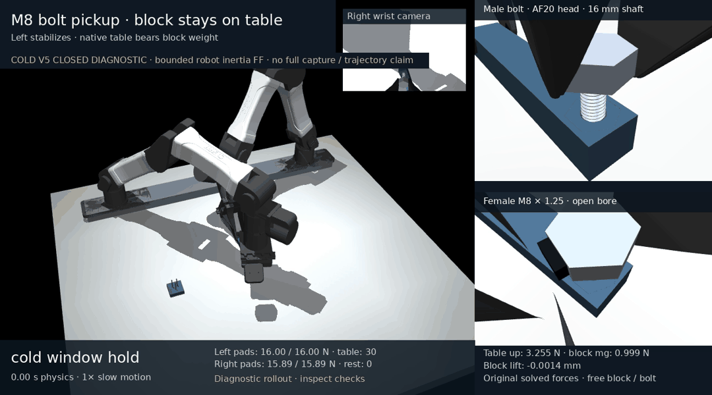

# Closed cold V5: real braking and first forward thread start

This separate native diagnostic completed **7.35660 s / 147,132 steps**, exit **0**, in **1141.46 s** wall time. It starts from the original failed continuous run's exact postintegration checkpoint **13.194899999975918 s**, row **2651**. It copies qpos/qvel/ctrl once, preserves the original cumulative grasp references, and starts new local force windows without solver warmstart or old force history. Its footage is never spliced into another trajectory.

The new controller combines approximate **five-dimensional robot-arm inertia feedforward** with the existing Cartesian controller inside the unchanged **8 N / 2 N·m** wrench and native joint caps. It controls two transverse translations and three rotations; axial translation remains force controlled. A separate velocity copy from immediately before the previous native step makes right-arm damping, native bias/drag and M/J/Jdot inputs coherent. The arm mass subblock includes downstream finger rigid inertia at their actual configuration, while independent finger accelerations and grasp/thread contact dynamics are not inverted. No body drive, helix constraint, thread-phase estimate or workpiece pose write is used after cold initialization.

The real reverse motion requests a CLOSED stop at **1.54310 s**, after a measured **50.011 µm** return from the actual bolt/female shallow crest. The robot continues its independently scheduled yaw with **150 ms C2 braking**. At **1.90625 s**, actual body/hand quiet, original native impulse/current-load and a fresh **100 ms 90/10 weight-transfer window** confirm a stopped search direction. Maximum radial error across the whole branch is **28.304 µm**, below the unchanged **150 µm** guard. Original all-step force, torque and motor clipping flags are zero.

The first forward scan advances **552.970 µm over 2.842942 rad**, then a **120 ms** stopped phase consumes a fresh native support window. Final nominal tip insertion is **2.014277 mm**, but conservative formed overlap is only **21.6147 µm**, and loaded fully interior contact duration is **zero**. Final stopped native thread upward load averages **99.997056%** of bolt weight, with **0.007070%** mean positive hand upward load. These are actual original solved loads, not replay forces or summed-normal proxies.

**This is not captured-thread, OPEN/reset, policy or full fresh end-to-end qualification.** The original validation remains `passed=false`, `partial=true`; `diagnostic_completed=true` records only this bounded cold branch. The robot uses privileged perfect native pose feedback. Material properties and hardware behavior have not been calibrated by this proof.

[](render/demo.mp4)

[Final saved state](render/demo.png) · [Thread/head detail](render/endpoint_detail.png) · [Confirmed stopped entry](render/settled_entry.png) · [Dense original trajectory](scientific_plot/native_closed_trajectory.png) · [Actual braking](scientific_plot/native_braking.png)

The video is normal **1× playback / 12 fps**, selecting exact original saved states without interpolation. Its encoded length is **7.4167 s** because of frame-time quantization; the final frame is the exact original endpoint. Rendering only refreshes kinematics, centers of mass and lights. It calls no integration, collision discovery, contact solve or `mj_forward`; no body is hidden or reposed. Image captions distinguish original preintegration forces at `t−50 µs`, original command-cache inputs at `t−100 µs` (initialization exception), and saved qpos/qvel at `t`.

## Verify and restore

All original native files, the complete **35-column FF ledger**, force histories, source snapshots, before/after execution records, separate software proofs, media and frozen independent audits are preserved. The **211,454,565-byte** FF ledger and other large files use contiguous **45 MB** binary chunks. Chunking is lossless; no force/state data is dropped or quantized. The raw cold parent is already preserved in the sibling [original continuous-failure package](../../full_canonical_v1_failed_evidence/README.md), bound by its exact ledger and nine original input hashes.

```sh
task_package=media/m8_table_supported/diagnostics/crest_seat_search_v5_closed
python "$task_package/reassemble_archives.py" --verify-only
python "$task_package/restore_original_run_layout.py" --verify-only
python "$task_package/reassemble_archives.py" --output /tmp/m8-v5-artifacts
python "$task_package/restore_original_run_layout.py" --output /tmp/m8-v5-native
```

The standard-library helpers verify all chunks and reconstructed whole-file SHA256 hashes. They refuse differing existing files and invoke no simulator. `/tmp/m8-v5-native` restores the complete original native filenames, including the full FF ledger. `/tmp/m8-v5-artifacts` restores source/proof/render/audit artifact layout as well. The outer original AFTER record has a null success-only `native_final_time_s`; the preserved derivative closure summary binds **7.35660 s** directly to the original executed FF time column without rewriting that record.

## Repeat the exact cold native branch

Use an isolated checkout of the **original producer `6e7d0d2ac3d28ff2538e122a10d7ffb2febf83b1`**. A newer canonical controller will intentionally fail this frozen harness's 65-source identity check. Copy the complete two evidence packages from the newer review checkout into ignored inputs; the pinned producer predates this packet.

```sh
task_review=/workspace/astra-r2s
task_trial=/workspace/astra-r2s-crest-v5-review
git clone --no-hardlinks "$task_review" "$task_trial"
git -C "$task_trial" checkout --detach 6e7d0d2ac3d28ff2538e122a10d7ffb2febf83b1
mkdir -p "$task_trial/outputs/m8_table_supported/cold_inputs"
cp -a "$task_review/media/m8_table_supported/full_canonical_v1_failed_evidence" \
  "$task_trial/outputs/m8_table_supported/cold_inputs/parent_package"
cp -a "$task_review/media/m8_table_supported/diagnostics/crest_seat_search_v5_closed" \
  "$task_trial/outputs/m8_table_supported/cold_inputs/v5_package"
cd "$task_trial"
task_parent_package=outputs/m8_table_supported/cold_inputs/parent_package
task_v5_package=outputs/m8_table_supported/cold_inputs/v5_package
python "$task_parent_package/reassemble_archives.py" --verify-only
python "$task_v5_package/reassemble_archives.py" --verify-only
python "$task_parent_package/restore_original_run_layout.py" \
  --output outputs/m8_table_supported/full_canonical_v1
python "$task_v5_package/reassemble_archives.py" \
  --output outputs/m8_table_supported/cold_inputs/v5_artifacts
mkdir -p outputs/m8_table_supported/diagnostics
cp "$task_v5_package/source_proof/crest_seat_inertia_probe_v5.py" outputs/m8_table_supported/diagnostics/
cp "$task_v5_package/source_proof/crest_seat_observer_v3.py" outputs/m8_table_supported/diagnostics/
cp "$task_v5_package/source_proof/reverse_brake_v4.py" outputs/m8_table_supported/diagnostics/
cp "$task_v5_package/source_proof/robot_inertia_feedforward_v5.py" outputs/m8_table_supported/diagnostics/
```

Keep these four helpers directly in `outputs/m8_table_supported/diagnostics`: the frozen harness derives its repository root from this depth and imports adjacent helpers. Prepare the matched native GCC CPU MuJoCo 3.15 core, bindings and analytic SDF plugin using `docs/m8_setup.md` and `scripts/setup.sh`. The stock wheel is insufficient. Original runtime identities remain in the declaration; another-machine rebuild must be compared before claiming identical binaries. No CUDA is required.

Run command-only preparation first. It compiles the exact archived model and checks finite coherent cold M/J/Jdot commands with qpos/qvel preserved; it executes **zero native integrations** and supplies no trajectory/support proof.

```sh
scripts/run_m8.sh outputs/m8_table_supported/diagnostics/crest_seat_inertia_probe_v5.py \
  --parent outputs/m8_table_supported/full_canonical_v1/insertion_trace.npz \
  --checkpoint-time 13.1949 --brake-duration .15 \
  --output outputs/m8_table_supported/diagnostics/crest_v5_repeat --prepare-only

scripts/run_m8.sh outputs/m8_table_supported/diagnostics/crest_seat_inertia_probe_v5.py \
  --parent outputs/m8_table_supported/full_canonical_v1/insertion_trace.npz \
  --checkpoint-time 13.1949 --brake-duration .15 \
  --output outputs/m8_table_supported/diagnostics/crest_v5_repeat
```

The output must be absent; do not overwrite the preserved run. This is a NEW cold experiment, not continuation of a previous failed endpoint or reconstruction of the full table-pickup trajectory. The original run used one CPU core and about **19 minutes** wall time. Changing engine, solver, guards, input or helper bytes creates a different experiment.

## Replay and replot preserved evidence

Restore the original V5 run to a separate directory; replay does not rerun its physics.

```sh
python "$task_v5_package/restore_original_run_layout.py" \
  --output outputs/m8_table_supported/crest_v5_original
scripts/run_m8.sh \
  outputs/m8_table_supported/cold_inputs/v5_artifacts/render/renderer_sources/render_crest_seat_search_v5_closed.py \
  --repository-root "$PWD" --mode closed \
  outputs/m8_table_supported/crest_v5_original \
  outputs/m8_table_supported/crest_v5_replay
scripts/run_m8.sh \
  outputs/m8_table_supported/cold_inputs/v5_artifacts/scientific_plot/plot_crest_seat_search_v5_closed.py \
  outputs/m8_table_supported/crest_v5_original \
  outputs/m8_table_supported/crest_v5_replots
```

The frozen independent audit source/report/binding remain verbatim under `independent_audits/`, with byte-identical sibling aliases preserving their historical relative links. Absolute execution paths are provenance; the archived reader's input assumptions are documented in its audit plan. The portable standard-library byte checks above require no native solver.

The separate **31-test independent arithmetic reader** checks all 147,132 executed FF commands, 147,130 prior-cache velocity links, actual event timing, original C2/crest/stopped windows, signed thread/table/left contact-frame sums and native hard-guard evidence. Individual right-hand local contact frames were not archived; its original all-step aggregate wrenches/pad loads remain preserved and source-bound, but cannot receive that same independent frame-sum reconstruction. The reader retains this limit and every original acceptance flag.

The original **402 tests / 65-source proof**, ignored **67 analytic/mechanics tests**, separate **6 rejection-artifact tests**, historical **69 crest/warmup contracts**, and **50 C2-command tests** have distinct scopes. None substitutes for native contact/lead/reset evidence or qualifies a new continuous end-to-end run. The original first carried-block demo and its evidence are unchanged.
