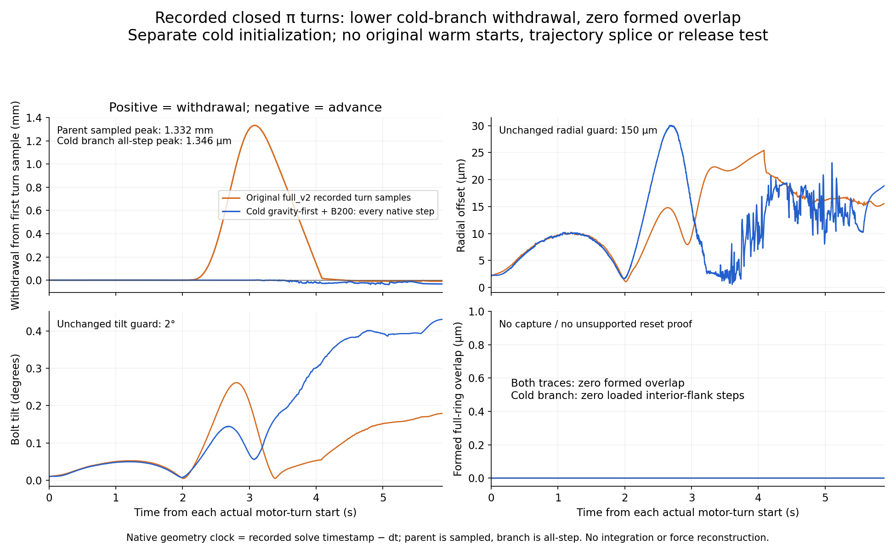

# Cold gravity-first B200 starting-turn diagnostic

This **closed 7.3905-second diagnostic** starts from the exact parent `full_v2`
checkpoint at **6.75515 s**, saved phase `feed_to_entry`, index 1363. A new
`MjData` receives archived qpos/qvel/ctrl once; original solver state and warm
starts are absent. It is a separate cold branch.

The axial damper is **200 N s/m**. Net feed ramps from **0.05 N** to the
**0.262414 N** bolt weight for 0.5 s, holds for 0.5 s, then a physical closed
**pi turn** runs at peak 1 rad/s for **5.8905 s**, followed by a 0.5 s hold.
All original diagnostic guards hold and there is no abort. There is no imposed
axial position spring or helix/lead constraint.

The scientific plot compares original measured withdrawal, radial alignment,
tilt and formed overlap during the two actual starting turns. Each curve has
its own phase-relative time zero and first measured turn-row axial reference.
The parent curve uses its original recorded samples (~5 ms); the branch uses
every original native turn-window row (50 microseconds). No integration,
interpolation or force reconstruction from saved poses occurs.



The original parent has **1.332065 mm sampled peak withdrawal**. The cold
branch has **1.346192 micrometres all-step peak withdrawal** from its first
actual turn row. Both curves have **zero formed overlap**, and the cold branch
has **zero actual loaded interior-flank contact steps**. Axial feed, damping
and the cold solver initialization change together; this comparison does not
isolate which change causes the different response.

The micrometre values below have different references or sample densities:

| Quantity | Withdrawal | Exact reference / minimum |
| --- | ---: | --- |
| Plot: all native turn rows | 1.346192 micrometres | First actual turn row, base_z = -0.022600006480653734 m; all-step minimum = -0.02260135267280573 m |
| Original producer summary | 1.315453 micrometres | Pre-turn raw reference = -0.022600006473209856 m; minimum from sparse saved turn_samples |
| Reviewer correction: all native rows from producer reference | 1.346200 micrometres | Native row 19999 just before the turn; all-step minimum |
| Independent phase/depth audit | 1.315616 micrometres | First new cold native row, base_z = -0.0226000370564958 m; all-step minimum |

The producer reference and plot reference differ by only about 7.44e-12 m;
the producer-versus-plot withdrawal difference is primarily the sparse versus
all-step extrema. Original report/audit/binding bytes are preserved. The
earlier audit-binding suggestion about the physical-turn reference is
superseded by this explicit reference table and the separate reviewer
precision sidecar. The plotted turn-end advance (32.653 micrometres) also has
a different endpoint from the original report's final post-hold advance
(12.475 micrometres); neither is a qualified thread lead.

Some earlier exact 100 ms force-readiness windows pass, but every passing
window remains **cone-only**. The final independent exact 100 ms window fails:
approximately **99.11% mean signed thread reaction** accompanies **94.26% mean
positive right-hand support**, with only **3.55% loaded thread-support duty**.
A signed force mean near bolt weight does not establish unsupported formed
thread support. No opening/release, passive reset, capture or complete policy
trajectory was executed in this branch.

- `declaration.json`, `report.json`, `diagnostic_source.py`, `observer_source.py`:
  exact cold initialization, commands, original outcome and executed sources.
- `original_native_force_ledger.npz`, `checkpoint_trace.npz`: complete original
  native force/geometry ledger and diagnostic saved-state/sample archive.
- `entry_gravity_comparison_source.py`, its manifest, `comparison_data.npz`:
  exact plotting source, input/time/reference identities and selected original
  geometry data, without interpolation or quantization.
- `independent_*`, `audit_sources/`: closed independent original force/frame,
  geometry/depth and cone-only readiness audits with exact frozen sources.
- `withdrawal_precision_correction.json`: separate reviewer correction of
  reference/sampling wording, preserving earlier frozen report/audit bytes.
- `frozen_observer/`: separate 15-test diagnostic observer proof. The separate
  4-test pure geometry proof is in `audit_sources/`. These counts remain
  separate from the historical **213-test parent producer proof**.
- `diagnostic_package_manifest.json`, `SHA256SUMS`: source, runtime, parent,
  state, sample and artifact identities. Every raw original byte is preserved.

The [published failed parent](../../failures/cone_release_alignment_abort/README.md)
contains the original model/source archives, runtime bindings and 213-test
proof. Its trace SHA is
`02a03f0262edfd519a3080bc3d44588f2f2f12ac2da6d40ca44dc379e3acae4c`,
and producer commit is `66276d0dd2188c763ada69e7426e5d74cf64fd29`.
The [later pre-open B200 diagnostic](../cone_weight_transfer_B200/README.md)
is another distinct cold branch and has not been spliced into this trajectory.

Verify this package from its directory:

```sh
sha256sum -c SHA256SUMS
```

To repeat independently, use an isolated checkout of the pinned producer and
the matched native CPU engine in `docs/m8_setup.md`; a stock MuJoCo wheel is
insufficient. This diagnostic package postdates that producer: copy its exact
diagnostic and observer sources from a newer review checkout that contains the
published package. Parent source/plugin/engine identities must match the
declaration. Different native builds require explicit comparison before claiming
identical bytes or physics.

The example uses `/workspace/astra-r2s` as the newer review checkout and an
unused `/workspace/astra-r2s-entry-B200` as the isolated destination. Reassemble
**all** parent artifacts into its ignored `outputs/m8_table_supported/full_v2/`,
including `scene.xml`, `scene_source.py` and source archives beside the trace.
Copying only the trace is insufficient for the archived-model loader. The
parent helper restores `trace.npz`; copy it to the guarded `insertion_trace.npz`
input name without changing bytes. Use a fresh diagnostic output directory:

```sh
supported_review_checkout=/workspace/astra-r2s
supported_entry_checkout=/workspace/astra-r2s-entry-B200
git clone https://github.com/robomechanics/astra-r2s.git "$supported_entry_checkout"
git -C "$supported_entry_checkout" switch --detach 66276d0dd2188c763ada69e7426e5d74cf64fd29
cd "$supported_entry_checkout"
python "$supported_review_checkout/media/m8_table_supported/failures/cone_release_alignment_abort/reassemble_archives.py" --output outputs/m8_table_supported/full_v2
cp outputs/m8_table_supported/full_v2/trace.npz outputs/m8_table_supported/full_v2/insertion_trace.npz
mkdir -p outputs/m8_table_supported/diagnostics/weight_transfer_observer_v1
cp "$supported_review_checkout/media/m8_table_supported/diagnostics/entry_gravity_start_B200/diagnostic_source.py" outputs/m8_table_supported/diagnostics/load_transfer_probe.py
cp "$supported_review_checkout/media/m8_table_supported/diagnostics/entry_gravity_start_B200/observer_source.py" outputs/m8_table_supported/diagnostics/weight_transfer_observer_v1/bolt_weight_transfer_observer.py
scripts/run_m8.sh outputs/m8_table_supported/diagnostics/load_transfer_probe.py --output outputs/m8_table_supported/diagnostics/repeated_entry_B200 --checkpoint 6.75515 --damping 200 --ramp 0.5 --hold 0.5 --turn-angle 3.141592653589793 --turn-speed 1 --post-turn-hold 0.5
```

Reuse the already verified native runtime; set it up from the pinned checkout
first if needed. The exact ignored source/observer paths above preserve the
diagnostic's repository-root lookup and frozen observer identity. The frozen
diagnostic rejects mismatched parent dependencies. A repeated cold experiment
remains separate from the unspliced original native parent.
