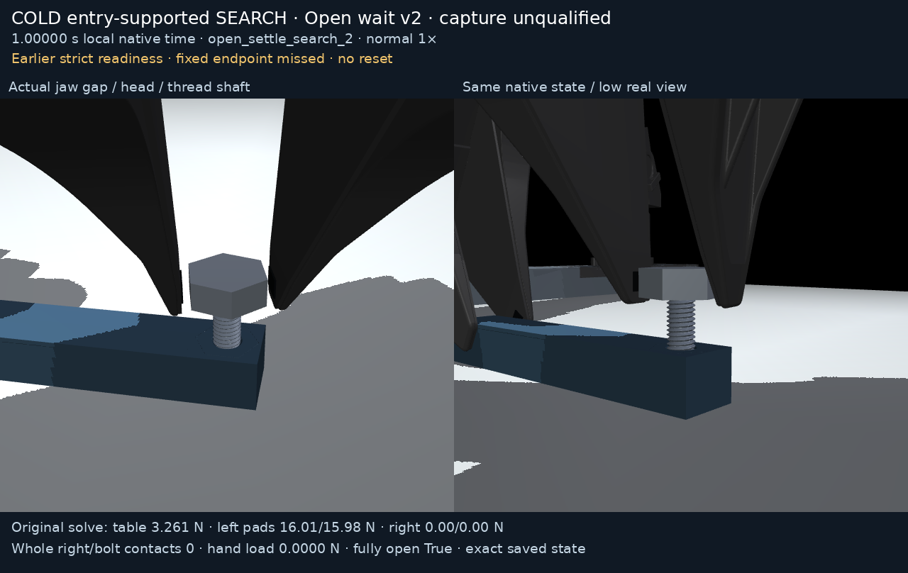
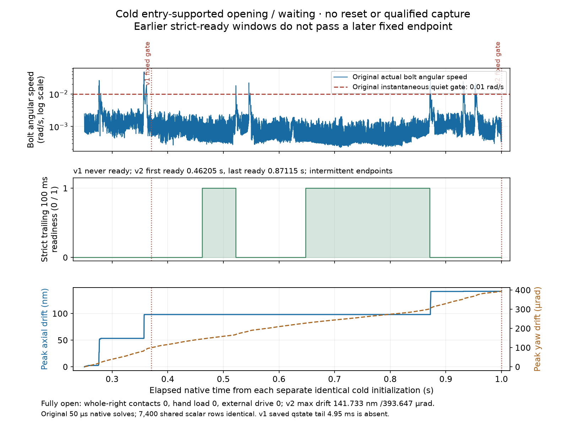

# Cold entry-supported opening and waiting trials

These two **separate cold local branches** physically open the right jaws and
leave the bolt supported at shallow thread entry. Both preserve their original
fixed-time readiness failure. **Neither reaches reset, regrasp or another turn;
full-flank capture, a qualified passive reset and a continuous assembly
trajectory remain unqualified.**

| Branch | Native duration | Original result | Media |
| --- | ---: | --- | --- |
| v1 | 0.37000 s | Never reaches the original strict 100 ms quiet window; pre-command gate fails at 0.37005 s | [MP4](entry_supported_open_search_v1/render/demo.mp4), [GIF](entry_supported_open_search_v1/render/demo.gif) |
| v2 | 1.00000 s | Strict ready windows occur earlier, first at 0.46205 s; fixed gate still fails at 1.00005 s | [MP4](entry_supported_open_search_v2/render/demo.mp4), [GIF](entry_supported_open_search_v2/render/demo.gif) |



During **every fully open native tick**, the whole right robot has **zero
contacts with the bolt**, hand load is **zero**, applied right axial feed is
**zero**, external free-object drive is **zero**, and there is no bolt/table
contact or nonthread head seating. V2 observes 15,000 such ticks, exactly
**0.75 s**, with maximum unsupported axial drift **141.733 nm** and yaw drift
**393.647 µrad**. V1 observes 2,400 open ticks, **0.12 s**, with respective maxima
**98.131 nm** and **99.762 µrad**. These are original cumulative maxima, distinct
from final displacements or means of a cumulative-peak field.

Original recorded hard contact/geometry/drive/table/left-grip/motor-cap checks
hold. The producer's overall `all_original_guards_held` remains **false**
because its separate readiness gate fails. Intentional opening suspends the
original closed right-grip retention and bilateral-pad guards; those become
active again only after a newly acquired quiet bilateral regrasp. That stage
is **unreached** here. The left arm keeps its existing finite 2 N downward
force feed with B200 world-Z damping, and the table bears real native contact
compression. A table load above block weight includes clamp load; it is not
reported as a percentage of gravity support.



V2 has **5,671 strict-ready native endpoints**, first at **0.46205 s** and last
at **0.87115 s**. These endpoints are intermittent; the range does not imply
continuous readiness. Small original instantaneous bolt-speed bursts reset
the strict quiet streak. Its final streak is only **44.85 ms**, so the fixed
1.00005-second gate correctly remains failed under the archived criterion.
The more general original weight observer is ready at the final endpoint;
that observer does not include the opening branch's extra instantaneous bolt
angular-speed condition. The independent source-faithful audit keeps both
observers distinct. Good mean load or small drift alone does not pass the
strict opening gate. V1's longest strict-valid streak is **76.75 ms**.

The plot reads complete original native scalars and the frozen independent
2000-tick arithmetic, verified against the original readiness count and exact
first/last endpoints. There is no physics replay or invented observer gate.
The two branches' first **7,400 scalar rows are identical in every original
column**, but they remain separately cold-initialized experiments, not a
stitched continuation. The original shared-prefix identity sidecar is retained.

## Exact media and the missing v1 state tail

Clips use normal **1×, 40 fps** playback of exact archived qpos/qvel rows and
two fixed real cameras. `mj_forward` replays geometry only, without integration,
interpolation, hidden bodies, changed geometry or manually posed free objects.
Caption forces are original solve records at logged time minus **50 µs**;
saved qpos/qvel are postintegration. GIF centisecond durations approximate
40 fps within one centisecond; encoded duration is presentation timing, not
additional integrated native history.

**V1's final saved state is at 0.36505 s**, while its scalar ledger continues
to 0.37000 s. The **4.95 ms saved-state tail is absent** and is never synthesized.
Its [open-jaw still](entry_supported_open_search_v1/render/open_jaw_gap.png)
and all media captions use actual saved rows. V2's separately corrected
endpoint instrumentation preserves the original exact **1.00000 s state**.
The pre-command timeout attempts at 0.37005/1.00005 s are **not integrated**.
Each `render/render_manifest.json` retains exact state indices, timestamps,
qpos/qvel/source/model/runtime hashes, original samples and missing-tail scope.

The dynamic head/tool measurement feedback is **disabled during release and
opening**. The actual release transform is frozen; finite XYZ robot impedance
holds the free hand at that robot target. Zero whole-right-robot contacts
prevent those robot motor commands from supporting or driving the bolt.
Applied extra axial feed is zero during these observed phases. Scheduled
reset/regrasp/closed-turn controller branches are present in the frozen source
but are not executed in either trial.

## Cold lineage and proof scopes

The [published pickup/entry prefix](../../face120_pickup_entry_v1/README.md)
is the canonical model and unchanged original grasp-reference parent:
`069e6f53f97507c1311d69a41ea5cea9a85ee3eba4879b55655c29ea91fbc5c0`.
Both branches instead initialize physical state from the exact final state
of [closed partial-helical-start v3](../face120_partial_helical_start_v3/README.md):
trace `8148b80ef7db5bbba06afa08096f54f6d02b3153847c4185cf630a712f320d1e`,
report `9c5d8dc33e4e510fe6d7f64f4f3c320e028cbb792eddddd6d633aa557d69ca6c`,
ledger `d773bf3247fbcfb4c97cd0d56370b26c87e5ad609c4e817cd49a3b2879396d67`.
That parent observes partial helical-flank starting load and about 21.6 µm
formed geometry, with conservative loaded full-interior contact count zero;
it does not qualify captured threading or a passive reset. The opening
branches retain zero conservative interior count. Entry tags must not be
automatically equated to a pure axisymmetric cone.

Closed v3's own cold state came from the archived failed reverse-seat-v1
endpoint. Complete prefix/trials/v3 dependencies and their original grip/state
lineages remain separate. A fresh `MjData` restores only the declared qpos/qvel
and reconstructed motor ctrl; original warm starts and solver state are
**absent**. Canonical app/helper source is pinned to
**b2b13ff39cd47c48afd19b38f83e9a405c9d6e32**, with its unchanged **281-test
software proof**. It does not cover these output-only opening harnesses or
qualify physics success. The separately frozen **six** opening-observer
arithmetic regressions remain separate from 281 and other auditor proofs.
Original failed reports, source bytes and limitations remain unchanged.

## Verify and repeat the exact cold inputs

All original scalar/state archives, declared initialization, report/declaration/
stdout-stderr log, model XML/scene bundle, producer/helper snapshots and four
independent audits/sources are retained for each branch. All files are below
45 MB; no chunks, dropped rows or quantization are needed. From this package:

```sh
sha256sum -c SHA256SUMS
```

Use an unused isolated checkout of the pinned source with the matched native
CPU engine in `docs/m8_setup.md`; stock MuJoCo is insufficient. Compare the
core/plugin-source/model/runtime identities before claiming identical physics.
A fresh different-machine native binary is not claimed byte-identical without
comparison. Evidence packages were published after the producer commit; copy
**complete** newer review directories into ignored cold inputs, including the
parent's adjacent report/ledger/model files required by its readiness checks:

```sh
git clone https://github.com/robomechanics/astra-r2s.git /workspace/astra-r2s-supported-open-b2b13ff
git -C /workspace/astra-r2s-supported-open-b2b13ff switch --detach b2b13ff39cd47c48afd19b38f83e9a405c9d6e32
cd /workspace/astra-r2s-supported-open-b2b13ff
set -e
mkdir -p outputs/m8_table_supported/cold_inputs
cp -a /workspace/astra-r2s/media/m8_table_supported/face120_pickup_entry_v1 outputs/m8_table_supported/cold_inputs/prefix
cp -a /workspace/astra-r2s/media/m8_table_supported/diagnostics/face120_closed_search_trials outputs/m8_table_supported/cold_inputs/trials
cp -a /workspace/astra-r2s/media/m8_table_supported/diagnostics/face120_partial_helical_start_v3 outputs/m8_table_supported/cold_inputs/closed_v3
cp -a /workspace/astra-r2s/media/m8_table_supported/diagnostics/entry_supported_open_wait_trials outputs/m8_table_supported/cold_inputs/open_trials
(cd outputs/m8_table_supported/cold_inputs/prefix && sha256sum -c SHA256SUMS)
(cd outputs/m8_table_supported/cold_inputs/trials && sha256sum -c SHA256SUMS)
(cd outputs/m8_table_supported/cold_inputs/closed_v3 && sha256sum -c SHA256SUMS)
(cd outputs/m8_table_supported/cold_inputs/open_trials && sha256sum -c SHA256SUMS)
mkdir -p outputs/m8_table_supported/diagnostics
cp outputs/m8_table_supported/cold_inputs/open_trials/entry_supported_open_search_v1/diagnostic_source.py outputs/m8_table_supported/diagnostics/entry_supported_open_wait_v1_probe.py
cp outputs/m8_table_supported/cold_inputs/open_trials/entry_supported_open_search_v2/diagnostic_source.py outputs/m8_table_supported/diagnostics/entry_supported_open_wait_v2_probe.py
```

The frozen harness root is `Path(__file__).resolve().parents[3]`: put each
source **directly** in `outputs/m8_table_supported/diagnostics/`, not a nested
package folder. Reuse the matched runtime through `scripts/run_m8.sh` or run
the pinned `scripts/setup.sh` first if needed. From the pinned repo root:

```sh
scripts/run_m8.sh outputs/m8_table_supported/diagnostics/entry_supported_open_wait_v1_probe.py --parent outputs/m8_table_supported/cold_inputs/prefix/insertion_trace.npz --state-source outputs/m8_table_supported/cold_inputs/closed_v3/checkpoint_trace.npz --output outputs/m8_table_supported/diagnostics/repeated_open_wait_v1
scripts/run_m8.sh outputs/m8_table_supported/diagnostics/entry_supported_open_wait_v2_probe.py --parent outputs/m8_table_supported/cold_inputs/prefix/insertion_trace.npz --state-source outputs/m8_table_supported/cold_inputs/closed_v3/checkpoint_trace.npz --output outputs/m8_table_supported/diagnostics/repeated_open_wait_v2 --open-settle .75
```

V1 defaults reproduce the original 0.25 s release and 0.12 s open wait.
V2 uses 0.25 s release and the archived `--open-settle .75` argument; its
source additionally saves the exact final native state at a pre-command stop.
Both use the unchanged 2 N left downward feed/B200 damping and native finite
motor caps. The harness validates the **exact original closed-v3 report/ledger/
trace** and rejects changed canonical source/helper bytes. Use the archived
original state parent, not a newly generated substitute, and fresh output paths.
Changed input yields another distinct cold experiment.

A fresh isolated recipe check verified all 63 canonical proof source files,
all four complete input/package ledgers, the exact native model/state/report/
ledger identities and both frozen harness layouts. Each branch ran **one
separate 50 µs initial-release native step**, exit 0 without abort. This checks
layout and runtime only; it does not repeat the full opening branches or add
to 281. Original small summaries/reports/declarations/logs are under
`recipe_validation/`. The binding preserves the initially reviewed 121-entry
prepublication ledger; the final publication ledger is verified separately
after adding this review evidence. Original native/media/source bytes stay
unchanged.

## Geometry and plot replay

The archived renderer/plotter resolve `/workspace/astra-r2s`. In that newer
review checkout, restore complete branch files under their corresponding
`outputs/m8_table_supported/diagnostics/entry_supported_open_search_v1` and
`.../entry_supported_open_search_v2` folders only if absent; otherwise compare
the existing original identities and never overwrite historical outputs.
From `/workspace/astra-r2s`, use fresh media destinations:

```sh
set -e
task_open_package=media/m8_table_supported/diagnostics/entry_supported_open_wait_trials
mkdir -p outputs/m8_table_supported/diagnostics
if [ ! -e outputs/m8_table_supported/diagnostics/entry_supported_open_search_v1 ]; then
  cp -a "$task_open_package/entry_supported_open_search_v1" outputs/m8_table_supported/diagnostics/entry_supported_open_search_v1
fi
if [ ! -e outputs/m8_table_supported/diagnostics/entry_supported_open_search_v2 ]; then
  cp -a "$task_open_package/entry_supported_open_search_v2" outputs/m8_table_supported/diagnostics/entry_supported_open_search_v2
fi
cmp "$task_open_package/entry_supported_open_search_v2/render/audit_m8_insertion_trace.py" scripts/audit_m8_insertion_trace.py
cmp "$task_open_package/entry_supported_open_search_v2/render/runtime.py" thread_lab/runtime.py
scripts/run_m8.sh "$task_open_package/entry_supported_open_search_v1/render/render_entry_supported_open_wait.py" entry_supported_open_search_v1 outputs/m8_table_supported/diagnostics/replayed_open_wait_v1
scripts/run_m8.sh "$task_open_package/entry_supported_open_search_v2/render/render_entry_supported_open_wait.py" entry_supported_open_search_v2 outputs/m8_table_supported/diagnostics/replayed_open_wait_v2
scripts/run_m8.sh "$task_open_package/plot/plot_entry_supported_open_wait.py" outputs/m8_table_supported/diagnostics/replotted_open_wait
```

Media encoding can differ on another rendering/runtime stack; compare hashes
before claiming identical pixels. Geometry replay never substitutes new
forces for original native solves. Adaptive opening v3 and all upcoming work
are outside this frozen historical package.
