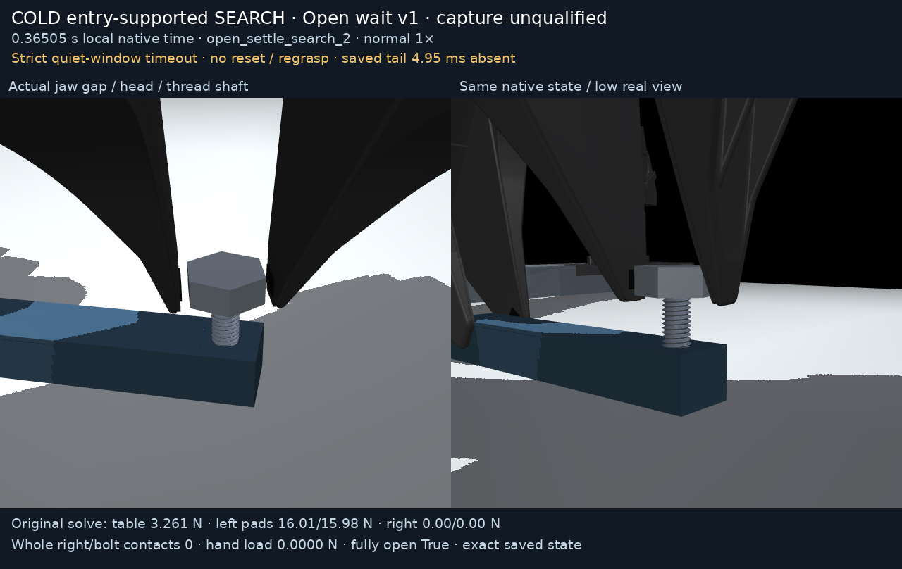

# entry_supported_open_search_v1

Separate closed cold entry-supported SEARCH opening/wait trial.
Original native duration **0.37000 s**; original fixed
readiness abort `{"elapsed_s": 0.37005, "failed_checks": ["fresh_fully_open_unloaded100ms_entry_support_not_ready"]}` stays failed.
Recorded native hard checks held; producer overall guards held is **false**.
No reset/regrasp/next turn/full capture/passive-reset qualification.

[Normal 1× MP4](render/demo.mp4) · [Normal 1× GIF](render/demo.gif) ·
[Actual first state](render/entry_detail.png)

Saved-state tail gap: **4.95000 ms**.
Missing state is never reconstructed. Exact qpos/qvel/mj_forward geometry
replay only; no integration, interpolation or body hiding. Caption forces
are original preintegration native solves at saved time minus50 µs.
Strict-ready endpoints: **0**, first
`None`, last
`None`; final strict readiness is false.
The complete original reports/native/model/source/audits remain unchanged.

See [package instructions](../README.md) for original cold parents, precise
strict-window scope, complete dependencies and runnable reproduction commands.
