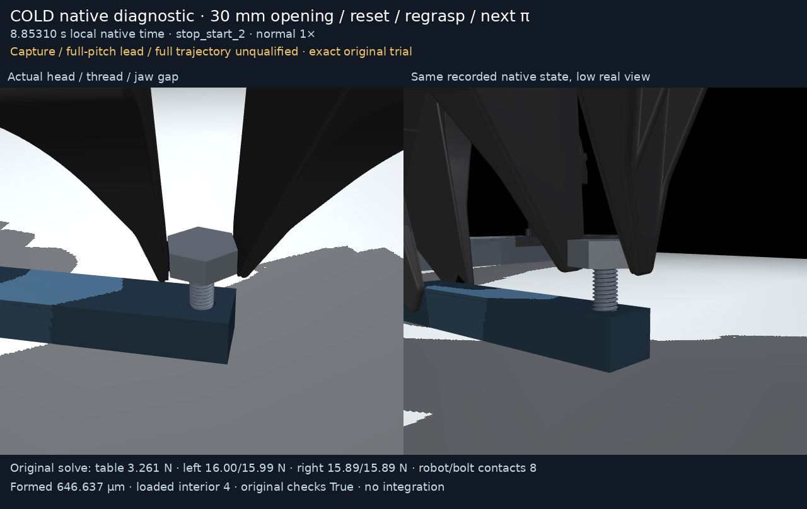

# Cold native opening, reset, regrasp and a second turn

The **30 mm V4 branch** actually opens, waits for the unchanged native
100 ms support/quiet gate, turns the unloaded right gripper back by −π,
reacquires a real bilateral grasp, and performs the next native π turn.
Its complete **8.85310 s** local trial held every original guard.
Final measured formed overlap is **646.637 µm**, with four loaded
conservative interior contacts and final 100 ms thread support
**99.997928% of bolt weight** / positive hand support **0.014985%**.
This remains a **cold, partial engagement diagnostic**: formed overlap is
below the M8 1.25 mm pitch. Full capture, a qualified passive reset,
full-pitch lead, reward qualification and the complete pickup-to-thread
trajectory are unqualified.



[Normal 1× V4 MP4](native_v4/render/demo.mp4) ·
[Normal 1× GIF](native_v4/render/demo.gif) ·
[Actual contact-free open reset](native_v4/render/open_reset.png) ·
[Actual quiet regrasp](native_v4/render/quiet_regrasp.png) ·
[Every original native tick](plot/native_open_reset_history.png)

The separate **earlier 24 mm adaptive V3 branch** passed its live opening
gate at 0.46205 s and started reset on the next tick. It then encountered
one real forbidden right pad/bolt contact at **1.43090 s**, retaining the
original failure. It did not reach regrasp or the next turn.
[Separate failed V3 MP4](earlier_adaptive_v3_failure/render/demo.mp4) ·
[GIF](earlier_adaptive_v3_failure/render/demo.gif) ·
[Exact failure state](earlier_adaptive_v3_failure/render/endpoint_detail.png).
The clips are independent native trials; they are never spliced together.

The distinct [30 mm static preflight](static30mm_preflight/study.json)
contains **416 sampled kinematic states**, minimum sampled pad/head
distance **2.99538 mm** and minimum sampled right joint margin
**0.127561 rad**. **NO ROLLOUT**: copied scratch finger coordinates,
kinematics, collision queries and sampled IK route only; no integration,
force solve, controller execution or continuous swept-volume proof.
Its hypothetical clearance is not claimed as a measured dynamic margin.

## What actually changed and what was measured

V4 changes the physical opening command to **30 mm**. The original XML,
assets, collision geometry, finger limits and force limits are unchanged.
Native finger targets +15.5/−15.5 mm lie inside the existing ±37.524 mm
joint/control bounds; the original ±20 N caps remain. Its final report,
effective arm configuration and raw aperture history describe the real
override. Geometry replay requires no model or finger-coordinate override.

V4's strict fully-open readiness event is at **0.37000 s**, the first reset
command at **0.37005 s**. All whole-right/bolt contacts, hand force and
extra axial feed remain zero throughout its fully-open native segment.
Maximum unsupported axial/yaw drift is **28.4998 nm / 0.235753 mrad**.
Quiet bilateral native pad loading persists for 100 ms before acquiring
the new grasp reference. The cumulative right 1 mm / 2° guard resumes
on the next native tick after that acquisition and remains active through
the second turn. The quiet-regrasp still is the exact later saved phase-end
state at 2.46005 s; the event itself is at 2.31260 s. Its original event
and every-50-µs scalar solve are retained, but an exact acquisition-event
post-state was not saved and is never invented.
Its actual guarded maxima are **30.6291 µm / 0.00332495 rad**.
The global unmasked 3.975 mm / approximately π slip includes intentional
opening; it is not the guarded closed-grasp maximum. Left retention,
table bearing, passive-body, motor-cap and native collision/depth guards
continue throughout the whole local trial.

The scientific plot shows actual instantaneous thread reactions as high
as approximately **20× bolt weight** during regrasp/turning; those are
not the settled 100 ms averages quoted above. Its physical closed jaw
command is **18.4 mm**, while the actual aperture stops against the hex
head at approximately **19.984–19.989 mm**. Command and measured state
are plotted separately.

Commands use privileged native pose feedback through bounded physical
robot motors at 20 kHz; free bolt/block coordinates and velocities are
not reset during a trial. This controller is not a trained policy.
The new right-grasp reference is acquired from the actual quiet bilateral
regrasp event, not an edited object pose. Original sources and guards are
archived without weakening the failure from the earlier 24 mm branch.

Both native branches begin from the exact closed partial-helical V3
endpoint qpos/qvel, **8148b80e…**, with adjacent original report and native
ledger. This is a cold initialization: warm starts, solver/plugin caches
and original runtime state are absent. The canonical pickup/entry prefix
**069e6f53…** supplies the unchanged model and original acquisition
references; it is a different parent from the cold state. The prior
reverse-seat checkpoint **0d87e71c…** is retained by that closed V3
lineage, not used to substitute a new V4 initial state.

Exact model/source/state identities and those acquisition events are in
[lineage.json](lineage.json), the original per-trial declarations, original
execution before/after manifests, render manifests and independent audits.
V4 executed in an isolated **b2b13ff39cd47c48afd19b38f83e9a405c9d6e32**
checkout, with all **63 producer source hashes identical before/after**.
Its original trace-only finalized timing/event metadata is explicitly
distinguished from the unchanged planned-input declaration. The separate
canonical **281** software checks cover the pinned application/helper,
not these output-only diagnostic harnesses, additional audit arithmetic
tests or native trajectory qualification. Newer canonical software is a
separate producer and is not relabeled as this historical experiment.

The independent adaptive-v2 audit corrects an older auditor's assumption
that the first-ever ready solve was automatically eligible. V4 became
ready at .35000 s, before minimum-dwell eligibility; the actual eligible
CURRENT ready solve is .37000 s. The derivative also separates intentional
CLOSED regrasp contacts from forbidden OPEN contacts. Original native
reports, helper, criterion and failed earlier branch remain unchanged;
draft reports/source and the correction lineage stay archived separately.
The new 12 pure-auditor tests are independent of canonical281 and of the
later 402-test producer, which did not produce V4.

## Media and raw timing

Each frame is an exact saved original qpos/qvel and archived-model
`mj_forward` geometry replay under the hash-bound patched native runtime.
There is no integration, interpolation, hidden body, cutaway, synthetic
pose or splicing. Caption forces/contact records are the **original
preintegration solve at saved time minus 50 µs**, while geometry,
aperture and alignment are the saved postintegration state. Forces are
never inferred from sparse qpos or the new replay solve.

Both clips use normal 1×, 12 fps presentation with the exact native
terminal state in the last display slot. Native V4 duration 8.85310 s is
encoded as **107 frames / 8.91667 s** (GIF centisecond rounding is recorded).
Native failed V3 duration 1.43090 s is encoded as **18 frames / 1.50000 s**.
This finite frame-time quantization is explicit. No native state is
resampled or interpolated; every chosen state index/time is archived.
All original every-50-µs scalar ledgers and every-5-ms native contact-local
records/frames/forces, states, exact endpoints, sources and models remain
lossless and unchanged. Largest artifacts are below 45 MB; no chunks or
quantization are required for this package.

Verify every package byte:

```bash
cd /workspace/astra-r2s/media/m8_table_supported/diagnostics/entry_supported_reset_regrasp_v4
sha256sum -c SHA256SUMS
```

## Repeat the frozen native branch in an isolated checkout

Use a **newer review checkout containing these published packages** as
the copy source. The pinned b2 checkout predates their publication and
does not itself contain them. The following restores COMPLETE package
directories, including adjacent XML, report, ledger, reference and
source sidecars. Keep the main checkout and historical raw files intact.
Use a fresh destination or review it before running these commands.

```bash
task_review=/workspace/astra-r2s
task_repeat=/workspace/astra-r2s-supported-reset-repeat
git clone --no-checkout "$task_review" "$task_repeat"
git -C "$task_repeat" checkout b2b13ff39cd47c48afd19b38f83e9a405c9d6e32
cd "$task_repeat"
mkdir -p outputs/m8_table_supported/cold_inputs outputs/m8_table_supported/diagnostics
cp -a "$task_review/media/m8_table_supported/face120_pickup_entry_v1" outputs/m8_table_supported/cold_inputs/prefix
cp -a "$task_review/media/m8_table_supported/diagnostics/face120_closed_search_trials" outputs/m8_table_supported/cold_inputs/trials
cp -a "$task_review/media/m8_table_supported/diagnostics/face120_partial_helical_start_v3" outputs/m8_table_supported/cold_inputs/v3
cp -a "$task_review/media/m8_table_supported/diagnostics/entry_supported_reset_regrasp_v4" outputs/m8_table_supported/cold_inputs/reset_trials
(cd outputs/m8_table_supported/cold_inputs/prefix && sha256sum -c SHA256SUMS)
(cd outputs/m8_table_supported/cold_inputs/trials && sha256sum -c SHA256SUMS)
(cd outputs/m8_table_supported/cold_inputs/v3 && sha256sum -c SHA256SUMS)
(cd outputs/m8_table_supported/cold_inputs/reset_trials && sha256sum -c SHA256SUMS)
python - <<'PY'
from pathlib import Path
import hashlib,json
root=Path('.')
p=Path('outputs/m8_table_supported/cold_inputs')
proof=json.loads((p/'prefix/software_proof/software_proof.json').read_text())
assert proof['tests_passed']==281 and proof['source_hashes_unchanged']
for name,digest in proof['source_hashes'].items():
    assert hashlib.sha256((root/name).read_bytes()).hexdigest()==digest,name
d=json.loads((p/'reset_trials/native_v4/declaration.json').read_text())
for path,key in [('prefix/insertion_trace.npz','parent_trace_sha256'),('v3/checkpoint_trace.npz','state_parent_trace_sha256'),('v3/report.json','state_parent_report_sha256')]:
    assert hashlib.sha256((p/path).read_bytes()).hexdigest()==d[key],path
print('All63 canonical sources and original parent identities match')
PY
cp outputs/m8_table_supported/cold_inputs/reset_trials/native_v4/diagnostic_source.py outputs/m8_table_supported/diagnostics/entry_supported_open_search_probe.py
cp outputs/m8_table_supported/cold_inputs/reset_trials/earlier_adaptive_v3_failure/diagnostic_source.py outputs/m8_table_supported/diagnostics/entry_supported_open_search_probe_v3.py
```

Use [the matched engine setup](../../../../docs/m8_setup.md) and
`scripts/setup.sh`; keep its exact native CPU engine patch, binding,
plugin and compiler provenance. A stock MuJoCo wheel does not satisfy
the 0.1 µm native SDF-search requirement. Compare `thread_lab.runtime`
engine/plugin source hashes with the original per-trial declarations.
Fresh builds on another CPU/compiler are not claimed byte-identical
unless measured. `scripts/run_m8.sh` chooses the matched environment.

The frozen harness's `ROOT = Path(__file__).resolve().parents[3]`
requires the exact copied location directly under
`outputs/m8_table_supported/diagnostics/*.py`; running the source from
inside its packaged subfolder uses the wrong root.

Actual V4 repeat (roughly 17.5 wall minutes on the original CPU):

```bash
scripts/run_m8.sh outputs/m8_table_supported/diagnostics/entry_supported_open_search_probe.py \
  --parent outputs/m8_table_supported/cold_inputs/prefix/insertion_trace.npz \
  --state-source outputs/m8_table_supported/cold_inputs/v3/checkpoint_trace.npz \
  --adaptive-open-settle --open-settle .75 --minimum-open-settle .12 \
  --open-aperture .030 \
  --output outputs/m8_table_supported/diagnostics/reset_v4_repeat
```

Separate earlier V3 failure repeat (default aperture remains .024 m):

```bash
scripts/run_m8.sh outputs/m8_table_supported/diagnostics/entry_supported_open_search_probe_v3.py \
  --parent outputs/m8_table_supported/cold_inputs/prefix/insertion_trace.npz \
  --state-source outputs/m8_table_supported/cold_inputs/v3/checkpoint_trace.npz \
  --adaptive-open-settle --open-settle .75 --minimum-open-settle .12 \
  --output outputs/m8_table_supported/diagnostics/reset_v3_failure_repeat
```

Defaults retained exactly: physical release .25 s, min/max adaptive
fully-open wait .12/.75 s; open −π reset peak 4 rad/s, .12 s open hold,
.25 s regrip and initial .25 s quiet-regrasp phase (bounded extension
if actual100ms acquisition is absent), next π peak1 rad/s, .5 s stopped
hold. Net feed is held at 100% bolt weight from the first cold step;
extra axial feed is zero during fully-open reset. Legacy declaration
fields `ramp_s` are retained but unused for this held-weight branch.
The finite left-down target and force/damping remain those of the exact
cold parent. Optional one-step `--maximum-native-steps 1` checks validate
layout/runtime only and do not reproduce the full branch or qualify
capture/reset. They remain separate from canonical281 software checks.

## Replay exact original saved states without integrating

In the pinned checkout after the complete restoration above, compare
archived replay dependencies to the selected frozen checkout before
loading them. The new renderer has explicit repository/model/trial
arguments and verifies producer sources and runtime before and after.

```bash
task_reset_package="$PWD/outputs/m8_table_supported/cold_inputs/reset_trials"
cmp scripts/audit_m8_insertion_trace.py "$task_reset_package/native_v4/render/renderer_sources/scripts/audit_m8_insertion_trace.py"
cmp thread_lab/runtime.py "$task_reset_package/native_v4/render/renderer_sources/thread_lab/runtime.py"
scripts/run_m8.sh "$task_reset_package/native_v4/render/renderer_sources/render_entry_supported_trial.py" \
  --repository-root "$PWD" \
  --canonical-prefix outputs/m8_table_supported/cold_inputs/prefix/insertion_trace.npz \
  --trial-dir "$task_reset_package/native_v4" \
  --output outputs/m8_table_supported/diagnostics/reset_v4_original_replay \
  --name '30 mm opening / reset / regrasp / next pi'
```

The static preflight is kept as source/data rationale only. Its frozen
source hard-codes historical output paths and should only be repeated
in a separate scratch b2 checkout with the COMPLETE canonical prefix
at `outputs/m8_table_supported/face120_prefix_v1`, COMPLETE earlier V3
failure at `outputs/m8_table_supported/diagnostics/entry_supported_open_search_v3`,
and its source copied directly to `outputs/m8_table_supported/diagnostics/open30_static_preflight.py`.
The output `open30_static_preflight_v1` must be absent; that script refuses
to overwrite. It is never an alternate native V4 state parent.

```bash
cp -a outputs/m8_table_supported/cold_inputs/prefix outputs/m8_table_supported/face120_prefix_v1
cp -a "$task_reset_package/earlier_adaptive_v3_failure" outputs/m8_table_supported/diagnostics/entry_supported_open_search_v3
cp "$task_reset_package/static30mm_preflight/diagnostic_source.py" outputs/m8_table_supported/diagnostics/open30_static_preflight.py
scripts/run_m8.sh outputs/m8_table_supported/diagnostics/open30_static_preflight.py
```
