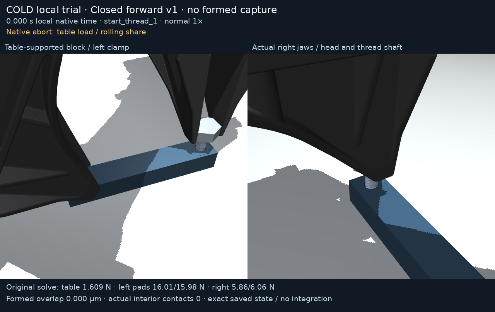

# face120_closed_forward_v1

Separate **cold local trial**, native duration 1.26175 s.
Original guards held: False. Original abort:
`{"elapsed_s": 1.2617500000000001, "failed_checks": ["table_original_load", "active_table_rolling_share"]}`. Original termination:
`None`. **Zero formed overlap or loaded interior
contact; no opening/reset/full trajectory qualification.**

[Normal 1x MP4](render/demo.mp4) · [Normal 1x GIF](render/demo.gif) ·
[Actual endpoint state](render/endpoint_detail.png)

Media uses exact saved qpos/qvel and two fixed real cameras, with `mj_forward`
only. Caption forces are original native solve records at logged time minus dt;
saved poses are postintegration. Physical occlusion remains. No body hiding,
interpolation, geometry change, free-body posing or physics integration occurs.

Original reports, raw all-step ledger, state archive, declared cold
initialization, stdout/stderr log, harness/helper sources and audits are
retained. Original constant yaw-origin instrumentation offset retained unchanged; corrected independent reports and original_yaw_origin_note remain separate.

Use the [package instructions](../README.md) for exact cold dependencies,
canonical model/grip parent, actual state parent, commands and proof scopes.
