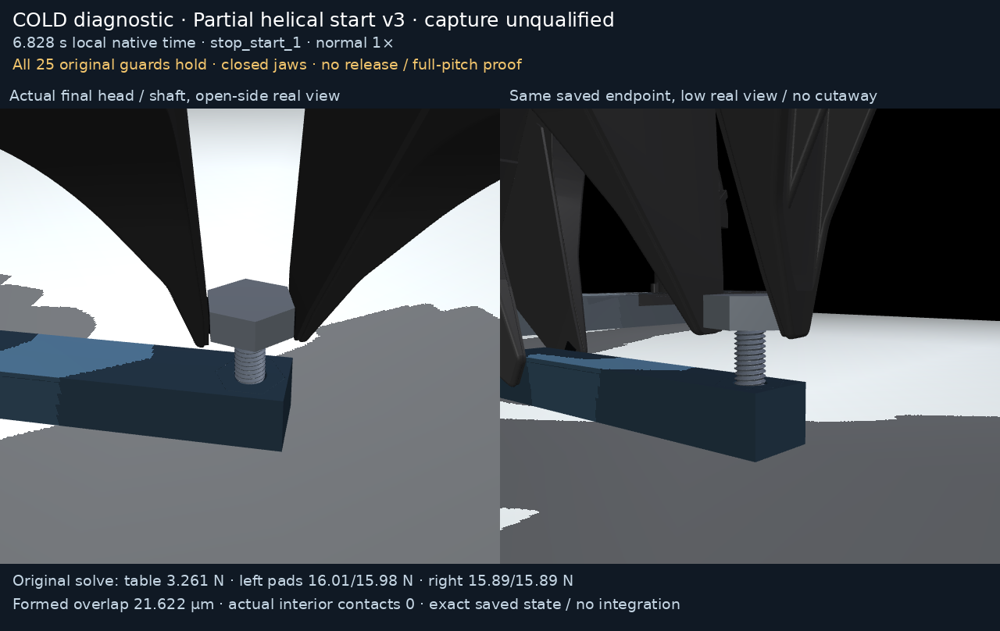
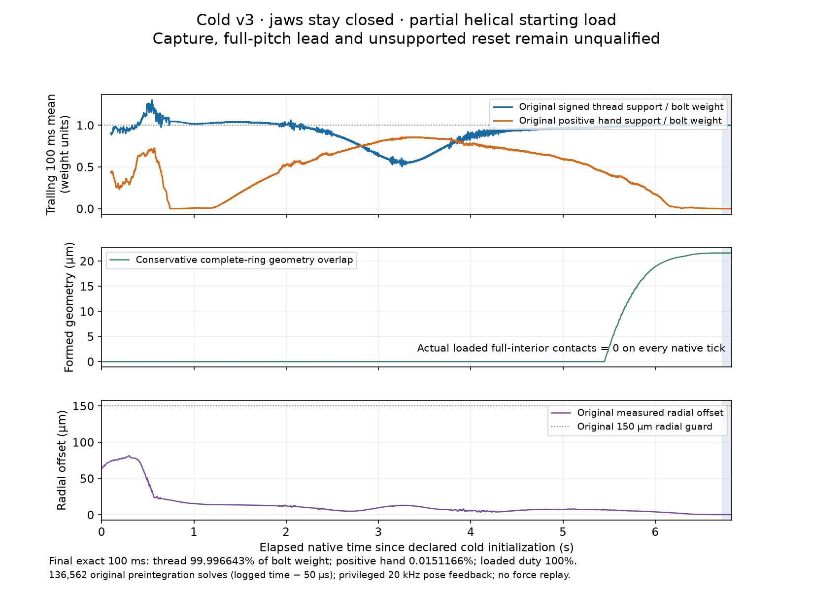

# Cold M8 partial helical starting load v3

This separate cold local diagnostic completes **6.82810 s** with all **25
original guards held**. Finite native robot motors stabilize the block on the
table and rotate the closed right jaws. The final state has **21.622 µm** of
conservative complete-ring geometry overlap. Original loaded entry-contact
normals show **partial helical-flank load**, outside the conservative
full-interior contact classification. **Capture, a full-pitch lead, jaw opening,
unsupported reset and a continuous full assembly trajectory remain unqualified.**



[Normal 1× MP4](render/demo.mp4) · [Normal 1× GIF](render/demo.gif) ·
[Actual cold entry](render/entry_detail.png) ·
[Fixed-camera endpoint](render/endpoint_detail.png)

The 82-frame clip uses exact saved qpos/qvel rows at 12 fps. Geometry replay
uses `mj_forward` only, without integration, interpolation, body hiding,
changed geometry or manually posed free objects. The supplementary endpoint
image uses two different real camera viewpoints around the **identical final
saved state**. Native forces in captions come from original solve records at
logged time minus **50 µs**, while saved qpos/qvel are postintegration. The
first actual saved row is 50 µs after initialization and displays 0.000 s when
rounded. All state/time/source identities are in `render/render_manifest.json`.



The scientific plot uses the complete **136,562-row** original native scalar
ledger. Its trailing 100 ms averages are explicit presentation derivatives;
the original bytes stay unchanged. In the final exact 100 ms, signed thread
reaction supports **99.996643% of bolt weight**, positive hand support is
**0.0151166%**, and upward loaded duty is **100%**. Actual bolt and hand angular
speeds are below 0.000162 rad/s and absolute axial speed is below 1.376 µm/s.
The table's mean compression is **3.261 N** with about **2 N downward left-hand
load**. Compression above block weight includes clamp load and the bolt's
reaction; it is not a percentage of gravity support.

The conservative loaded full-interior contact count is **zero on every tick**.
That tag does not establish that the loaded entry surface is a pure cone:
82 original positive-normal contacts in the final 100 ms have world-Z axial
normal components about 0.865 and azimuthal components -0.045 to -0.051.
The independently archived approximate world-Z normal calculation gives
**1.2486–1.2513 mm** helical pitch. This is helical-flank evidence near entry,
not an exact transformed contact-point reclassification or a capture proof.
A geometry-positive short span advances about 18.807 µm over 5.44°; a 1.25 mm
pitch comparison gives 18.878 µm. This short comparison does not span a full
pitch rotation and does not qualify lead. Read
`independent_formed_entry_audit.json` and its exact source/proof for scope.
All original normals, frames, local forces, world contact positions, bolt
origins and conservative tags remain in `checkpoint_trace.npz` → `info_json`
→ `native_contact_records`; no inferred replacement record is written.

This uses **privileged perfect simulator head pose feedback at 20 kHz**
through finite native arm/finger motors. Desired yaw is independently
scheduled. Transverse head centering uses the measured grasp transform; axial
position feedback is projected out, net feed is bolt weight from the first
cold step, and B200 axial damping dissipates motion. There is **no imposed
axial pitch trajectory**, thread-phase input, free-body force or free-body
state write after declared initialization. It is a physics diagnostic,
not a demonstrated sensor stack or learned policy. Left downward force ramps
to 2 N over 0.3 s through the existing finite wrench/motor caps with B200
world-Z damping; 0.3 s alignment and 0.3 s closed prehold follow. Stronger
right aperture is 0.0184 m. The retained CLI `--left-down-offset` option is
unused in this v3 force controller; it does not impose the older v2 target.

## Exact parent identities and proof scopes

The [published pickup/entry prefix](../../face120_pickup_entry_v1/README.md)
is the canonical model and unchanged original grip-reference parent:
trace `069e6f53f97507c1311d69a41ea5cea9a85ee3eba4879b55655c29ea91fbc5c0`.
The actual physical cold state instead comes from
[reverse-seat v1](../face120_closed_search_trials/face120_seat_search_v1/README.md)
at **9.94905 s**, checkpoint trace
`0d87e71cc5f85a1210d5b6e3fc43484b6f48d0ecc08ae1e3f941d74acbc5ac3c`.
Its original direction-event criterion failed and remains failed; this branch
explores forward rotation without inferring a confirmed direction event.

Exact saved qpos/qvel and reconstructed original motor ctrl initialize a
fresh `MjData` once. Original solver state and warm starts are **absent**.
This is not a continuation or a splice. The original prefix measured grip
references remain unchanged; cold input does not redefine them.
`declared_cold_initialization.npz`, declaration and lineage binding preserve
the exact initial state. V3's original yaw counter starts from the actual
cold quaternion origin; its independent audit applies no correction.

Canonical app/helper source is pinned to
**b2b13ff39cd47c48afd19b38f83e9a405c9d6e32**, with its unchanged **281-test
software proof**. The executed output-only harness has separate SHA
`b735c16a0b60136e1593501286c13d215ad0f75bb27af89ad0befda423612629`.
The 281 tests do not cover this harness or qualify native assembly physics.
Separate auditor arithmetic counts remain separate; they are not added to
281. All original reports, sources, failures/limitations and audit bindings
are preserved, including generic producer observer wording. The independent
formed-entry audit explicitly explains why conservative entry tags must not
be equated to pure cones.

## Verify original archives and replay media

Every file is below 45 MB; no chunks, quantization or dropped rows are needed.
From this package directory:

```sh
sha256sum -c SHA256SUMS
```

The original all-step ledger, exact saved-state archive, model XML/scene
bundle, cold initialization, complete producer/helper source snapshots,
original stdout/stderr log, declarations/reports and all four independent
audits/sources are retained. The renderer/plotter executed sources and all
media/state/source hashes are retained. `package_manifest.json` binds these
identities and qualification limits. `canonical_prefix_reference_binding.json`
binds original grasp references separately from the actual state parent.

The archived renderer resolves its repository root as `/workspace/astra-r2s`
and reads the exact historical prefix there. It expects this trial's closed
native originals under
`outputs/m8_table_supported/diagnostics/face120_closed_forward_visual_v3`.
In a newer review checkout at that path, restore complete package files there
only if the directory is absent. If it already exists, verify its original
hashes instead of overwriting it. Keep all recorded model/source sidecars.
Use fresh media destinations. From `/workspace/astra-r2s`:

```sh
set -e
task_v3_package=media/m8_table_supported/diagnostics/face120_partial_helical_start_v3
mkdir -p outputs/m8_table_supported/diagnostics
if [ ! -e outputs/m8_table_supported/diagnostics/face120_closed_forward_visual_v3 ]; then
  cp -a "$task_v3_package" outputs/m8_table_supported/diagnostics/face120_closed_forward_visual_v3
fi
cmp "$task_v3_package/render/audit_m8_insertion_trace.py" scripts/audit_m8_insertion_trace.py
cmp "$task_v3_package/render/runtime.py" thread_lab/runtime.py
scripts/run_m8.sh "$task_v3_package/render/render_face120_partial_helical_v3.py" face120_closed_forward_visual_v3 outputs/m8_table_supported/diagnostics/replayed_v3_media
scripts/run_m8.sh "$task_v3_package/plot/plot_face120_partial_helical_v3.py" "$task_v3_package" outputs/m8_table_supported/diagnostics/replotted_v3
```

The renderer verifies the matched native engine and archived XML and imports
repository dependencies. The explicit byte comparisons above require its dependency sources to match archived snapshots;
the exact loader uses recorded XML instead of regenerating the scene. The
plotter only reads original native data and does not run physics. Media
encodings may vary on a different rendering/runtime stack; compare hashes
before claiming identical rendered bytes. Original recorded forces always
remain independent of geometry replay.

## Repeat the exact cold native input

Use an isolated checkout of the pinned source commit with the matched native
CPU engine in `docs/m8_setup.md`; stock MuJoCo is insufficient. Native core,
plugin-source and XML hashes are in the declaration and render manifest.
Rebuild from the pinned patched engine/source instructions and compare the
identities before claiming identical physics. A different machine's fresh
native binary is not asserted byte-identical without comparison.

These evidence packages were published after the producer commit. Start from
a newer review checkout at `/workspace/astra-r2s` containing all three complete
packages, then restore them into ignored outputs in an unused pinned checkout.
Copy complete directories, keeping the adjacent model and source files:

```sh
git clone https://github.com/robomechanics/astra-r2s.git /workspace/astra-r2s-supported-v3-b2b13ff
git -C /workspace/astra-r2s-supported-v3-b2b13ff switch --detach b2b13ff39cd47c48afd19b38f83e9a405c9d6e32
cd /workspace/astra-r2s-supported-v3-b2b13ff
mkdir -p outputs/m8_table_supported/cold_inputs
cp -a /workspace/astra-r2s/media/m8_table_supported/face120_pickup_entry_v1 outputs/m8_table_supported/cold_inputs/prefix
cp -a /workspace/astra-r2s/media/m8_table_supported/diagnostics/face120_closed_search_trials outputs/m8_table_supported/cold_inputs/trials
cp -a /workspace/astra-r2s/media/m8_table_supported/diagnostics/face120_partial_helical_start_v3 outputs/m8_table_supported/cold_inputs/v3
(cd outputs/m8_table_supported/cold_inputs/prefix && sha256sum -c SHA256SUMS)
(cd outputs/m8_table_supported/cold_inputs/trials && sha256sum -c SHA256SUMS)
(cd outputs/m8_table_supported/cold_inputs/v3 && sha256sum -c SHA256SUMS)
mkdir -p outputs/m8_table_supported/diagnostics
cp outputs/m8_table_supported/cold_inputs/v3/diagnostic_source.py outputs/m8_table_supported/diagnostics/closed_forward_visual_servo_probe.py
```

The harness root is `Path(__file__).resolve().parents[3]`; its frozen source
must be **directly** in `outputs/m8_table_supported/diagnostics/`, not a nested
package directory. Activate the reused matched runtime with `scripts/run_m8.sh`
or run the pinned `scripts/setup.sh` first if needed. From the pinned repo root:

```sh
scripts/run_m8.sh outputs/m8_table_supported/diagnostics/closed_forward_visual_servo_probe.py --parent outputs/m8_table_supported/cold_inputs/prefix/insertion_trace.npz --state-source outputs/m8_table_supported/cold_inputs/trials/face120_seat_search_v1/checkpoint_trace.npz --output outputs/m8_table_supported/diagnostics/repeated_partial_helical_start_v3
```

These defaults match the original archived argv. The harness rejects changes
to canonical producer sources or the helper
`yam_twin/m8_supported_start.py` SHA
`ce9c3c2272b475167108ff2d25e568125d6378e64af7a0eadc1fe2219be656f7`.
Use the **archived original reverse checkpoint** and a fresh output path.
A regenerated input is another distinct experiment. No opening/reset or
continuous full native assembly result follows from repeating this local trial.
A fresh isolated recipe review verified all 63 canonical proof source files,
the exact input ledgers/model/source identities and one separate **50 µs native
step** (exit 0). Its original summary/report/declaration/log are under
`recipe_validation/`. This demonstrates layout and runtime only, not a repeated
full trial, native capture or trajectory qualification; it is separate from
281. The binding retains the initially reviewed prepublication ledger identity;
the final publication ledger is verified separately after the replay-instruction
clarification and addition of this evidence.

Upcoming v4 files and all earlier published packages remain outside this package.
