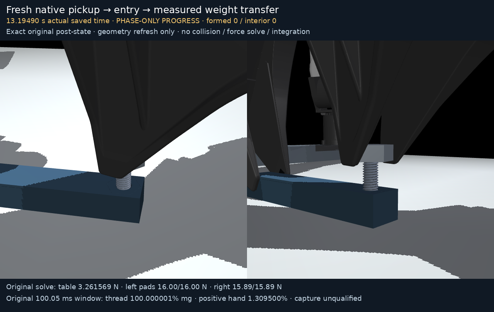

# Native entry and weight-transfer progress

This is one original fresh continuous native prefix, from separately spawned
block/bolt through pickup, alignment, entry and measured weight transfer.
Actual saved native time: **0.00005 to13.19490s**,2652 exact saved states.
**PHASE-ONLY PROGRESS**: final formed overlap0 and loaded interior contacts0.
No captured pitch, qualified turn/reset, full physical audit or completed
end-to-end trajectory is claimed. This is a **HISTORICAL snapshot captured
at 13.19490 s before whole-run closure**. Its original metadata flags saying
full ledgers/qualification were pending remain unchanged. The whole native
attempt subsequently closed at **16.47615 s**, failed at `stop_reverse`
because measured drop19.1214 micrometres was below the50-micrometre direction
gate, with no formed capture. The separate failed whole-attempt evidence
retains that later result; this prefix is not relabeled as final success.

[Normal1x GIF](entry_transfer_progress.gif) · [Normal1x MP4](entry_transfer_progress.mp4) ·
[Full robot/table view](entry_transfer_progress.png)

Original entry dwell6.67495s was within the declared10s maximum; entry
overlap was1.310219mm, separate from formed overlap. At the endpoint,
original solved table up-force is3.261569N; the left physical pads
stabilize the free block on the unchanged solid table. Original100.05ms
load-window measurements: thread100.000001% of boltweight and positive
right-hand support1.309500%, with zero loaded interior duration.
This is starting-geometry support, not captured full-pitch engagement.

Every frame is an exact original saved post-step qpos/qvel. Geometry refresh
uses ONLY mj_kinematics, mj_comPos and mj_camlight: no mj_forward, collision
discovery, dynamics/contact-force solve, integration, interpolation, manual
freebody pose, or splice with cold diagnostics/earlier progress. Displayed
force samples/contact records are original native preintegration solves
at saved time minus50us. The detail views share the same exact endpoint.
The canonical renderer/cameras and its existing geomgroup visibility filter
are unchanged; no extra body hiding occurs. Real detail cameras are archived.

Playback is normal1x at12fps:159 frames,13.25000s encoded video and13.250s
GIF. Finite frame-time quantization and the exact endpoint in the last
display slot are explicit; original timestamps/states are never retimed.
The canonical footer uses the wording "1x slow motion"; its unchanged
factor1 means normal1x playback, with no slowing applied.

Producer commit6e7d0d2ac3d28ff2538e122a10d7ffb2febf83b1 and ALL65 original
source-file bytes are archived under producer_sources. Exact source hashes
match before/after capture and render. The original402-test proof/log/
verifier are retained separately from physical qualification and historical
b2/281 cold trials. Runtime native core/plugin identities, original model
XML/ZIP,65-source map, launch command, contact-local records, snapshot and
render source/state bindings are preserved. Matched CPU MuJoCo/GCC setup
is documented in [docs/m8_setup.md](../../../docs/m8_setup.md); the stock
wheel is insufficient and another-machine binary equality is not assumed.

Verify from this folder: `sha256sum -c SHA256SUMS`. Every artifact is below
45MB, with the original NPZ preserved whole without dropped/quantized rows.
To repeat this geometry-only replay in a matching producer checkout at
/workspace/astra-r2s, copy this COMPLETE folder to a new ignored output
location and remove only its copied four generated media/render_manifest
files; run its archived render_progress_source.py with `--snapshot` pointing
to that copied folder. The helper refuses an existing output video and
checks ALL65 source hashes/runtime before/after. Do not use the active
producer folder or alter any original native output.
