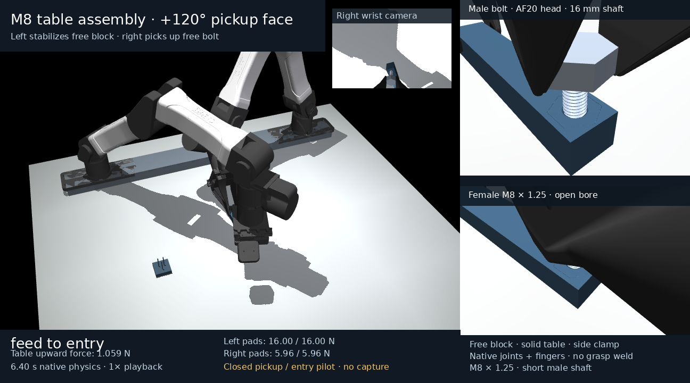
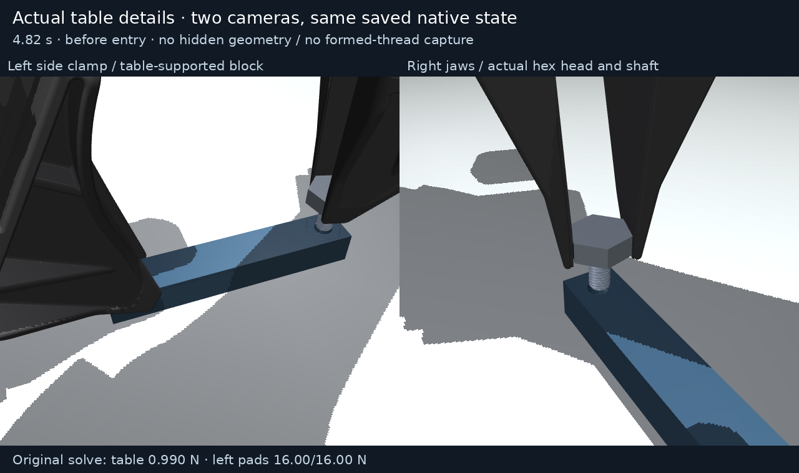

# Native +120-degree-face pickup and cone-entry pilot

This **6.3983-second closed native prefix** starts with both robot hands
separate from the free workpieces. The left hand acquires a side grip on the
female block and stabilizes it on the plain solid table. The right hand picks
up the separate male bolt using another hex-head face, clears the physical
rest, transports it above the bore and feeds to measured native cone entry.

**Original overall status: partial=true, passed=false, aborted=null.**
Pickup, grasp retention, rest clearance and table bearing are observed. This
pilot stops before any starting rotation. Formed overlap is zero; no captured
thread, qualified lead, opening/release, passive reset or completed assembly is
claimed. Cone entry is not formed-thread capture.





The supplementary detail uses two real camera angles of the **same actual
4.82-second saved state**: left side clamp on the table-supported block and
right jaws around the actual hex head. No physical bodies are hidden by render
settings or removed. Its original force caption, exact state hashes, camera
parameters and executed source are bound in `render/table_context/`.

[Normal 1x MP4](render/demo.mp4) · [Normal 1x GIF](render/demo.gif) ·
[Actual lift-complete still](render/lift_bolt.png)

The 77 video frames replay exact archived qpos/qvel at 12 fps using native
`mj_forward` only. No integration, state interpolation, manually posed free
objects or grasp welds are added. Displayed forces are the selected original
native solve records at saved time minus dt; replay forces are not used.
MP4 playback is normal 1x. GIF alternating 80/90 ms centisecond durations
preserve the same total time within one centisecond. The renderer/GIF source,
runtime, model and exact screenshot state hashes are in `render/`.

The minimum actual all-step native joint margin is **0.017349 rad**. The
independent saved-pose check gives **0.0173493 rad**. The separate sampled
kinematic planner reports **0.10156 rad** for its reconstructed parent route;
that value is not the native result. The archived planner is a fixed-pose
reach/collision rationale without native integration, forces or grip proof.
It does not certify a continuous trajectory or thread/reset success.

The original native whole-task table ledger confirms the table continues to
bear block weight while the left hand stabilizes it. The minimum active 100 ms
mean table share is **99.047%**, maximum mean positive left-hand upward share
is **0.953%**, and table loaded duty is **100%**. The bolt has no later world
support after pickup. Measured grip translation slip reaches **0.12717 mm**;
this is retained as an actual result, rather than replacing the original grasp
reference. Minimum whole-shaft/rest clearance during guarded transfer is
**14.939 mm**, above the original 10 mm guard. Read all original criteria in
`validation.json` and independent reports, including the incomplete thread and
reset criteria.

The trial and original audit binding were produced from an **uncommitted
orientation-only controller snapshot**. That exact snapshot was later
published as commit **b2b13ff39cd47c48afd19b38f83e9a405c9d6e32**. The separate
`published_producer_binding.json` verifies the archived controller bytes and
all **63 source hashes** against that commit. Its full software suite passed
**281 tests in 83.016 seconds**, with sources unchanged across execution.
This software proof does not turn the partial physics pilot into a successful
thread trajectory. The earlier audit provenance remains byte unchanged;
historical 213-test proof does not qualify this new controller. The focused
15-test auditor proof stays separate and is not added to 281.

- `insertion_trace.npz`: closed original native state/sample archive.
- `insertion_trace_partial.npz`: exact earlier original checkpoint archive,
  retained separately without splicing or relabeling.
- `table_support_force_history.npz`, `left_pad_force_history.npz`: complete
  original all-step ledgers; no rows removed or values quantized.
- `scene.xml`, `supported_scene.zip`, `scene_source.py`, `controller_source.py`,
  `recorded_sources/`: original model, meshes and producer source snapshots.
- `validation_original.json.txt`: unchanged original validation bytes.
  `validation.json` is a strict JSON derivative only, with nonfinite unobserved
  minima exported as null and each conversion recorded separately.
- `independent_audits/`: four closed independent physics/grasp/rest/free-body
  audits, their unchanged binding and exact source snapshots.
- `software_proof/`, `frozen_software_sources/`: full 281-test log/proof and
  exact published bytes for every proof-bound source.
- `kinematic_rationale/`: separate frozen sampled-route and open-workspace
  studies. These did not integrate a native opening/reset trajectory.
- `package_manifest.json`, `SHA256SUMS`: all trace, model, source, proof,
  native-versus-planner margin, presentation and artifact identities.

Every artifact is smaller than 45 MB, so no binary chunks are needed. Verify
the complete package from its directory:

```sh
sha256sum -c SHA256SUMS
```

Reconstruction uses the matched native CPU engine described in
`docs/m8_setup.md`, including its pinned source patch and plugin. A stock
MuJoCo wheel is insufficient. Core/plugin hashes are archived; independently
rebuilt native libraries require comparison before claiming identical physics.
Use an isolated checkout of the pinned producer. To replay this recording:

```sh
scripts/run_m8.sh -m yam_twin.m8_supported_demo --replay media/m8_table_supported/face120_pickup_entry_v1/insertion_trace.npz --output outputs/m8_table_supported/replayed_face120 --video --fps 12 --slow-motion 1
```

To regenerate a separate fresh native prefix, use a fresh output path and the
same archived source/configuration:

```sh
scripts/run_m8.sh -m yam_twin.m8_supported_demo --output outputs/m8_table_supported/repeated_face120 --dt .00005 --maximum-phases 12 --starting-angular-speed 1 --angular-speed 2 --axial-damping 50
```

The first carried-block demonstration remains at
`media/m8_table_pickup/full`. Earlier failed trials and cold diagnostics remain
separate immutable evidence. This package makes no calibrated-material,
full-seating/preload, numerical convergence or policy robustness claim.
